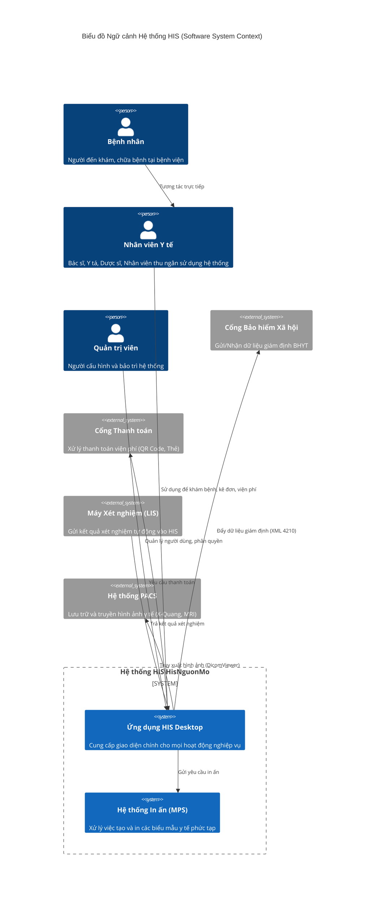

# Ngữ cảnh Hệ thống (System Context)

## 1. Mục đích và Phạm vi

Tài liệu này định nghĩa phạm vi hoạt động của **Hệ thống Thông tin Bệnh viện (HIS) HisNguonMo**. Đây không chỉ là một phần mềm quản lý đơn thuần mà là một hệ sinh thái toàn diện phục vụ cho việc vận hành bệnh viện, từ quản lý hành chính, khám chữa bệnh đến các nghiệp vụ chuyên sâu như xét nghiệm và in ấn y tế.

Hệ thống được thiết kế để xử lý quy mô lớn với:
- **956 Plugin**: Các mô-đun chức năng nghiệp vụ riêng biệt.
- **790+ Print Processor**: Hệ thống in ấn chuyên dụng.
- **131 User Control**: Các thành phần giao diện tái sử dụng (trong thư viện Core).

## 2. Sơ đồ Ngữ cảnh (System Context Diagram)

Sơ đồ dưới đây mô tả vị trí của HIS trong bức tranh tổng thể, tương tác với các đối tượng người dùng và hệ thống bên ngoài.

## 3. Các Bên liên quan chính (Stakeholders)

| Hạng mục | Đối tượng | Vai trò trong hệ thống |
|----------|-----------|------------------------|
| **Người dùng cuối** | Bác sĩ, Y tá | Sử dụng các plugin nghiệp vụ (Khám bệnh, Đơn thuốc, Bệnh án điện tử) để thực hiện công việc hàng ngày. |
| | Thu ngân, Kế toán | Sử dụng các plugin Thanh toán, Viện phí để xử lý tài chính. |
| | Dược sĩ | Sử dụng các plugin Kho dược để quản lý nhập xuất thuốc. |
| **Hệ thống vệ tinh** | LIS, PACS | Các hệ thống chuyên môn kết nối chặt chẽ với HIS để trao đổi dữ liệu cận lâm sàng. |
| **Cơ quan quản lý** | BHXH, Bộ Y tế | Nhận báo cáo và dữ liệu giám định từ hệ thống HIS. |
