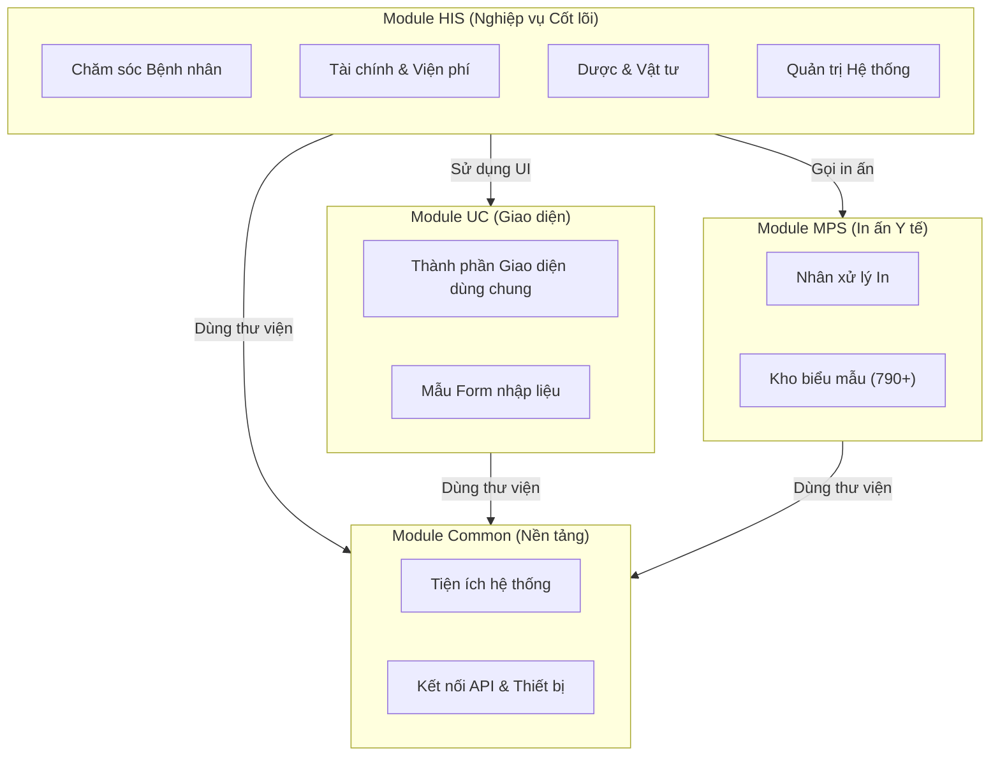

# Kiến trúc Nghiệp vụ (Functional Architecture)

## 1. Tổng quan các Module Chức năng

Hệ thống HisNguonMo được chia thành 4 khối chức năng lớn, mỗi khối chịu trách nhiệm cho một mảng nghiệp vụ hoặc kỹ thuật cụ thể. Việc phân chia này giúp hệ thống dễ dàng mở rộng và bảo trì.

## 2. Chi tiết các Module

### 2.1. Module HIS (Hospital Information System) - `HIS.Desktop.sln`
Đây là module quan trọng nhất, chứa toàn bộ logic nghiệp vụ của bệnh viện. Nó được tổ chức theo kiến trúc **Plugin**, cho phép thêm mới hoặc gỡ bỏ các chức năng mà không ảnh hưởng đến toàn bộ hệ thống.

**Các nhóm nghiệp vụ chính (Dựa trên Namespace):**

| Mã Plugin | Số lượng | Vùng Nghiệp vụ | Chức năng cụ thể |
|-----------|----------|----------------|------------------|
| `HIS` | ~600+ | **Nghiệp vụ cốt lõi** | Tiếp đón, Khám bệnh, Điều trị nội trú, Phẫu thuật thủ thuật. Đây là nơi các bác sĩ và điều dưỡng làm việc nhiều nhất. |
| `ACS` | 13 | **Kiểm soát truy cập** | Quản lý người dùng, phân quyền (Role-based Access Control), bảo mật truy cập vào các phân hệ. |
| `EMR` | 16 | **Bệnh án điện tử** | Ký số văn bản, quản lý hồ sơ bệnh án điện tử, quy trình phê duyệt hồ sơ. |
| `LIS` | 12 | **Xét nghiệm** | Kết nối máy xét nghiệm, quản lý mẫu bệnh phẩm, trả kết quả xét nghiệm. |
| `SAR` | 15 | **Báo cáo** | Tổng hợp báo cáo thống kê, báo cáo quản trị, báo cáo gửi Bộ Y tế/BHXH. |
| `SDA` | 14 | **Dữ liệu danh mục** | Quản lý các danh mục dùng chung (ICD, Dân tộc, Nghề nghiệp, Đơn vị hành chính). |
| `TYT` | 17 | **Y tế xã phường** | Các chương trình y tế dự phòng, tiêm chủng, quản lý sức khỏe cộng đồng tại tuyến cơ sở. |

### 2.2. Module MPS (Medical Print System) - `MPS.sln`
Hệ thống in ấn chuyên dụng, hoạt động như một "nhà máy in" riêng biệt.
*   **Vấn đề giải quyết**: Biểu mẫu y tế rất phức tạp (nhiều ô, bảng biểu, mã vạch) và yêu cầu độ chính xác cao khi in số lượng lớn.
*   **Cách hoạt động**: HIS gửi "Yêu cầu in" (dữ liệu thô) -> MPS nạp "Bộ xử lý mẫu" (Processor) tương ứng -> Xuất ra PDF/Excel hoặc in trực tiếp.
*   **Quy mô**: Hơn 790 bộ xử lý mẫu (từ `Mps000001` đến `Mps000xxx`).

### 2.3. Module UC (User Controls) - `HIS.UC.sln`
Kho chứa các "viên gạch" giao diện.
*   **Mục đích**: Giúp giao diện đồng nhất trên toàn bộ hàng nghìn màn hình chức năng.
*   **Ví dụ**: Control "Chọn thuốc" (`MedicineType`) được dùng chung cho cả màn hình Kê đơn ngoại trú lẫn màn hình Tủ trực nội trú. Control "Nhập chẩn đoán" (`Icd`) tự động gợi ý mã ICD-10 khi gõ tên bệnh.

### 2.4. Module Common - `Inventec.Common.sln`
Cung cấp các công cụ nền tảng mà các module trên đều cần.
*   **Kết nối**: `WebApiClient` (gọi API), `RedisCache` (lưu đệm dữ liệu).
*   **Tiện ích**: `ElectronicBill` (Hóa đơn điện tử), `QRCoder` (Tạo mã QR), `FlexCelPrint` (Xuất Excel).

## 3. Liên kết với Nghiệp vụ Bệnh viện

| Hoạt động Bệnh viện | Module/Plugin xử lý |
|---------------------|---------------------|
| Bệnh nhân đến đăng ký khám | `HIS.Desktop.Plugins.Reception` (Tiếp đón) |
| Bác sĩ khám và kê đơn | `HIS.Desktop.Plugins.ExamTreatment` (Khám bệnh), `AssignPrescriptionPK` (Kê đơn) |
| Bệnh nhân đi làm xét nghiệm | `LIS.Desktop.Plugins.*` (Hệ thống xét nghiệm) |
| Bệnh nhân thanh toán | `HIS.Desktop.Plugins.Transaction*` (Thu ngân), `ElectronicBill` (Xuất hóa đơn) |
| In kết quả và đơn thuốc | `MPS` (Hệ thống in) |
