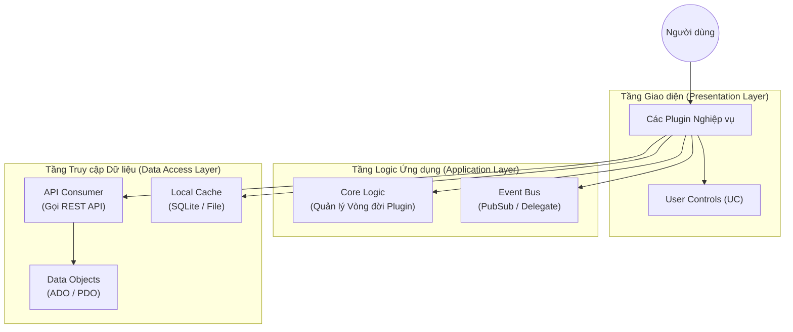

# Kiến trúc Kỹ thuật (Technical Architecture)

## 1. Công nghệ Sử dụng (Tech Stack)

Hệ thống được xây dựng trên nền tảng Microsoft .NET với các thư viện hỗ trợ giao diện mạnh mẽ.

| Thành phần | Công nghệ / Phiên bản | Mục đích |
|------------|-----------------------|----------|
| **Framework** | .NET Framework 4.5 | Nền tảng runtime chính cho ứng dụng Desktop. |
| **Giao diện** | DevExpress 15.2.9 | Bộ controll UI cao cấp (Grid, Chart, Ribbon) cho trải nghiệm người dùng hiện đại. |
| **Giao diện** | Telerik WinForms | Bổ sung các control UI chuyên biệt khác. |
| **In ấn & Xuất bản** | FlexCell 5.7.6.0 | Tạo và xử lý file Excel, PDF cho báo cáo và biểu mẫu. |
| **Mã vạch** | BarTender 10.1.0 | Tích hợp in mã vạch cho bệnh nhân và mẫu xét nghiệm. |
| **Giao tiếp API** | JSON / REST | Chuẩn giao tiếp dữ liệu với Backend. |
| **Dữ liệu cục bộ** | SQLite / XML | Lưu trữ cấu hình và cache cục bộ. |

## 2. Kiến trúc Phân tầng (Layered Architecture)

Hệ thống tuân thủ kiến trúc phân tầng cổ điển để tách biệt giao diện, logic và dữ liệu.

## 3. Các mô hình Giao tiếp (Communication Patterns)

Vì hệ thống được chia nhỏ thành gần 1000 plugin, việc giao tiếp giữa chúng là cực kỳ quan trọng. Hệ thống sử dụng 2 cơ chế chính:

### 3.1. Giao tiếp Đồng bộ (Direct Call / Delegate)
*   **Cơ chế**: `DelegateRegister`
*   **Mô tả**: Plugin A gọi trực tiếp một hàm của Plugin B và chờ kết quả trả về.
*   **Khi nào dùng**: Khi cần kết quả ngay lập tức để tiếp tục xử lý (Ví dụ: Từ màn hình Khám bệnh cần mở màn hình Kê đơn và lấy về ID đơn thuốc vừa tạo).
*   **Độ gắn kết (Coupling)**: Chặt (Tight).

### 3.2. Giao tiếp Bất đồng bộ (Pub/Sub)
*   **Cơ chế**: `Event Bus` (Publish / Subscribe)
*   **Mô tả**: Plugin A phát đi một sự kiện ("Bệnh nhân X vừa nhập viện"). Plugin B, C, D... nếu quan tâm sẽ tự động nhận được thông báo để cập nhật giao diện của mình.
*   **Khi nào dùng**: Để cập nhật dữ liệu trên nhiều màn hình, làm mới cache, ghi log. Plugin phát sự kiện không cần biết ai đang lắng nghe.
*   **Độ gắn kết (Coupling)**: Lỏng (Loose).

## 4. Bảo mật (Security)

*   **Xác thực (Authentication)**: Đăng nhập tập trung, sử dụng Token để giao tiếp với API.
*   **Phân quyền (Authorization)**: Cơ chế RBAC (Role-Based Access Control) sâu rộng. Quyền được phân đến từng chức năng nhỏ (Button, Menu) trong mỗi Plugin.
*   **Mã hóa**: Dữ liệu nhạy cảm được mã hóa khi truyền tải và khi lưu cache cục bộ.
