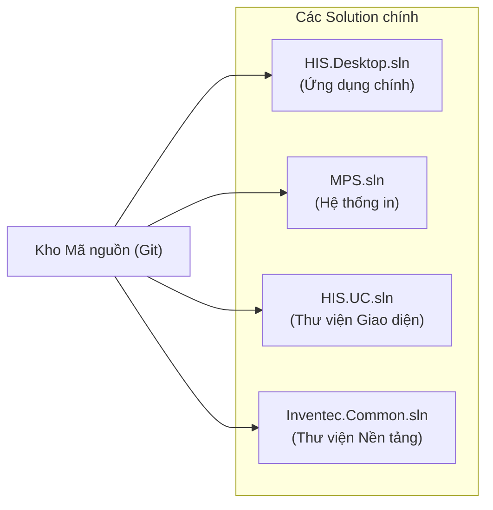
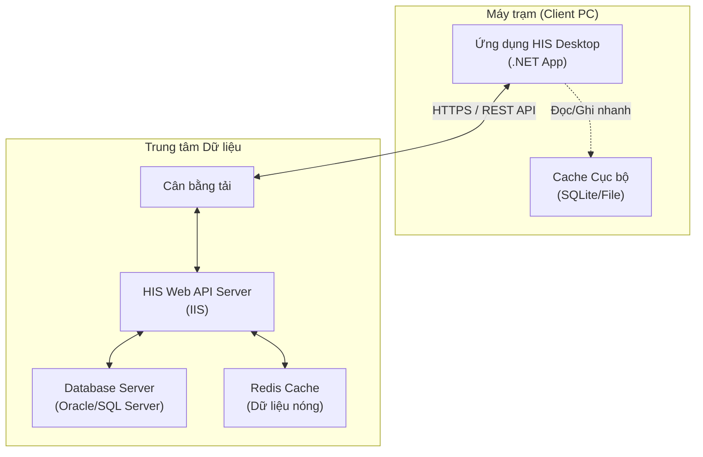

# Kiến trúc Triển khai (Deployment Architecture)

## 1. Tổ chức Mã nguồn (Source Code Organization)

Mã nguồn khổng lồ của dự án được chia tách vật lý thành các Solution (.sln) riêng biệt đề giảm tải cho Visual Studio và cho phép các đội nhóm làm việc song song.

### Chi tiết các Solution:
*   **HIS.Desktop.sln**: Chứa dự án khởi chạy (`HIS.Desktop.exe`) và hơn 600 plugin nghiệp vụ. Đây là nơi làm việc chính của các lập trình viên tính năng.
*   **MPS.sln**: Chứa động cơ in ấn và hàng trăm Processor xử lý mẫu in.
*   **HIS.UC.sln**: Chứa các User Control nền tảng.
*   **Inventec.Common.sln**: Chứa các thư viện lõi, tiện ích dùng chung cho toàn bộ các dự án của công ty (Inventec), không chỉ riêng HIS.

## 2. Quản lý Phụ thuộc (Dependencies)

Để build được dự án, môi trường phát triển cần thiết lập cẩn thận các phụ thuộc bên ngoài không nằm trong Git (do vấn đề bản quyền hoặc kích thước lớn).

### 2.1. Thư viện ngoài (External Libs)
Cần tải và giải nén thủ công các gói zip sau vào thư mục dự án:
*   `lib_extend.zip`: Chứa các DLL của DevExpress (Giao diện), Newtonsoft (JSON)...
*   `extend.zip`: Chứa các file tài nguyên runtime, cấu hình mẫu.

### 2.2. NuGet Packages
Hệ thống sử dụng NuGet để quản lý các gói phổ biến:
*   `EntityFramework`: Để truy cập dữ liệu (ORM).
*   `EO.Pdf` / `EO.WebBrowser`: Công cụ mạnh mẽ để xử lý PDF và trình duyệt nhúng.

## 3. Mô hình Triển khai Vật lý

*   **Mô hình Client-Server**: Ứng dụng Desktop (Fat Client) giao tiếp với Server qua REST API.
*   **Offloading**: Một phần logic hiển thị và xử lý dữ liệu tạm thời được đẩy xuống máy Client để giảm tải cho Server và tăng tốc độ phản hồi cho người dùng.
*   **Khả năng hoạt động Offline**: Nhờ kiến trúc Cache cục bộ mạnh mẽ (`LocalCache`), hệ thống có thể duy trì hoạt động cơ bản ngay cả khi mạng chập chờn (sẽ đồng bộ lại khi có mạng).
