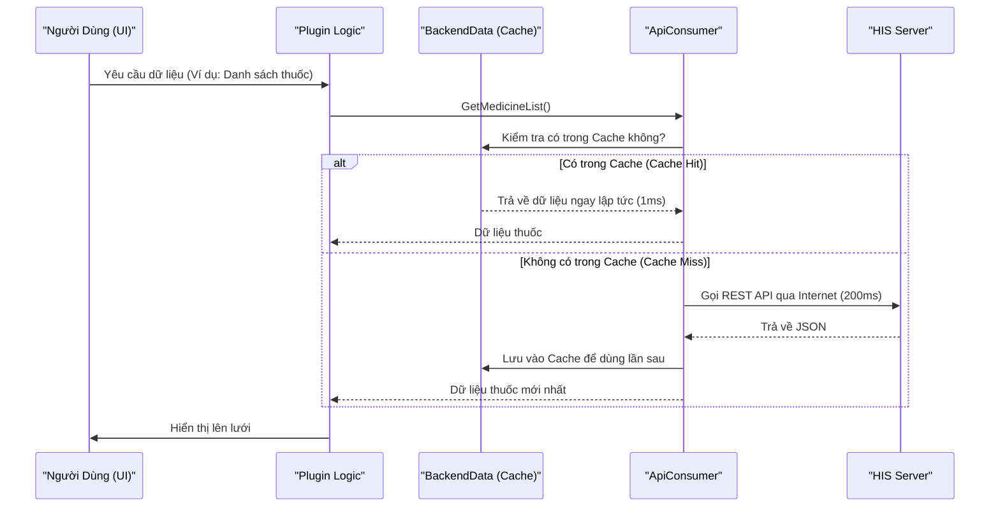
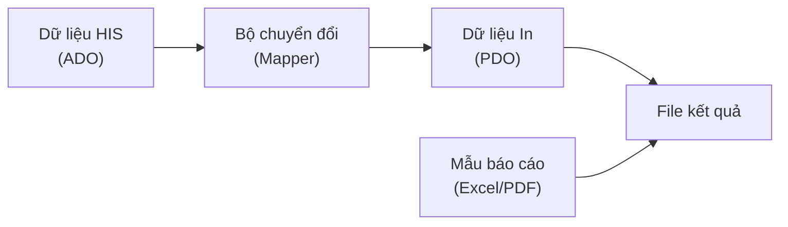

# Kiến trúc Dữ liệu (Data Architecture)

## 1. Luồng Dữ liệu Tổng quát (General Data Flow)

Hệ thống HIS phải xử lý lượng dữ liệu khổng lồ với yêu cầu tốc độ cao. Do đó, luồng dữ liệu được thiết kế tối ưu hóa qua nhiều lớp đệm (cache).

## 2. Các Thành phần Dữ liệu Cốt lõi

### 2.1. BackendData (Hệ thống Cache)
*   **Vị trí**: `HIS.Desktop.LocalStorage.BackendData` (69 file)
*   **Vai trò**: Là trái tim của hệ thống lưu trữ phía Client. Nó lưu trữ các danh mục ít thay đổi (Danh mục thuốc, danh mục bệnh, danh sách phòng ban) xuống đĩa cứng (SQLite/File).
*   **Lợi ích**: Giúp ứng dụng khởi động nhanh, hoạt động mượt mà ngay cả khi mất mạng tạm thời, và giảm tải đáng kể cho Server.

### 2.2. ADO (Application Data Objects)
*   **Vị trí**: `HIS.Desktop.ADO` (74 file)
*   **Vai trò**: Định nghĩa khuôn mẫu dữ liệu (Data Schema) để trao đổi giữa Client và Server.
*   **Đặc điểm**: Đây là các lớp C# thuần túy (POCO), ánh xạ 1-1 với cấu trúc JSON trả về từ API.

### 2.3. Cấu hình Ứng dụng
*   `ConfigApplication`: Lưu các cài đặt của người dùng (vị trí cửa sổ, máy in mặc định).
*   `HisConfig`, `SdaConfigKey`: Lưu các cấu hình hệ thống quan trọng được tải về từ Server.

## 3. Kiến trúc Dữ liệu In ấn (MPS Data)

Hệ thống in (MPS) sử dụng một cấu trúc dữ liệu riêng biệt gọi là **PDO (Print Data Objects)** để đảm bảo tính độc lập với nghiệp vụ HIS.

*   **Nguyên lý**: Plugin HIS không gửi trực tiếp dữ liệu thô cho máy in. Nó phải chuyển đổi (Map) dữ liệu đó sang một đối tượng PDO chuẩn.
*   **Lợi ích**: Nếu cấu trúc Database thay đổi, ta chỉ cần sửa `Converter`, không cần sửa lại hàng trăm mẫu in đang hoạt động ổn định.
