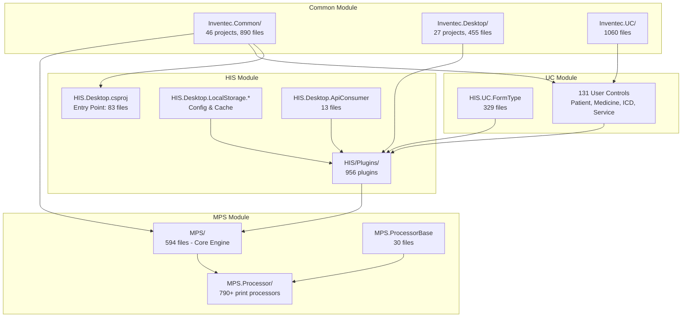
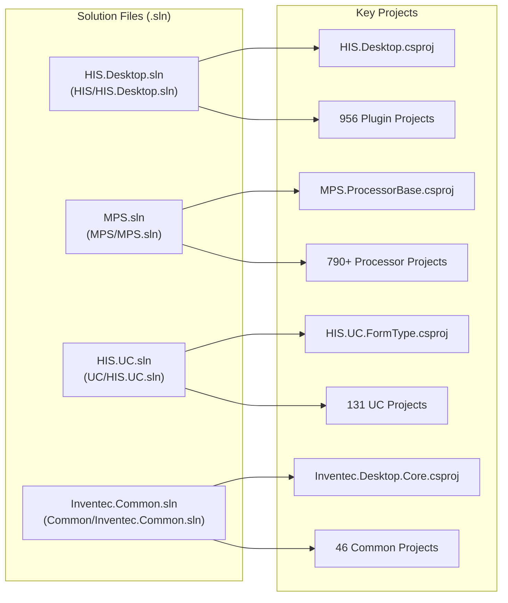
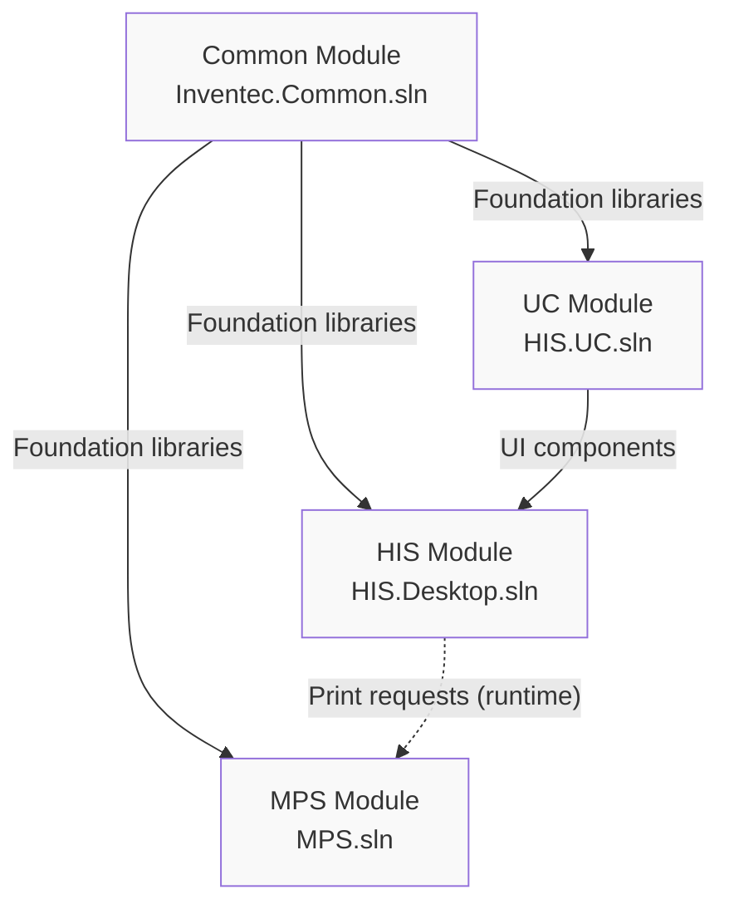
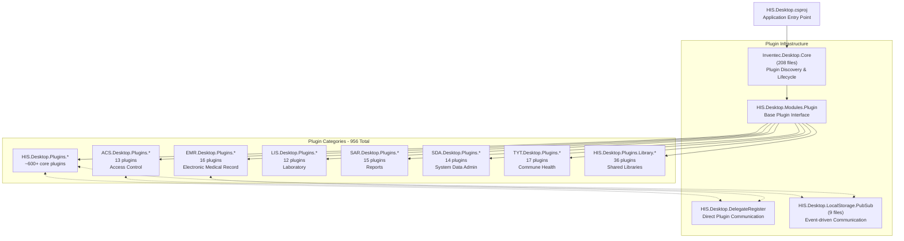
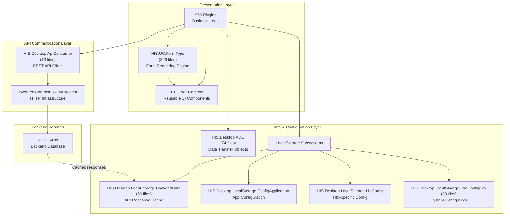
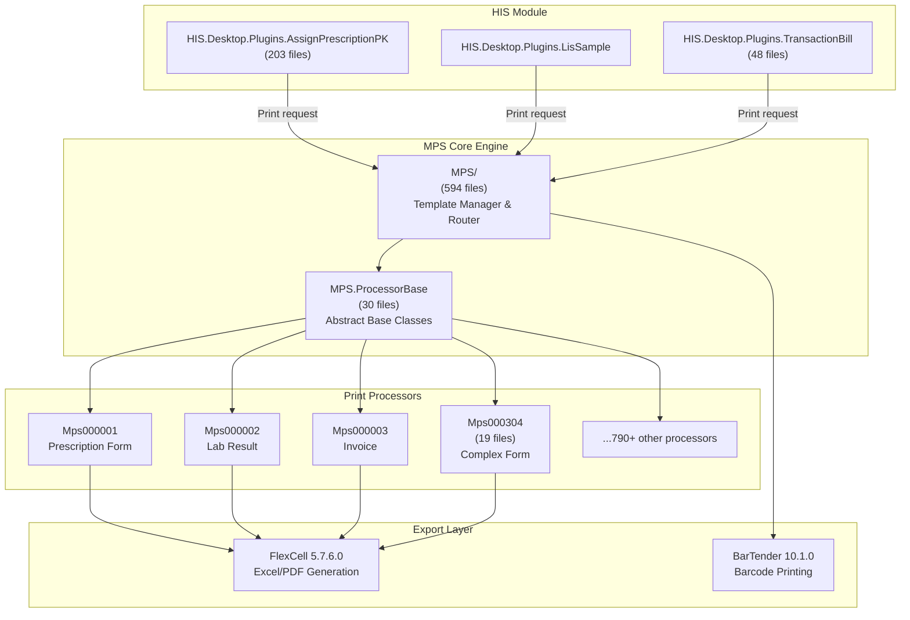
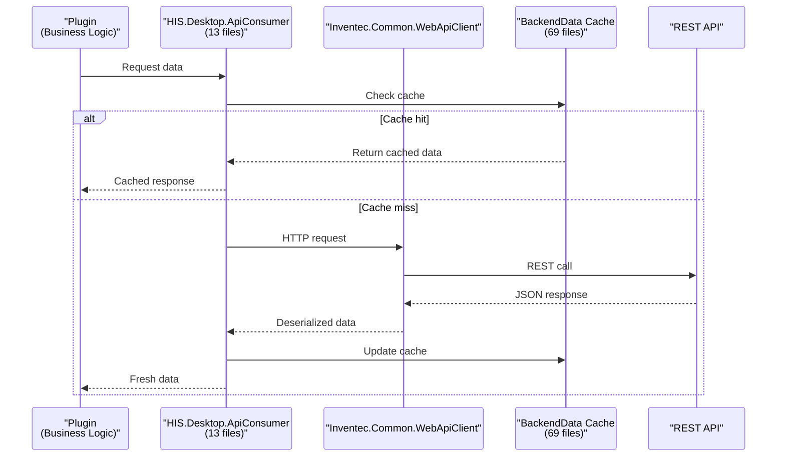
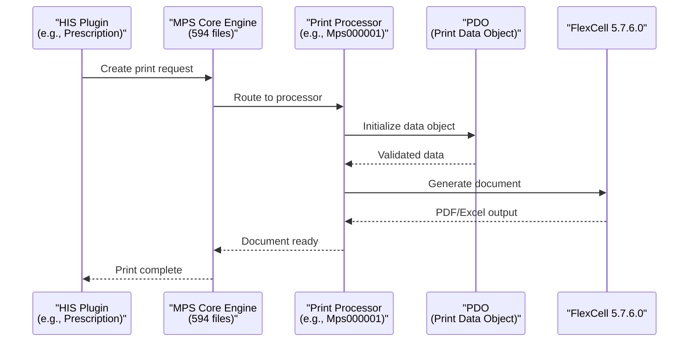

## Purpose and Scope

This document provides a comprehensive overview of the HisNguonMo Hospital Information System architecture. It covers the four-module structure (HIS, MPS, UC, Common), solution file organization, plugin-based architecture, data flow patterns, and inter-module dependencies. This page serves as the entry point for understanding how the 956 plugins, 790+ print processors, and 131 user controls work together in the system.

For detailed information about specific subsystems:
- HIS Desktop entry point and initialization: see [HIS Desktop Core](../02-modules/his-desktop/core.md)
- Plugin system implementation: see [Plugin System Architecture](../01-architecture/plugin-system.md)
- Print system details: see [MPS Print System](../02-modules/his-desktop/business-plugins.md#mps-print)
- User control library: see [UC Components Library](../02-modules/uc-controls/form-type-controls.md)
- Foundation utilities: see [Common Libraries](../02-modules/common-libraries/libraries.md)

---

## Four-Module Architecture

HisNguonMo is structured as four distinct modules, each with its own solution file and specific responsibilities. The modules form a layered dependency hierarchy where foundation libraries support higher-level application logic.

**Sources:** [`.devin/wiki.json:1-294`](../../../.devin/wiki.json#L1-L294, [.gitignore:1-10]()

### Module Responsibilities

| Module | Solution File | Primary Responsibility | Key Components |
|--------|--------------|------------------------|----------------|
| **HIS** | [[`HIS/HIS.Desktop.sln`](../../HIS/HIS.Desktop.sln)](../../HIS/HIS.Desktop.sln) | Main application, business logic, plugin hosting | 956 plugins, [[`HIS.Desktop.csproj`](../../HIS.Desktop.csproj)](../../HIS.Desktop.csproj), API consumer layer, LocalStorage |
| **MPS** | [[`MPS/MPS.sln`](../../MPS/MPS.sln)](../../MPS/MPS.sln) | Medical Print System | 790+ processors (`Mps000001` - `Mps000xxx`), `MPS.ProcessorBase` |
| **UC** | [[`UC/HIS.UC.sln`](../../../../HIS.UC.sln)](../../../../HIS.UC.sln) | Reusable UI components | 131 controls including `HIS.UC.FormType`, `HIS.UC.TreatmentFinish` |
| **Common** | [[`Common/Inventec.Common.sln`](../../Common/Inventec.Common.sln)](../../Common/Inventec.Common.sln) | Foundation libraries | `Inventec.Desktop.Core`, `Inventec.Common.WebApiClient`, utilities |

**Sources:** [`.devin/wiki.json:30-31`](../../../.devin/wiki.json#L30-L31, [`Common/HIS.Common.Treatment/HIS.Common.Treatment.sln:1-21`](../../Common/HIS.Common.Treatment/HIS.Common.Treatment.sln#L1-L21)

---

## Solution Files & Project Organization

The system is organized into four primary solution files, each representing a major architectural module. These solutions contain multiple C# projects that compile into assemblies used throughout the application.

### Primary Solutions

**Sources:** [`.devin/wiki.json:30-31`](../../../.devin/wiki.json#L30-L31, [`Common/HIS.Common.Treatment/HIS.Common.Treatment.sln:1-21`](../../Common/HIS.Common.Treatment/HIS.Common.Treatment.sln#L1-L21)

### Dependency Flow

The modules have a strict dependency hierarchy that prevents circular references and maintains clean architecture:

**Key Points:**
- **Common** provides utilities to all other modules (logging, HTTP client, UI framework)
- **UC** builds on Common to provide reusable controls consumed by HIS
- **HIS** references both Common and UC at compile time
- **MPS** is invoked by HIS at runtime through print request patterns (no compile-time dependency)

**Sources:** [`.devin/wiki.json:30-31`](../../../.devin/wiki.json#L30-L31)

---

## Plugin Architecture (956 Plugins)

The HIS module implements a plugin-based architecture where each business function is encapsulated as a standalone plugin. The system uses `Inventec.Desktop.Core` (208 files) as the plugin discovery and lifecycle engine.

### Plugin System Components

**Sources:** [`.devin/wiki.json:8-9`](../../../.devin/wiki.json#L8-L9, [`.devin/wiki.json:64-67`](../../../.devin/wiki.json#L64-L67)

### Plugin Organization by Domain

| Plugin Prefix | Count | Domain | Notable Plugins |
|--------------|-------|--------|-----------------|
| `HIS.Desktop.Plugins.*` | ~600+ | Core hospital operations | `AssignPrescriptionPK` (203 files), `ServiceExecute` (119 files), `TreatmentFinish` (101 files) |
| `ACS.Desktop.Plugins.*` | 13 | Access control | `AcsUser` (30 files), `AcsRole` (25 files), `AcsRoleUser` (25 files) |
| `EMR.Desktop.Plugins.*` | 16 | Electronic medical records | `EmrDocument` (42 files), `EmrSignDocumentList` (23 files) |
| `LIS.Desktop.Plugins.*` | 12 | Laboratory system | `LisSampleCondition` (24 files), `LisSampleUpdate` (36 files) |
| `SAR.Desktop.Plugins.*` | 15 | Advanced reporting | `SarReportTemplate` (38 files), `SarPrintType` (34 files) |
| `SDA.Desktop.Plugins.*` | 14 | System data admin | `SdaNational` (38 files), `SdaExecuteSql` (26 files) |
| `TYT.Desktop.Plugins.*` | 17 | Commune health | `TytDeath` (22 files), `TytHiv` (22 files) |
| `HIS.Desktop.Plugins.Library.*` | 36 | Shared libraries | `ElectronicBill` (101 files), `PrintOtherForm` (94 files) |

**Sources:** [`.devin/wiki.json:70-177`](../../../.devin/wiki.json#L70-L177)

### Plugin Communication Patterns

Plugins communicate through two mechanisms:

1. **DelegateRegister** (`HIS.Desktop.DelegateRegister`): Direct method invocation for tight coupling scenarios
2. **PubSub** (`HIS.Desktop.LocalStorage.PubSub`): Event-driven messaging for loose coupling

**Sources:** [`.devin/wiki.json:64-67`](../../../.devin/wiki.json#L64-L67)

---

## Data Flow Architecture

The system implements a three-tier architecture separating presentation logic, data management, and API communication.

**Sources:** [`.devin/wiki.json:36-42`](../../../.devin/wiki.json#L36-L42, [`.devin/wiki.json:46-51`](../../../.devin/wiki.json#L46-L51)

### Core Data Components

| Component | Location | Files | Purpose |
|-----------|----------|-------|---------|
| `HIS.Desktop.ADO` | `HIS/HIS.Desktop.ADO/` | 74 | Data Transfer Objects for API communication |
| `HIS.Desktop.ApiConsumer` | `HIS/HIS.Desktop.ApiConsumer/` | 13 | REST API client wrapper |
| `BackendData` | `HIS/HIS.Desktop.LocalStorage.BackendData/` | 69 | Caches API responses for offline capability |
| `ConfigApplication` | `HIS/HIS.Desktop.LocalStorage.ConfigApplication/` | - | Application-level configuration |
| `HisConfig` | `HIS/HIS.Desktop.LocalStorage.HisConfig/` | - | HIS module configuration |
| `SdaConfigKey` | `HIS/HIS.Desktop.LocalStorage.SdaConfigKey/` | 30 | System configuration key definitions |

**Sources:** [`.devin/wiki.json:36-42`](../../../.devin/wiki.json#L36-L42, [`.devin/wiki.json:46-51`](../../../.devin/wiki.json#L46-L51)

---

## MPS Print System Integration

The Medical Print System (MPS) operates as a semi-independent module invoked by HIS plugins for document generation. It contains 790+ specialized print processors, each handling specific medical form templates.

### Print Processor Structure

Each print processor follows a two-component pattern:
- **Logic folder** (`Mps000xxx`): Contains 4-19 files with processing logic
- **PDO folder** (`Mps000xxx.PDO`): Contains 3-10 files defining Print Data Objects

**Example processors:**
- `Mps000304` (19 files) - Complex medical form
- `Mps000321` (17 files) - Specialized report
- `Mps000463` (15 files) - Invoice template

**Sources:** [`.devin/wiki.json:16-17`](../../../.devin/wiki.json#L16-L17, [`.devin/wiki.json:183-197`](../../../.devin/wiki.json#L183-L197)

---

## User Control Library (131 Components)

The UC module provides domain-specific, reusable UI components consumed by plugins. `HIS.UC.FormType` (329 files) serves as the core form rendering engine for all data entry screens.

```mermaid
graph TB
    subgraph CoreUC["Core UC Components"]
        FormType["HIS.UC.FormType<br/>(329 files)<br/>Form Engine"]
        CreateReport["His.UC.CreateReport<br/>(165 files)<br/>Report Builder"]
        UCHein["His.UC.UCHein<br/>(153 files)<br/>Insurance Workflows"]
        PlusInfo["HIS.UC.PlusInfo<br/>(147 files)<br/>Additional Info"]
    end
    
    subgraph DomainUC["Domain-Specific UCs"]
        ExamTreatment["HIS.UC.ExamTreatmentFinish<br/>(103 files)"]
        TreatmentFinish["HIS.UC.TreatmentFinish<br/>(94 files)"]
        MaterialType["HIS.UC.MaterialType<br/>(85 files)"]
        MedicineType["HIS.UC.MedicineType<br/>(82 files)"]
        ICD["HIS.UC.Icd<br/>(65 files)"]
        SecondaryICD["HIS.UC.SecondaryIcd<br/>(61 files)"]
        ServiceRoom["HIS.UC.ServiceRoom<br/>(48 files)"]
    end
    
    subgraph Foundation["Foundation Layer"]
        InventecUC["Inventec.UC<br/>(1060 files)<br/>Base Controls"]
    end
    
    FormType --> InventecUC
    CreateReport --> InventecUC
    UCHein --> InventecUC
    PlusInfo --> InventecUC
    
    ExamTreatment --> InventecUC
    TreatmentFinish --> InventecUC
    MaterialType --> InventecUC
    MedicineType --> InventecUC
    ICD --> InventecUC
    SecondaryICD --> InventecUC
    ServiceRoom --> InventecUC
```

### UC Component Categories

| Category | Components | Purpose | Largest UC |
|----------|-----------|---------|-----------|
| Form Engine | `FormType` | Core data entry forms | `HIS.UC.FormType` (329 files) |
| Reporting | `CreateReport`, `UCHein` | Report generation, insurance | `His.UC.CreateReport` (165 files) |
| Treatment | `ExamTreatmentFinish`, `TreatmentFinish`, `Hospitalize` | Patient treatment workflows | `HIS.UC.ExamTreatmentFinish` (103 files) |
| Medicine/Material | `MedicineType`, `MaterialType`, `MedicineInStock` | Drug and supply management | `HIS.UC.MaterialType` (85 files) |
| Diagnosis | `Icd`, `SecondaryIcd` | ICD-10 diagnosis coding | `HIS.UC.Icd` (65 files) |
| Services | `ServiceRoom`, `ServiceUnit`, `RoomExamService` | Service and room management | `HIS.UC.ServiceRoom` (48 files) |

**Sources:** [`.devin/wiki.json:20-21`](../../../.devin/wiki.json#L20-L21, [`.devin/wiki.json:200-238`](../../../.devin/wiki.json#L200-L238)

---

## Common Libraries Foundation

The Common module provides cross-cutting utilities through three major library collections: `Inventec.Common` (46 projects, 890 files), `Inventec.Desktop` (27 projects, 455 files), and `Inventec.UC` (1060 files).

```mermaid
graph TB
    subgraph Apps["Application Modules"]
        HISApp["HIS Application"]
        MPSApp["MPS Print System"]
        UCApp["UC Components"]
    end
    
    subgraph DesktopFW["Inventec.Desktop Framework (27 projects)"]
        DesktopCore["Inventec.Desktop.Core<br/>(208 files)<br/>Plugin Engine"]
        CustomControl["Inventec.Desktop.CustomControl<br/>(26 files)"]
        ExportXML["Inventec.Desktop.ExportXML<br/>(30 files)"]
        BasePlugins["Base Plugins:<br/>ChangePassword<br/>ConfigApplication<br/>EventLog<br/>Updater"]
    end
    
    subgraph CommonUtils["Inventec.Common Utilities (46 projects)"]
        ElectronicBill["Inventec.Common.ElectronicBill<br/>(319 files)<br/>E-Invoice Integration"]
        WordContent["Inventec.Common.WordContent<br/>(60 files)"]
        QRCoder["Inventec.Common.QRCoder<br/>(51 files)"]
        FlexCelPrint["Inventec.Common.FlexCelPrint<br/>(38 files)"]
        BarcodeLib["Inventec.Common.BarcodeLib<br/>(32 files)"]
        RedisCache["Inventec.Common.RedisCache<br/>(26 files)"]
        WebApiClient["Inventec.Common.WebApiClient<br/>HTTP Infrastructure"]
        Logging["Inventec.Common.Logging"]
    end
    
    subgraph Integrations["External Integrations"]
        DicomViewer["Inventec.DicomViewer<br/>(134 files)<br/>Medical Imaging"]
        Speech["Inventec.Speech<br/>(31 files)<br/>Voice Recognition"]
        FssClient["Inventec.Fss.Client<br/>File Storage Service"]
    end
    
    HISApp --> DesktopCore
    HISApp --> WebApiClient
    HISApp --> ElectronicBill
    HISApp --> RedisCache
    
    MPSApp --> FlexCelPrint
    MPSApp --> BarcodeLib
    
    UCApp --> DesktopCore
    
    HISApp --> DicomViewer
    HISApp --> Speech
    HISApp --> FssClient
```

### Key Common Libraries

| Library | Location | Size | Purpose |
|---------|----------|------|---------|
| `Inventec.Desktop.Core` | `Common/Inventec.Desktop/Core/` | 208 files | Plugin discovery, lifecycle management |
| `Inventec.Common.ElectronicBill` | `Common/Inventec.Common/ElectronicBill/` | 319 files | E-invoice integration (largest utility) |
| `Inventec.Common.WebApiClient` | `Common/Inventec.Common/WebApiClient/` | - | HTTP client wrapper for REST APIs |
| `Inventec.Common.FlexCelPrint` | `Common/Inventec.Common/FlexCelPrint/` | 38 files | Excel/PDF printing integration |
| `Inventec.Common.QRCoder` | `Common/Inventec.Common/QRCoder/` | 51 files | QR code generation |
| `Inventec.Common.RedisCache` | `Common/Inventec.Common/RedisCache/` | 26 files | Redis caching integration |
| `Inventec.UC` | `Common/Inventec.UC/` | 1060 files | Foundation UI controls |
| `Inventec.DicomViewer` | `Common/Inventec.DicomViewer/` | 134 files | Medical imaging viewer |

**Sources:** [`.devin/wiki.json:12-13`](../../../.devin/wiki.json#L12-L13, [`.devin/wiki.json:240-272`](../../../.devin/wiki.json#L240-L272)

---

## Module Interaction Patterns

### Plugin Communication

Plugins interact through two primary mechanisms managed by the Desktop framework:

1. **DelegateRegister Pattern**: Direct method invocation for synchronous operations
   - Located in `HIS.Desktop.DelegateRegister`
   - Used for tight coupling scenarios requiring immediate response
   - Example: Opening a new plugin from another plugin

2. **PubSub Pattern**: Event-driven messaging for asynchronous operations
   - Located in `HIS.Desktop.LocalStorage.PubSub` (9 files)
   - Integrates with `Inventec.Common.WSPubSub`
   - Used for loose coupling scenarios like data refresh notifications
   - Example: Notifying multiple plugins when patient data changes

### API Communication Flow

**Sources:** [`.devin/wiki.json:46-57`](../../../.devin/wiki.json#L46-L57, [`.devin/wiki.json:36-42`](../../../.devin/wiki.json#L36-L42)

### Print Request Flow

**Sources:** [`.devin/wiki.json:16-17`](../../../.devin/wiki.json#L16-L17, [`.devin/wiki.json:183-197`](../../../.devin/wiki.json#L183-L197)

---

## Build Configuration

The system requires specific build dependencies and configurations:

### Required Dependencies

- **.NET Framework 4.5**: Target framework for all projects
- **DevExpress 15.2.9**: UI component library (requires license)
- **FlexCell 5.7.6.0**: Excel/PDF generation engine
- **Telerik WinForms**: Additional UI controls
- **BarTender 10.1.0**: Barcode printing integration

### External Library Downloads

Two external packages must be downloaded separately:
- **lib_extend.zip**: Contains closed-source libraries and DevExpress components
- **extend.zip**: Runtime components and additional dependencies

These are not included in the repository due to licensing restrictions.

### NuGet Packages

The `HIS/packages/` directory contains 132 NuGet packages including:
- `Newtonsoft.Json` for JSON serialization
- `EntityFramework` for ORM
- `EO.Pdf` and `EO.WebBrowser` for PDF/web integration

**Sources:** [`.devin/wiki.json:12-13`](../../../.devin/wiki.json#L12-L13, [`.devin/wiki.json:285-293`](../../../.devin/wiki.json#L285-L293)

---

## Summary

HisNguonMo implements a modular, plugin-based architecture with clear separation of concerns:

- **4 primary modules**: HIS (application), MPS (printing), UC (controls), Common (utilities)
- **956 plugins** organized by domain (HIS core, ACS, EMR, LIS, SAR, SDA, TYT, Library)
- **790+ print processors** for medical document generation
- **131 user controls** for consistent UI patterns
- **Three-tier data flow**: Presentation → Data/Config → API
- **Dual communication**: DelegateRegister (synchronous) + PubSub (asynchronous)

For development setup and build instructions, see [Build & Development Setup](../99-development/build-setup.md).