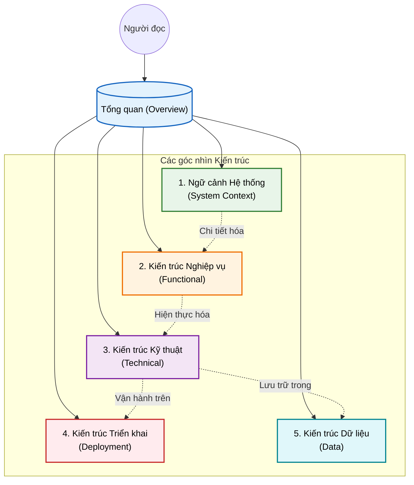

# Tổng quan Kiến trúc HisNguonMo

Chào mừng đến với tài liệu kỹ thuật của hệ thống HisNguonMo. Để giúp độc giả dễ dàng tiếp cận hệ thống phức tạp với hơn 956 plugin này, tài liệu kiến trúc đã được chia nhỏ thành 5 phần chuyên biệt.

Vui lòng chọn tài liệu phù hợp với vai trò của bạn:

## Mục lục Tài liệu Kiến trúc

### 1. [Ngữ cảnh Hệ thống (System Context)](01-system-context.md)
> **Dành cho:** Tất cả mọi người (BA, Dev, PM, Stakeholders)
> *   Tổng quan về mục đích hệ thống HIS.
> *   Sơ đồ ngữ cảnh (Context Diagram): Ai sử dụng hệ thống? Hệ thống kết nối với bên nào (Bảo hiểm, LIS, PACS)?

### 2. [Kiến trúc Nghiệp vụ (Functional Architecture)](02-functional-architecture.md)
> **Dành cho:** Business Analyst (BA), Product Owner
> *   Phân tích 4 module lớn: HIS, MPS, UC, Common.
> *   Bản đồ các phân hệ chức năng: Tiếp đón, Khám bệnh, Dược, Viện phí, v.v.
> *   Mối quan hệ giữa Module kỹ thuật và Nghiệp vụ bệnh viện.

## Phạm vi và Giới hạn
> [!CAUTION]
> **CẢNH BÁO: THIẾU SOURCE CODE BACKEND**
> Repository này chỉ chứa mã nguồn của Client (Desktop App). Toàn bộ phần Backend API và Database không được bao gồm.
> Xem chi tiết tại: [Hạ tầng Backend (Thiếu)](../03-technical-specs/backend-infrastructure/00-technical-overview.md).

## Kiến trúc Hệ thống

### Kiến trúc Tổng thể (High-Level Architecture)](03-technical-architecture.md)
> **Dành cho:** Developers, Tech Leads
> *   Công nghệ sử dụng (Tech Stack): .NET 4.5, DevExpress.
> *   Kiến trúc phân tầng (Layered Architecture).
> *   Các mẫu giao tiếp plugin (Sync/Async, PubSub/Delegate).

### 4. [Kiến trúc Triển khai (Deployment Architecture)](04-deployment-architecture.md)
> **Dành cho:** DevOps, System Admin
> *   Tổ chức mã nguồn và Solution.
> *   Các phụ thuộc (Dependencies) và thư viện ngoài.
> *   Mô hình triển khai vật lý (Client-Server, Load Balancing).

### 5. [Kiến trúc Dữ liệu (Data Architecture)](05-data-architecture.md)
> **Dành cho:** Database Developers, Backend Devs
> *   Luồng dữ liệu (Data Flow) và chiến lược Caching (BackendData).
> *   Các đối tượng dữ liệu (ADO, PDO).
> *   Cơ chế xử lý dữ liệu in ấn.

---

## Tài liệu liên quan khác
*   [Kiến trúc Plugin](plugin-system/01-overview.md): Cách chúng tôi quản lý 956 module.
*   [Quy trình Nghiệp vụ](../02-business-processes/README.md): Các luồng nghiệp vụ chi tiết (Trước đây là 02-business-processes).
*   [Thông số Kỹ thuật](../03-technical-specs/README.md): Chi tiết kỹ thuật module (Trước đây là 03-technical-specs).