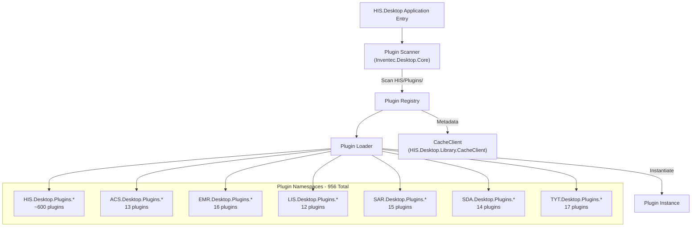
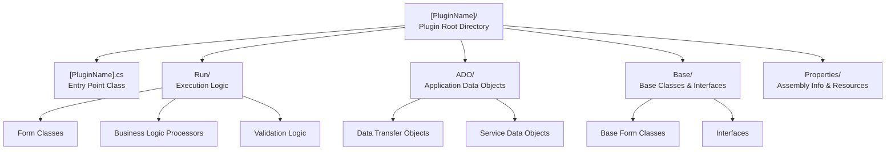
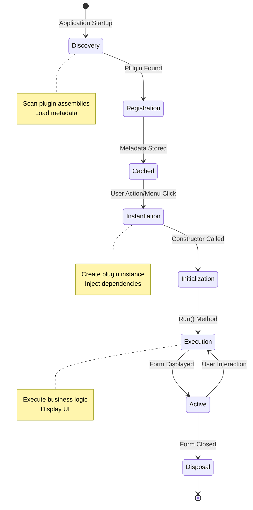
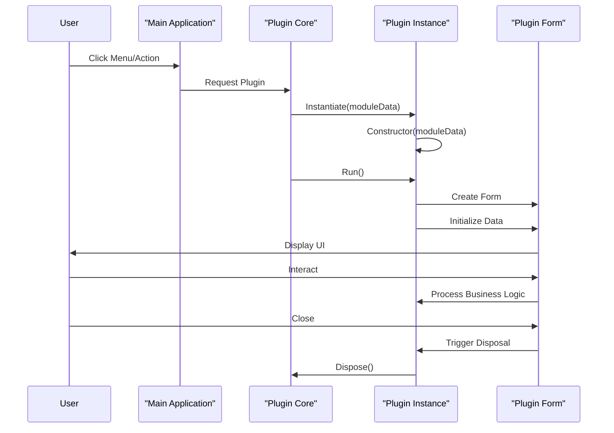
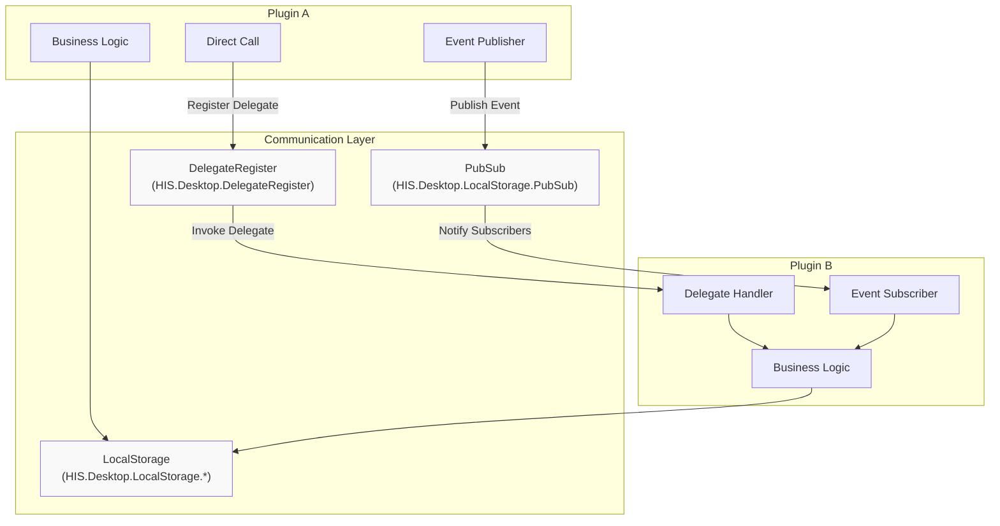
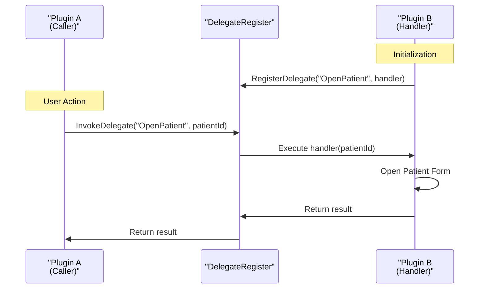
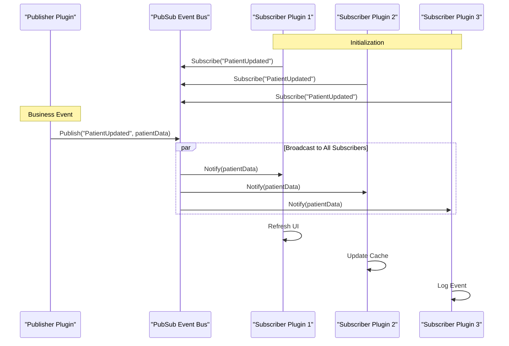
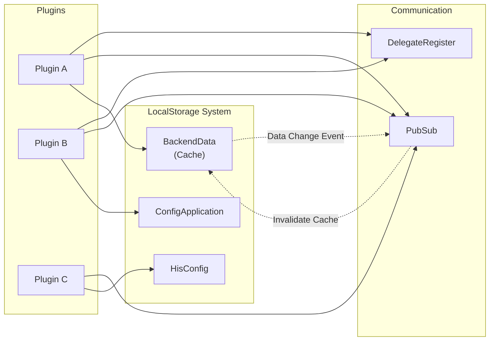
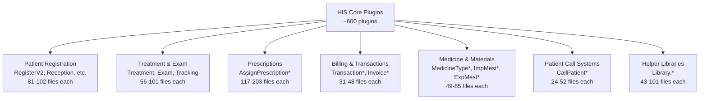
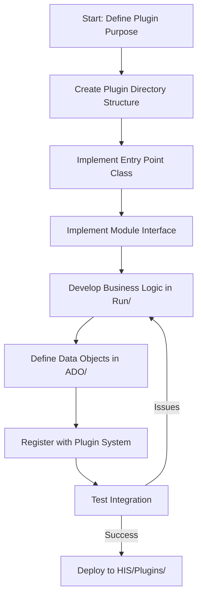

## Purpose and Scope

This document describes the plugin-based architecture that forms the core extensibility mechanism of the HIS Desktop application. It covers plugin discovery, lifecycle management, communication patterns, and organizational structure. The system contains **956 plugins** distributed across seven domain-specific namespaces.

For information about the main application entry point and initialization, see [HIS Desktop Core](../01-architecture/overview.md). For plugin-specific business domain details, see the child pages for [HIS Core Business Plugins](../02-modules/his-desktop/business-plugins.md), [Transaction & Billing](../02-modules/his-desktop/business-plugins.md#transaction-billing), and other specialized plugin categories.

---

## Plugin Discovery and Loading

The HIS Desktop application uses a dynamic plugin discovery mechanism to locate and load plugins at runtime. The plugin system is managed by the `HIS.Desktop.Modules.Plugin` project and the `Inventec.Desktop.Core` framework.

### Plugin Discovery Process



**Sources:** `HIS/HIS.Desktop/`, `HIS/HIS.Desktop.Modules.Plugin/`, `HIS/HIS.Desktop.Library.CacheClient/`, `Common/Inventec.Desktop/Inventec.Desktop.Core/`

### Plugin Registration

Each plugin is registered with metadata that describes its capabilities, dependencies, and entry point. The registration process occurs during application startup.

| Component | Responsibility |
|-----------|---------------|
| `Inventec.Desktop.Core` | Plugin discovery engine, scanning plugin assemblies |
| `HIS.Desktop.Modules.Plugin` | HIS-specific plugin management and metadata handling |
| `HIS.Desktop.Library.CacheClient` | Caching plugin metadata and configuration for performance |
| Plugin Assembly | Self-registration via attributes or manifest files |

**Sources:** `Common/Inventec.Desktop/Inventec.Desktop.Core/`, `HIS/HIS.Desktop.Modules.Plugin/`, `HIS/HIS.Desktop.Library.CacheClient/`

---

## Plugin Organization and Structure

Each plugin follows a standardized directory structure to ensure consistency and maintainability across the 956 plugins in the system.

### Standard Plugin Structure



**Sources:** `HIS/Plugins/HIS.Desktop.Plugins.*/`, `HIS/Plugins/ACS.Desktop.Plugins.*/`, `HIS/Plugins/EMR.Desktop.Plugins.*/`

### Typical Plugin Components

| Component | File/Folder | Purpose |
|-----------|-------------|---------|
| **Entry Point** | [`[PluginName].cs`](../../[PluginName].cs) | Plugin initialization and module interface implementation |
| **Run Folder** | `Run/` | Contains forms, user controls, and business logic |
| **ADO Folder** | `ADO/` | Application Data Objects for internal plugin data transfer |
| **Base Folder** | `Base/` | Base classes and interfaces used within the plugin |
| **Properties** | `Properties/` | Assembly information and resource files |

### Example: Large Plugin Structure

Larger plugins like `AssignPrescriptionPK` (203 files) follow an extended structure:

```
HIS.Desktop.Plugins.AssignPrescriptionPK/
├── AssignPrescriptionPK.cs              (Entry point)
├── Run/
│   ├── frmAssignPrescriptionPK.cs      (Main form)
│   ├── Validation/                      (Input validators)
│   ├── Processor/                       (Business logic)
│   └── UserControl/                     (Embedded controls)
├── ADO/
│   ├── MedicineADO.cs
│   ├── MaterialADO.cs
│   └── PrescriptionADO.cs
├── Base/
│   ├── ResourceMessage.cs
│   └── ResourceLangManager.cs
└── Properties/
```

**Sources:** `HIS/Plugins/HIS.Desktop.Plugins.AssignPrescriptionPK/`, `HIS/Plugins/HIS.Desktop.Plugins.ServiceExecute/`, `HIS/Plugins/HIS.Desktop.Plugins.TreatmentFinish/`

---

## Plugin Lifecycle

Plugins follow a defined lifecycle from discovery through execution to disposal. The lifecycle is managed by the `Inventec.Desktop.Core` framework.

### Lifecycle Stages



**Sources:** `Common/Inventec.Desktop/Inventec.Desktop.Core/`, `HIS/HIS.Desktop.Modules.Plugin/`

### Plugin Interface Contract

Plugins implement a module interface that defines their lifecycle methods:

| Method | Stage | Purpose |
|--------|-------|---------|
| Constructor | Instantiation | Initialize plugin instance, receive dependencies |
| `Run()` | Execution | Entry point for plugin logic, typically creates and shows a form |
| `Dispose()` | Disposal | Clean up resources, unsubscribe from events |

### Module Data Flow



**Sources:** `Common/Inventec.Desktop/Inventec.Desktop.Core/`, `HIS/Plugins/HIS.Desktop.Plugins.*/`

---

## Inter-Plugin Communication

The plugin architecture supports both tight and loose coupling patterns through two primary communication mechanisms: **DelegateRegister** and **PubSub**.

### Communication Architecture



**Sources:** `HIS/HIS.Desktop.LocalStorage.PubSub/`, `HIS/HIS.Desktop/`

### DelegateRegister Pattern

The `DelegateRegister` provides direct, synchronous communication between plugins through registered delegates. This pattern is used when one plugin needs to invoke specific functionality in another plugin with immediate response.

**Use Cases:**
- Opening a specific form from another plugin
- Requesting data refresh in another module
- Triggering validation or calculation in another component
- Navigating to a specific record in another plugin

**Communication Flow:**



**Sources:** `HIS/HIS.Desktop/`, `HIS/Plugins/HIS.Desktop.Plugins.*/`

### PubSub Pattern

The `PubSub` (Publish-Subscribe) pattern provides loose-coupled, asynchronous communication through events. Multiple plugins can subscribe to events without the publisher knowing about subscribers.

**Key Components:**

| Component | File Location | Responsibility |
|-----------|---------------|----------------|
| Publisher | Plugin raising events | Publishes events when state changes occur |
| Subscriber | Plugins interested in events | Subscribes to specific event types |
| Event Bus | `HIS.Desktop.LocalStorage.PubSub` | Routes events from publishers to subscribers |
| Event Types | Various ADO classes | Define event data structures |

**Use Cases:**
- Broadcasting data changes (patient updated, prescription saved)
- Notifying multiple plugins of system events
- Cache invalidation across plugins
- UI refresh triggers

**Communication Flow:**



**Sources:** `HIS/HIS.Desktop.LocalStorage.PubSub/`, `Common/Inventec.Common/Inventec.Common.WSPubSub/`

### LocalStorage Integration

Both communication patterns integrate with the `LocalStorage` system for shared state management:



**Sources:** `HIS/HIS.Desktop.LocalStorage.BackendData/`, `HIS/HIS.Desktop.LocalStorage.ConfigApplication/`, `HIS/HIS.Desktop.LocalStorage.HisConfig/`

---

## Plugin Categories

The 956 plugins are organized into seven domain-specific namespaces, each serving a distinct functional area of the hospital information system.

### Category Overview

| Category | Namespace | Plugin Count | Primary Function | Child Page |
|----------|-----------|--------------|------------------|------------|
| **HIS Core** | `HIS.Desktop.Plugins.*` | ~600 | Core hospital operations: registration, treatment, prescriptions, billing | [#1.1.3.1](../02-modules/his-desktop/business-plugins.md) |
| **Access Control** | `ACS.Desktop.Plugins.*` | 13 | User management, roles, permissions, module access control | [#1.1.3.5](../03-business-domains/administration/access-control.md) |
| **EMR** | `EMR.Desktop.Plugins.*` | 16 | Electronic medical records, digital signatures, approval workflows | [#1.1.3.6](../02-modules/his-desktop/business-plugins.md#emr) |
| **Laboratory** | `LIS.Desktop.Plugins.*` | 12 | Lab sample management, machine integration, test results | [#1.1.3.7](../03-business-domains/laboratory/lis-plugins.md) |
| **Reporting** | `SAR.Desktop.Plugins.*` | 15 | Report templates, custom print types, report configuration | [#1.1.3.8](../02-modules/his-desktop/business-plugins.md#reporting) |
| **System Data** | `SDA.Desktop.Plugins.*` | 14 | Master data administration: locations, ethnic groups, fields | [#1.1.3.10](../03-business-domains/administration/system-data.md) |
| **Commune Health** | `TYT.Desktop.Plugins.*` | 17 | Community health programs: tuberculosis, malaria, maternal care | [#1.1.3.9](../02-modules/his-desktop/business-plugins.md#commune-health) |

### HIS Core Plugin Subcategories

The largest category, `HIS.Desktop.Plugins.*`, is further divided into functional subcategories:



**Sources:** `HIS/Plugins/HIS.Desktop.Plugins.*/`

For detailed documentation of each plugin category, refer to the child pages:
- [HIS Core Business Plugins](../02-modules/his-desktop/business-plugins.md)
- [Transaction & Billing Plugins](../02-modules/his-desktop/business-plugins.md#transaction-billing)
- [Medicine & Material Plugins](../03-business-domains/pharmacy/medicine-material.md)
- [Patient Call & Display Plugins](../03-business-domains/patient-management/patient-call-display.md)
- [Library Helper Plugins](../04-integrations/helper-plugins.md)

---

## Plugin Development Guidelines

### Creating a New Plugin

The typical workflow for developing a new plugin:



**Sources:** `HIS/Plugins/HIS.Desktop.Plugins.*/`, `Common/Inventec.Desktop/Inventec.Desktop.Core/`

### Plugin Naming Conventions

| Component | Convention | Example |
|-----------|-----------|---------|
| **Namespace** | `[Domain].Desktop.Plugins.[PluginName]` | `HIS.Desktop.Plugins.AssignPrescriptionPK` |
| **Entry Class** | [`[PluginName].cs`](../../[PluginName].cs) | [[`AssignPrescriptionPK.cs`](../../AssignPrescriptionPK.cs)](../../AssignPrescriptionPK.cs) |
| **Main Form** | [`frm[PluginName].cs`](../../frm[PluginName].cs) | [[`frmAssignPrescriptionPK.cs`](../../frmAssignPrescriptionPK.cs)](../../frmAssignPrescriptionPK.cs) |
| **ADO Classes** | [`[Entity]ADO.cs`](../../[Entity]ADO.cs) | [[`MedicineADO.cs`](../../MedicineADO.cs)](../../MedicineADO.cs), [[`PrescriptionADO.cs`](../../PrescriptionADO.cs)](../../PrescriptionADO.cs) |
| **Base Classes** | Descriptive names in Base/ | [[`ResourceMessage.cs`](../../ResourceMessage.cs)](../../ResourceMessage.cs), [[`GlobalConfig.cs`](../../GlobalConfig.cs)](../../GlobalConfig.cs) |

### Plugin Dependencies

Plugins typically depend on the following core components:

| Dependency | Location | Purpose |
|------------|----------|---------|
| `Inventec.Desktop.Core` | `Common/Inventec.Desktop/` | Plugin framework and module interface |
| `HIS.Desktop.Common` | `HIS/HIS.Desktop.Common/` | Shared interfaces and base classes |
| `HIS.Desktop.LocalStorage.*` | `HIS/HIS.Desktop.LocalStorage.*/` | Configuration, caching, and event system |
| `HIS.Desktop.Utility` | `HIS/HIS.Desktop.Utility/` | Helper functions and utilities |
| `HIS.Desktop.ApiConsumer` | `HIS/HIS.Desktop.ApiConsumer/` | Backend API communication |
| `HIS.Desktop.ADO` | `HIS/HIS.Desktop.ADO/` | Shared data models |
| `UC Components` | `UC/HIS.UC.*/` | Reusable user controls |

**Sources:** `HIS/HIS.Desktop/`, `HIS/HIS.Desktop.Common/`, `HIS/HIS.Desktop.Utility/`, `Common/Inventec.Desktop/`

### Best Practices

1. **Separation of Concerns**: Keep UI logic in `Run/` folder, data objects in `ADO/`, and shared utilities in `Base/`
2. **Event-Driven Communication**: Prefer PubSub for loose coupling when plugins don't need immediate response
3. **Delegate Registration**: Use DelegateRegister for direct plugin-to-plugin calls requiring return values
4. **Cache Utilization**: Leverage `LocalStorage.BackendData` for frequently accessed data
5. **Resource Management**: Properly dispose of resources and unsubscribe from events in plugin disposal
6. **User Controls**: Reuse existing UC components from `UC/` instead of creating duplicate functionality

**Sources:** `HIS/Plugins/HIS.Desktop.Plugins.*/`, `HIS/HIS.Desktop.LocalStorage.*/`, `UC/HIS.UC.*/`

---

## Summary

The HIS plugin system provides a flexible, extensible architecture for the hospital information system:

- **956 plugins** organized into 7 domain-specific namespaces
- **Standardized structure** with entry point, Run/, ADO/, Base/, and Properties/ folders
- **Lifecycle management** through Inventec.Desktop.Core framework
- **Dual communication patterns**: DelegateRegister for synchronous calls, PubSub for asynchronous events
- **Integration with LocalStorage** for shared state and configuration
- **Modular design** enabling independent development and deployment of features

For specific plugin category implementations, refer to the child pages listed in the Plugin Categories section above.

**Sources:** `HIS/Plugins/`, `HIS/HIS.Desktop.Modules.Plugin/`, `HIS/HIS.Desktop.LocalStorage.PubSub/`, `Common/Inventec.Desktop/Inventec.Desktop.Core/`