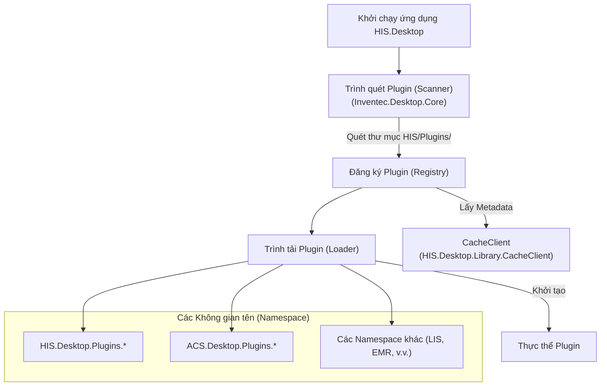
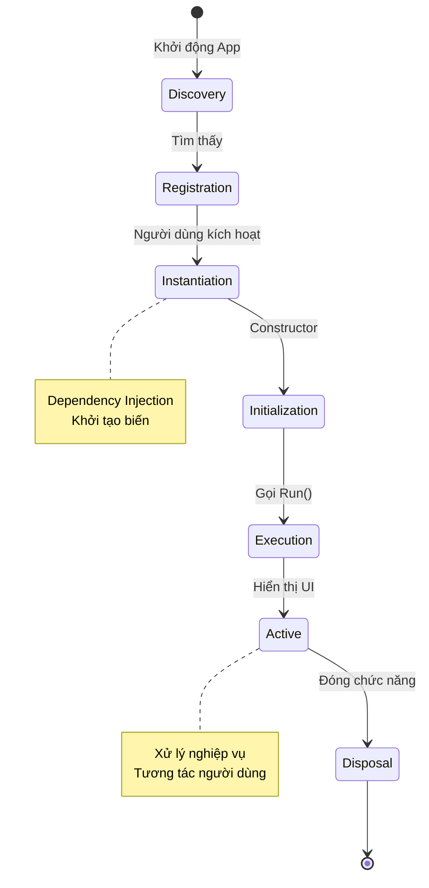
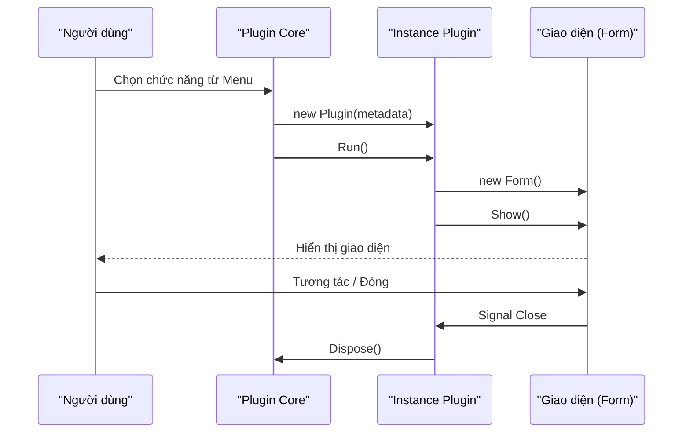

# Khám Phá và Vòng Đời Plugin

## Cơ chế Khám phá (Plugin Discovery)

Ứng dụng HIS Desktop sử dụng cơ chế khám phá động để tự động nhận diện và tải các plugin khi khởi động. Quá trình này đảm bảo tính linh hoạt, cho phép thêm hoặc bớt tính năng bằng cách đơn giản là thêm hoặc xóa file plugin mà không cần biên dịch lại ứng dụng chính.

### Quy trình Tải

**Thành phần tham gia:**
*   **Plugin Scanner**: Quét thư mục cài đặt để tìm các file `.dll` tuân thủ quy ước plugin.
*   **Plugin Registry**: Duy trì danh sách các plugin khả dụng và metadata của chúng.
*   **CacheClient**: Lưu trữ metadata để tăng tốc độ khởi động trong các lần chạy sau.

## Vòng Đời Plugin (Lifecycle)

Mỗi plugin tuân theo một chu trình sống nghiêm ngặt được quản lý bởi `Inventec.Desktop.Core`. Điều này đảm bảo tài nguyên hệ thống được sử dụng hiệu quả và tránh rò rỉ bộ nhớ.

### Các Giai đoạn

### Interface Module

Mọi plugin phải triển khai interface chuẩn của module để Core có thể điều khiển:

| Giai đoạn | Phương thức | Mô tả |
|-----------|-------------|-------|
| **Khởi tạo** | `Constructor` | Tạo thực thể, nhận các dependency cần thiết. |
| **Thực thi** | `Run()` | Điểm bắt đầu logic chính, thường là khởi tạo và hiển thị Form. |
| **Kết thúc** | `Dispose()` | Dọn dẹp tài nguyên, hủy đăng ký sự kiện, đóng kết nối. |

### Luồng Dữ liệu Khởi chạy

---
*Xem tiếp: [Cấu trúc & Tổ chức Plugin](03-structure-organization.md)*
