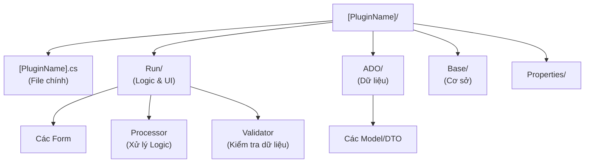

# Cấu trúc và Tổ chức File Plugin

Để đảm bảo tính nhất quán giữa gần 1000 plugin, hệ thống áp dụng một quy chuẩn nghiêm ngặt về cấu trúc thư mục và đặt tên file.

## Cấu trúc Thư mục Chuẩn

Mỗi dự án plugin (Project) được tổ chức như sau:



## Chi tiết Các Thành phần

### 1. File Điểm vào (Entry Point)
*   **Vị trí**: Nằm ngay thư mục gốc của project.
*   **Tên file**: Trùng tên với Plugin (ví dụ `AssignPrescriptionPK.cs`).
*   **Vai trò**: Triển khai interface module, cầu nối giữa Core và các thành phần bên trong.

### 2. Thư mục `Run/`
Đây là nơi chứa "trái tim" của plugin:
*   **Forms**: Các file giao diện (`.cs`, `.designer.cs`).
*   **UserControls**: Các thành phần giao diện nhỏ hơn, tái sử dụng nội bộ.
*   **Processor**: Các lớp xử lý logic nghiệp vụ phức tạp, tách biệt khỏi code giao diện (Code-behind).
*   **Validation**: Các lớp kiểm tra dữ liệu đầu vào.

### 3. Thư mục `ADO/` (Application Data Objects)
Chứa các định nghĩa đối tượng dữ liệu:
*   Mô hình dữ liệu để trao đổi thông tin với API.
*   Các DTO (Data Transfer Object) dùng nội bộ.

### 4. Thư mục `Base/`
Chứa các lớp hỗ trợ dùng riêng cho plugin:
*   Các hằng số (Constants).
*   Các hàm tiện ích (Utils).
*   Quản lý thông báo, đa ngôn ngữ (Resources).

## Ví dụ Thực tế: Plugin Kê đơn (AssignPrescriptionPK)

Plugin `HIS.Desktop.Plugins.AssignPrescriptionPK` là một module lớn với hơn 200 file, tuân thủ chặt chẽ cấu trúc này:

```text
HIS.Desktop.Plugins.AssignPrescriptionPK/
├── AssignPrescriptionPK.cs              (Entry Point)
├── Run/
│   ├── frmAssignPrescriptionPK.cs      (Form chính)
│   ├── View/                            (Các View con)
│   ├── Validation/                      (Logic validate thuốc, tương tác...)
│   └── Processor/                       (Xử lý tính toán giá, tồn kho...)
├── ADO/
│   ├── MedicineADO.cs                   (Model thuốc)
│   └── PrescriptionADO.cs               (Model đơn thuốc)
└── Base/
    └── ResourceMessage.cs               (Thông báo)
```

---
*Xem tiếp: [Cơ chế Giao tiếp](04-communication.md)*
