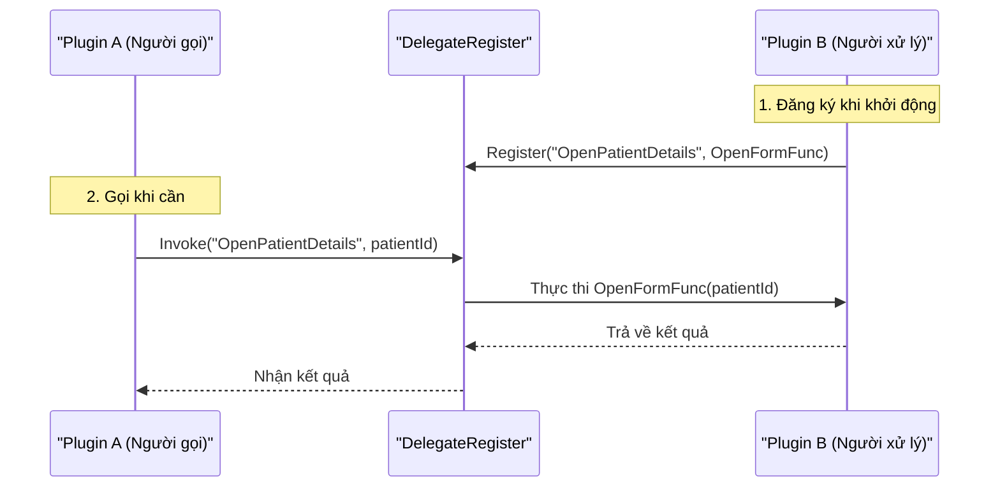
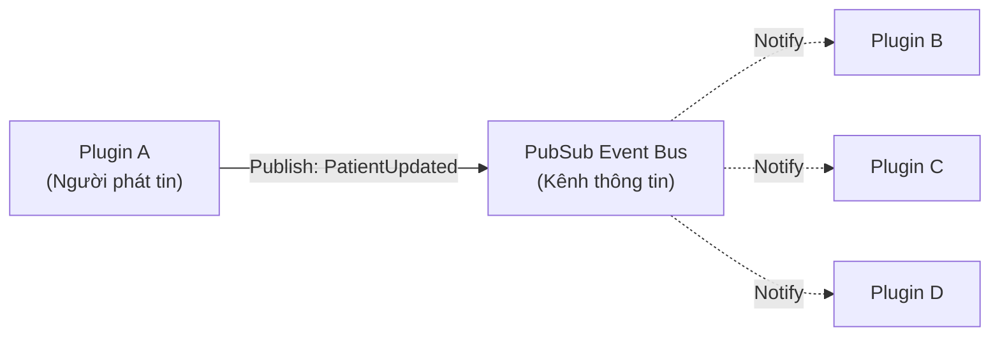

# Cơ chế Giao tiếp giữa các Plugin

Trong một hệ thống phân tán module như HIS, việc giao tiếp hiệu quả giữa các plugin là cực kỳ quan trọng. Hệ thống hỗ trợ hai mô hình giao tiếp chính:

1.  **Đồng bộ (Synchronous)**: Sử dụng `DelegateRegister`.
2.  **Bất đồng bộ (Asynchronous)**: Sử dụng `PubSub` (Publish/Subscribe).

## 1. Giao tiếp Đồng bộ (DelegateRegister)

Mô hình này được sử dụng khi Plugin A cần gọi một chức năng của Plugin B và **cần biết kết quả ngay lập tức** hoặc cần đảm bảo hành động đã hoàn tất trước khi tiếp tục.

### Nguyên lý hoạt động

*   **Đăng ký**: Plugin B đăng ký một hàm (delegate) với hệ thống dưới một cái tên (Key).
*   **Gọi**: Plugin A yêu cầu hệ thống thực thi hàm đó bằng Key tương ứng.

### Ứng dụng
*   Mở một form chi tiết từ danh sách.
*   Yêu cầu tính toán logic từ một module khác.
*   Kiểm tra quyền truy cập chéo.

## 2. Giao tiếp Bất đồng bộ (PubSub)

Mô hình này giúp giảm sự phụ thuộc (loose coupling). Người gửi không cần biết ai sẽ nhận thông điệp, và người nhận không cần biết ai gửi.

### Nguyên lý hoạt động

*   **Publish**: Khi có sự kiện (ví dụ: "Lưu bệnh nhân thành công"), plugin phát ra một thông điệp lên kênh chung.
*   **Subscribe**: Các plugin quan tâm đến sự kiện này sẽ lắng nghe và tự động phản ứng khi nhận được thông báo.

### Ứng dụng
*   Làm mới dữ liệu trên các màn hình khác nhau sau khi cập nhật.
*   Cập nhật Cache hệ thống.
*   Ghi log hoạt động.

## 3. Chia sẻ Dữ liệu qua LocalStorage

Ngoài giao tiếp trực tiếp, các plugin chia sẻ trạng thái thông qua các kho dữ liệu cục bộ (`HIS.Desktop.LocalStorage`).

*   **ConfigApplication**: Cấu hình ứng dụng.
*   **BackendData**: Dữ liệu danh mục được cache từ server (giảm tải API).
*   **HisConfig**: Các thiết lập nghiệp vụ đặc thù HIS.

---
*Xem tiếp: [Hướng dẫn Phát triển](05-development-guide.md)*
