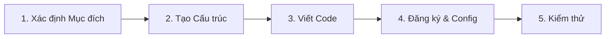

# Hướng dẫn Phát triển Plugin

Tài liệu này hướng dẫn các bước cơ bản và các quy tắc cần tuân thủ khi phát triển một plugin mới cho hệ thống HIS Desktop.

## Quy trình Tạo Plugin Mới

1.  **Xác định Mục đích**: Plugin thuộc nghiệp vụ nào? (Tiếp đón, Khám bệnh, hay Dược...).
2.  **Tạo Cấu trúc**: Tạo Project mới theo [cấu trúc chuẩn](03-structure-organization.md).
3.  **Viết Code**:
    *   Implement Entry Point class.
    *   Tạo giao diện trong folder `Run/`.
    *   Xử lý logic, gọi API.
4.  **Đăng ký**: Thêm thông tin plugin vào cơ sở dữ liệu hoặc file cấu hình để `Scanner` có thể tìm thấy.
5.  **Kiểm thử**: Chạy trên môi trường dev.

## Quy tắc Đặt tên (Naming Convention)

Việc đặt tên sai quy tắc sẽ dẫn đến việc hệ thống không nhận diện được plugin hoặc gây xung đột.

| Thành phần | Quy tắc | Ví dụ |
|------------|---------|-------|
| **Namespace** | `[Domain].Desktop.Plugins.[TênChứcNăng]` | `HIS.Desktop.Plugins.Reception` |
| **Entry Class** | Trùng tên với phần cuối của Namespace | `Reception.cs` |
| **Form Chính** | `frm` + Tên chức năng | `frmReception.cs` |
| **Data Model** | Tên thực thể + `ADO` | `PatientADO.cs` |

## Các Thư viện Phụ thuộc (Dependencies)

Khi phát triển, bạn sẽ thường xuyên sử dụng các thư viện lõi sau:

*   **`Inventec.Desktop.Core`**: Chứa các interface cơ bản (`IPlugin`, `IModule`).
*   **`HIS.Desktop.ApiConsumer`**: Dùng để gọi API về Backend. **Tuyệt đối không gọi trực tiếp Database**.
*   **`HIS.Desktop.Common`**: Chứa các hàm dùng chung, tiện ích xử lý chuỗi, ngày tháng.
*   **`HIS.Desktop.LocalStorage.*`**: Để truy xuất cấu hình và cache.

## Best Practices (Thực hành Tốt nhất)

1.  **Không gọi chéo trực tiếp**: Hạn chế `Add Reference` giữa các plugin. Hãy dùng `DelegateRegister` hoặc `PubSub` để giảm sự phụ thuộc.
2.  **Xử lý ngoại lệ**: Luôn bao bọc các logic quan trọng trong `try-catch` và ghi log lỗi đầy đủ.
3.  **Tối ưu UI**: Form load phải nhanh. Đẩy các tác vụ nặng (tải dữ liệu lớn) xuống Background Thread hoặc `async/await`.
4.  **Dọn dẹp**: Luôn implement `Dispose` để giải phóng bộ nhớ, đặc biệt là các biến static hoặc sự kiện.

---
*Xem tiếp: [Danh mục Plugin](06-catalog.md)*
