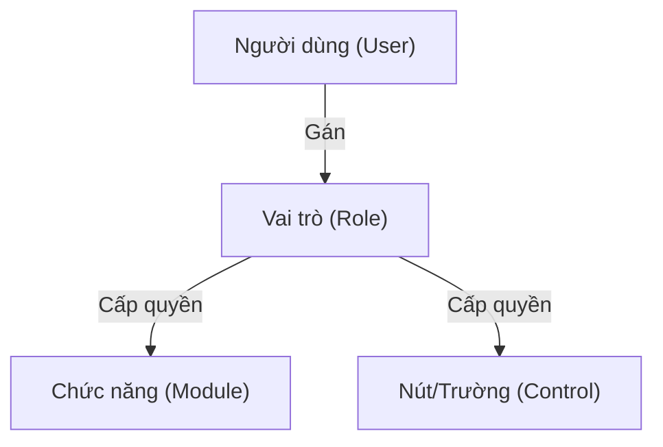

# Kiểm soát Truy cập (ACS) - Business Overview

## 1. Mục đích và Phạm vi
Hệ thống ACS (Access Control System) quản lý toàn bộ việc phân quyền và bảo mật truy cập trong HIS.
Mô hình dựa trên vai trò (RBAC - Role Based Access Control) đảm bảo người dùng chỉ truy cập được các chức năng được cấp phép.

## 2. Mô hình Phân quyền
Hệ thống phân quyền theo 4 cấp độ chi tiết:

1.  **Application**: Quyền truy cập vào ứng dụng HIS Desktop.
2.  **Module Group**: Quyền truy cập vào nhóm chức năng (VD: Nhóm Dược, Nhóm Viện phí).
3.  **Module**: Quyền truy cập vào từng chức năng cụ thể (VD: Chức năng Đăng ký khám, Chức năng Nhập kho).
4.  **Control**: Quyền chi tiết trên giao diện (VD: Ẩn nút "Xóa", Ẩn đơn giá nhập).

## 3. Quy trình Quản trị
### 3.1. Quản lý Người dùng
*   Tạo người dùng mới với thông tin định danh (Tên đăng nhập, Khoa phòng).
*   Kích hoạt/Vô hiệu hóa tài khoản.
*   Thiết lập mật khẩu và chính sách bảo mật.

### 3.2. Quản lý Vai trò
*   **Vai trò cơ sở (Base Role)**: Các vai trò mẫu có sẵn (VD: Bác sĩ, Điều dưỡng, Thu ngân).
*   **Vai trò tùy biến**: Quản trị viên có thể tạo vai trò mới bằng cách copy từ vai trò cơ sở và điều chỉnh quyền.

### 3.3. Phân quyền Control
Cho phép can thiệp sâu vào giao diện mà không cần sửa code:
*   Vô hiệu hóa nút "Lưu" đối với nhân viên mới.
*   Ẩn cột "Giá vốn" đối với kho dược viên.

## 4. Liên kết Tài liệu
*   Chi tiết kỹ thuật và danh sách 13 Plugin ACS: [Thiết kế Kỹ thuật ACS](../../../03-technical-specs/administration/02-access-control-technical.md).
