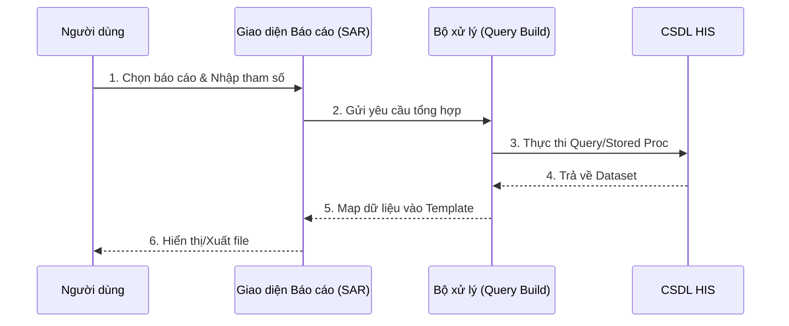

# Hệ thống Báo cáo (Reporting System - SAR)

## 1. Tổng quan
Phân hệ Báo cáo (SAR) cung cấp công cụ để định nghĩa, quản lý và trích xuất các báo cáo nghiệp vụ trong toàn bộ hệ thống HIS.
Mục tiêu:
*   Đảm bảo số liệu thống nhất giữa các khoa phòng.
*   Đáp ứng các mẫu báo cáo theo quy định của Bộ Y tế và Bảo hiểm Xã hội (BHYT).

## 2. Quy trình Quản lý Báo cáo

### 2.1. Quản lý Mẫu Báo cáo (`SarReportTemplate`)
Quy trình dành cho quản trị viên hoặc nhân viên thống kê để thiết lập các mẫu báo cáo mới.
*   **Định nghĩa tham số**: Thiết lập các bộ lọc (Ngày tháng, Khoa phòng, Đối tượng BHYT/Viện phí).
*   **Thiết kế mẫu in (Layout)**: Cấu hình biểu mẫu hiển thị (thường dùng Excel hoặc Crystal Report).
*   **Phân quyền**: Gán quyền truy cập báo cáo cho từng nhóm người dùng (Bác sĩ, Tài chính, Dược).

### 2.2. Tổng hợp & Trích xuất Số liệu (`SarReport`)
Quy trình thực hiện bởi người dùng cuối khi cần lấy số liệu.
1.  **Chọn báo cáo**: Tìm kiếm báo cáo trong danh mục được phân quyền.
2.  **Nhập tham số**: Chọn khoảng thời gian, khoa phòng cần xem.
3.  **Xử lý (Processing)**: Hệ thống chạy các câu lệnh SQL/Stored Procedure để tổng hợp dữ liệu.
4.  **Xuất kết quả**: Xem trước, in trực tiếp hoặc xuất ra Excel/PDF.

### 2.3. Ký số Báo cáo (Digital Signature)
Hỗ trợ ký số trên các báo cáo điện tử để nộp cho cơ quan quản lý (BHYT).
*   Tích hợp chữ ký số Token USB hoặc HSM.
*   Lưu trữ lịch sử người ký và thời điểm ký.

## 3. Các Nhóm Báo cáo Chính
*   **Báo cáo BHYT**: 79a, 80a, 19, 20, 21... (XML 4210/130).
*   **Báo cáo Dược**: Nhập xuất tồn, thẻ kho, biên bản kiểm kê.
*   **Báo cáo Tài chính**: Doanh thu ngày, báo cáo thu chi, bảng kê hóa đơn.
*   **Báo cáo Chuyên môn**: Sổ khám bệnh, sổ vào viện, sổ phẫu thuật thủ thuật.

## 4. Sơ đồ Hoạt động

