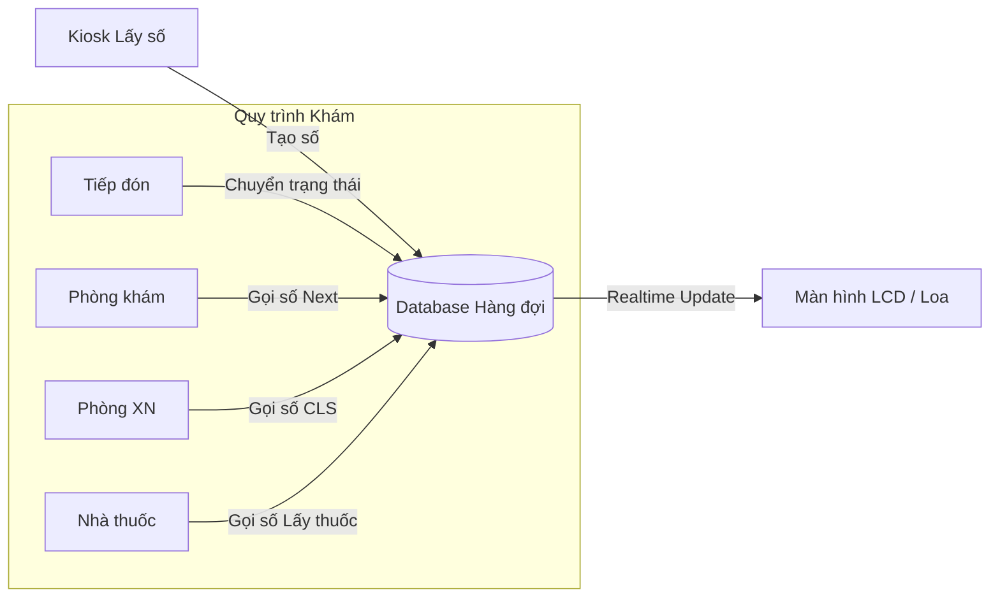

# Hệ thống Quản lý Hàng đợi (Queue Management - QCS)

## 1. Tổng quan
Hệ thống QCS (Queue Management System) điều phối luồng bệnh nhân trong bệnh viện, đảm bảo trật tự, công bằng và giảm thời gian chờ đợi.
Phạm vi:
*   Lấy số tự động (Kiosk).
*   Gọi số tại phòng khám/phòng xét nghiệm/nhà thuốc.
*   Hiển thị số trên màn hình LCD.

## 2. Quy trình Nghiệp vụ

### 2.1. Cấp số (Ticketing)
*   **Kiosk lấy số**: Bệnh nhân quét thẻ BHYT hoặc CCCD để lấy số thứ tự tiếp đón.
*   **Phân luồng**: Hệ thống tự động phân loại bệnh nhân (Ưu tiên, Người già, Trẻ em) để cấp số vào đúng hàng đợi (Queue).

### 2.2. Gọi số (Calling)
Tích hợp trực tiếp trên màn hình làm việc của Bác sĩ/Dược sĩ (`CallPatient` plugins).
*   **Gọi số**: Mời bệnh nhân tiếp theo vào phòng.
*   **Gọi lại (Recall)**: Nếu bệnh nhân chưa có mặt.
*   **Bỏ qua (Skip)**: Chuyển bệnh nhân xuống cuối hàng đợi nếu vắng mặt quá 3 lần.
*   **Chuyển tiếp (Transfer)**: Chuyển bệnh nhân từ phòng tiếp đón sang phòng khám.

### 2.3. Hiển thị Thông tin (Digital Signage)
*   **Màn hình tại cửa phòng**: Hiển thị số đang phục vụ, tên bệnh nhân.
*   **Màn hình tổng**: Hiển thị trạng thái các phòng khám tại sảnh chờ trung tâm.
*   **Loa thông báo**: Đọc số tự động (Text-to-Speech).

## 3. Cấu trúc Hàng đợi
Hệ thống xử lý nhiều loại hàng đợi khác nhau:
1.  **Hàng đợi Tiếp đón**: Chờ đăng ký khám.
2.  **Hàng đợi Phòng khám**: Chờ bác sĩ khám.
3.  **Hàng đợi Cận lâm sàng**: Chờ lấy máu, chụp X-quang (lấy số riêng hoặc dùng chung số khám).
4.  **Hàng đợi Dược**: Chờ cấp phát thuốc/đóng tiền.

## 4. Tích hợp Technical
Module QCS hoạt động chặt chẽ với các phân hệ khác:

