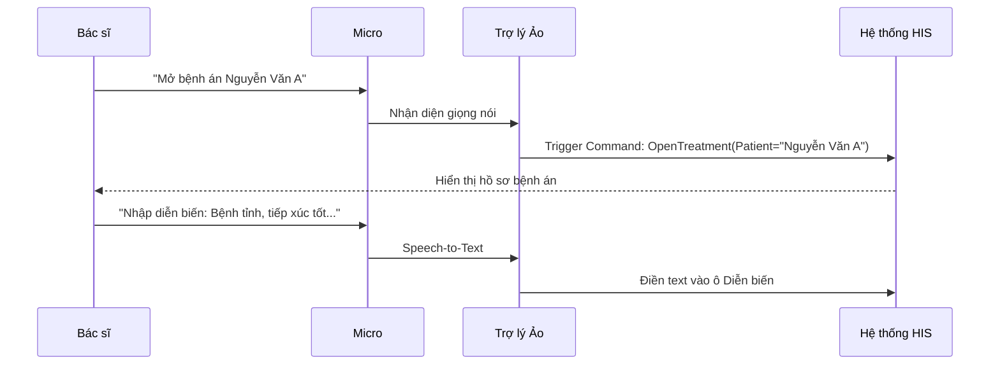

# Trợ lý Giọng nói (Voice Assistant - VVA)

## 1. Tổng quan
Phân hệ VVA (Voice Virtual Assistant) cung cấp khả năng điều khiển hệ thống HIS bằng giọng nói, giúp nhân viên y tế thao tác rảnh tay (hands-free), đặc biệt hữu ích trong các môi trường vô trùng (Phòng mổ, Phòng thủ thuật) hoặc khi đang thăm khám.

## 2. Các Tính năng Chính

### 2.1. Điều khiển Chức năng (Voice Command)
Ra lệnh mở các chức năng mà không cần dùng chuột/bàn phím.
*   **Mở Form**: "Mở bệnh án", "Mở chỉ định", "Xem kết quả xét nghiệm".
*   **Điều hướng**: "Bệnh nhân tiếp theo", "Quay lại danh sách".
*   **Tác vụ nhanh**: "Gọi số", "In phiếu chỉ định".

### 2.2. Nhập liệu Giọng nói (Speech-to-Text)
Hỗ trợ bác sĩ đọc kết quả hoặc diễn biến bệnh để hệ thống tự chuyển thành văn bản.
*   **Ứng dụng**: Nhập lời dặn bác sĩ, mô tả hình ảnh X-quang/Siêu âm, ghi chép biên bản phẫu thuật.
*   **Từ điển Y khoa**: Tối ưu hóa nhận diện các thuật ngữ chuyên ngành (Tên thuốc, tên bệnh lý).

## 3. Cấu hình & Huấn luyện
*   **Từ khóa (Keywords)**: Định nghĩa các từ khóa kích hoạt lệnh (Ví dụ: "HIS Open...").
*   **Macro**: Thiết lập các lệnh tắt cho các đoạn văn bản dài thường dùng.

## 4. Kịch bản Sử dụng

