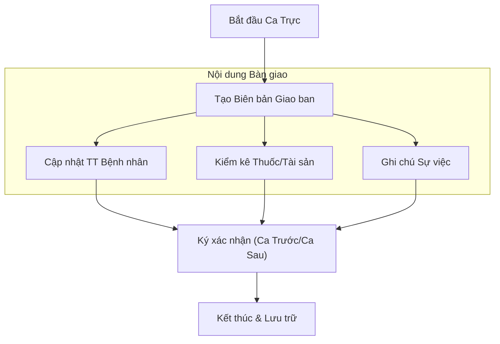

# Quản lý Giao Ban & Bàn Giao (Shift Handover) - Business Overview

## 1. Mục đích và Phạm vi
Phân hệ Giao ban (Handover) hỗ trợ quy trình bàn giao công việc, bệnh nhân và tài sản giữa các ca trực tại khoa phòng.
Phạm vi bao gồm:
*   Bàn giao bệnh nhân (Số lượng hiện diện, vào viện, ra viện, chuyển viện, tử vong, nặng xin về).
*   Bàn giao chuyên môn (Diễn biến bệnh nhân nặng, y lệnh đặc biệt).
*   Bàn giao tài sản, thuốc trực.

## 2. Quy trình Nghiệp vụ Tổng quan

## 3. Các Hoạt động Chính

### 3.1. Bàn giao Bệnh nhân (Patient Handover)
Hệ thống tự động tổng hợp số liệu từ dữ liệu bệnh án điện tử để điền vào biên bản:
*   **Tổng số bệnh nhân cũ**: Số liệu chốt từ ca trước.
*   **Biến động trong ca**: Số vào viện, ra viện, chuyển khoa, tử vong.
*   **Danh sách bệnh nhân nặng**: Các ca cần theo dõi đặc biệt (ICU, Hồi sức).
*   **Bệnh nhân phẫu thuật/thủ thuật**: Danh sách các ca mổ trong ngày.

### 3.2. Bàn giao Thuốc & Tài sản
*   **Cơ số tủ trực**: Bàn giao số lượng thuốc độc, thuốc gây nghiện, hướng thần tại tủ trực.
*   **Trang thiết bị**: Bàn giao tình trạng hoạt động của máy thở, monitor, v.v.

### 3.3. Sổ Giao ban Điện tử
*   Thay thế sổ giao ban giấy truyền thống.
*   Cho phép trưởng khoa/điều dưỡng trưởng duyệt và xem lại lịch sử giao ban bất cứ lúc nào.

## 4. Chức năng Hệ thống (Key Features)

### 4.1. Tự động Tổng hợp (Auto-Aggregation)
*   Plugin `HoreHandover` có khả năng tự động quét dữ liệu bệnh nhân tại khoa để đề xuất danh sách bàn giao, giảm thiểu thời gian viết tay cho điều dưỡng.

## 5. Liên kết Tài liệu
*   Module chính: `HIS.Desktop.Plugins.HoreHandover`, `HIS.Desktop.Plugins.HoreHandoverList`.
