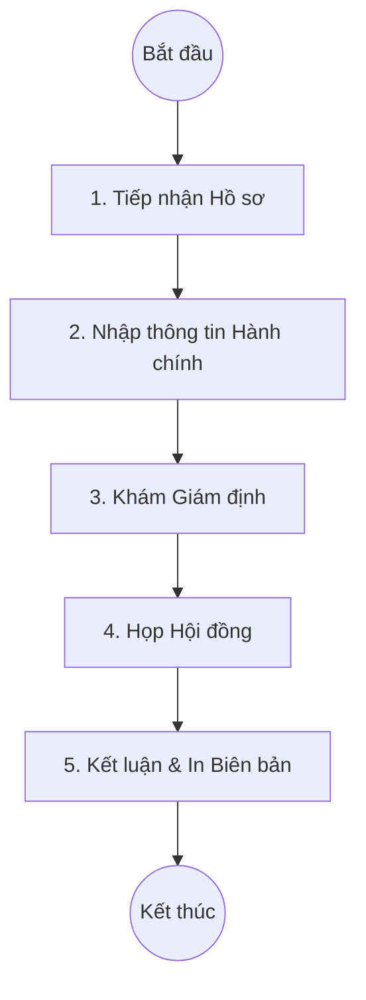

# Quy trình Giám định Y khoa (Medical Assessment)

## 1. Tổng quan
Quy trình Giám định Y khoa hỗ trợ Hội đồng Giám định Y khoa trong việc tiếp nhận hồ sơ, tổ chức khám giám định và kết luận về tỷ lệ tổn thương cơ thể hoặc khả năng lao động của đối tượng giám định.

## 2. Lưu đồ Quy trình

## 3. Chi tiết Các bước & Mapping Plugin

### 3.1. Tiếp nhận & Nhập liệu Hành chính
Tiếp nhận yêu cầu từ cơ quan giới thiệu (Công an, BHXH, Pháp y...) hoặc cá nhân.
*   **Thông tin chính**:
    *   **Cơ quan trưng cầu (`Request Org`)**: Tên, Mã cơ quan.
    *   **Đối tượng giám định (`Assessment Object`)**: Thương binh, Tai nạn lao động, Hưu trí...
    *   **Văn bản pháp lý (`Legal Ground`)**: Số văn bản, trích yếu.
*   **Plugin chính**:
    *   `HIS.Desktop.Plugins.HisMedicalAssessment`: Giao diện chính quản lý hồ sơ giám định.

### 3.2. Khám & Ghi nhận Tiền sử
Bác sĩ giám định viên thực hiện khám và ghi nhận các thông tin y khoa.
*   **Dữ liệu**:
    *   **Tiền sử bệnh (`Pathological History`)**: Quá trình điều trị trước đó.
    *   **Kết quả khám (`Examination Result`)**: Các dấu hiệu lâm sàng, cận lâm sàng hiện tại.
    *   **Tỷ lệ tổn thương cũ (`Previous Injury Rate`)**: Nếu đã từng giám định trước đây.

### 3.3. Họp Hội đồng (Assessment Council)
Hội đồng tiến hành thảo luận và bỏ phiếu thống nhất kết quả.
*   **Thành phần Hội đồng (`Assessment Member`)**:
    *   Chủ tịch Hội đồng.
    *   Thư ký.
    *   Các thành viên (Ủy viên).
*   **Chức năng**:
    *   Ghi nhận ý kiến thảo luận (`Discussion`).
    *   Ghi nhận các ý kiến không đồng thuận (nếu có).

### 3.4. Kết luận (Conclusion)
Xác định tỷ lệ tổn thương cơ thể cuối cùng.
*   **Dữ liệu đầu ra**:
    *   **Tỷ lệ tổn thương (`Injury Rate`)**: Tỷ lệ % suy giảm khả năng lao động/sức khỏe.
    *   **Kết luận (`Conclusion`)**: Văn bản kết luận cuối cùng.
    *   **Đề nghị (`Request After Assessment`)**: Các chế độ, chính sách đề xuất.

## 4. Dữ liệu Đầu ra
*   **Biên bản Giám định Y khoa**: In từ hệ thống, có đủ chữ ký của Hội đồng.
*   **Giấy Chứng nhận**: Trả cho đối tượng giám định/cơ quan trưng cầu.

## 5. Liên kết Tài liệu
*   [Danh mục Đối tượng Giám định](../administration/03-system-data-business.md)
