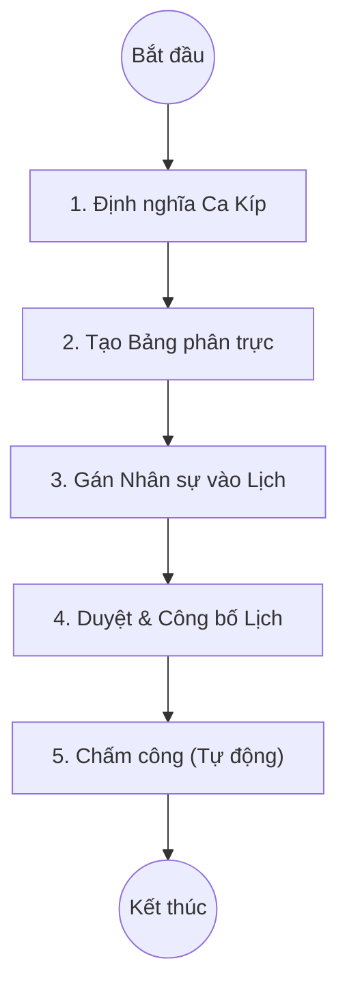

# Quy trình Phân lịch trực (Duty Rostering)

## 1. Tổng quan
Quy trình Phân lịch trực cho phép quản lý ca làm việc, phân công nhân sự trực (bác sĩ, điều dưỡng, nhân viên khác) theo ngày, tuần hoặc tháng tại các khoa phòng.

## 2. Lưu đồ Quy trình

## 3. Chi tiết Các bước & Mapping Plugin

### 3.1. Định nghĩa Ca Kíp (Shift Definition)
Thiết lập các khung giờ làm việc và loại ca trực.
*   **Plugin chính**:
    *   `HIS.Desktop.Plugins.HisWorkingShift`: Quản lý danh mục ca làm việc (Sáng, Chiều, Đêm, Trực 24h...).
    *   **Thông tin cấu hình**: Giờ bắt đầu, Giờ kết thúc, Số giờ công quy đổi.

### 3.2. Tạo và Phân lịch (Rostering)
Lãnh đạo khoa hoặc Thư ký khoa thực hiện xếp lịch cho nhân viên.
*   **Plugin chính**:
    *   `HIS.Desktop.Plugins.HisEmployeeSchedule`: Giao diện lịch trực quan (Lịch tháng/tuần).
    *   **Chức năng**:
        *   Chọn khoa phòng.
        *   Kéo thả nhân viên vào ngày và ca trực tương ứng.
        *   Copy lịch từ tuần trước/tháng trước.

### 3.3. Duyệt Lịch (Approval)
Lịch trực sau khi xếp xong cần được Lãnh đạo bệnh viện hoặc Phòng Kế hoạch Tổng hợp phê duyệt mới có hiệu lực.
*   **Tác động**:
    *   Lịch đã duyệt sẽ là cơ sở để tính công và thù lao trực.
    *   Nhân viên có thể xem lịch trực của mình trên hệ thống.

### 3.4. Bàn giao Ca trực (Shift Handover)
Nhân viên thực hiện bàn giao công việc và người bệnh khi hết ca.
*   *Chi tiết xem tại tài liệu [Bàn giao ca Trực](./07-shift-handover.md)*.

## 4. Dữ liệu Đầu ra
*   **Bảng phân trực**: Danh sách nhân sự trực theo ngày.
*   **Dữ liệu chấm công**: Báo cáo tổng hợp số công/giờ làm việc thực tế.

## 5. Liên kết Tài liệu
*   [Quy trình Bàn giao ca Trực](./07-shift-handover.md)
*   [Quản lý Nhân sự (Danh mục)](./01-access-control-business.md)
