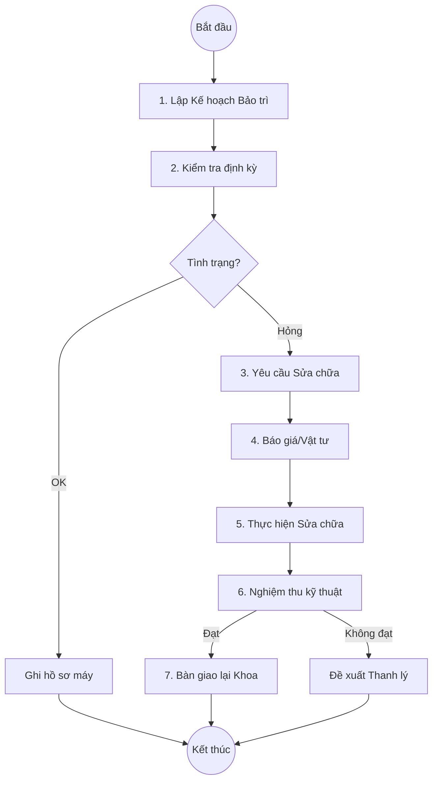

# Quy trình Bảo trì & Sửa chữa Thiết bị (Maintenance Cycle)

## 1. Tổng quan
Đảm bảo trang thiết bị y tế luôn trong tình trạng hoạt động tốt, giảm thiểu thời gian ngừng máy (downtime) thông qua việc bảo trì định kỳ và sửa chữa kịp thời.

## 2. Lưu đồ Quy trình

## 3. Các Hoạt động Chính

### 3.1. Bảo trì Định kỳ (Preventive Maintenance)
*   **Lập lịch**: Theo dõi hạn bảo trì của từng máy (3 tháng, 6 tháng, 1 năm).
*   **Nhắc nhở**: Hệ thống cảnh báo các thiết bị sắp đến hạn bảo dưõng.
*   **Plugin chính**:
    *   `HIS.Desktop.Plugins.Machine`: Tab Bảo trì/Lịch sử.

### 3.2. Sửa chữa & Thay thế (Corrective Maintenance)
Khi máy phát sinh sự cố bất ngờ:
1.  Khoa sử dụng báo hỏng.
2.  Phòng Vật tư kiểm tra.
3.  Xuất linh kiện thay thế hoặc gọi đơn vị bên ngoài.
*   **Plugin chính**:
    *   `HIS.Desktop.Plugins.MaterialType` (Linh kiện): Quản lý vật tư thay thế.

### 3.3. Theo dõi Hoạt động (Usage Log)
Ghi nhận số giờ hoạt động hoặc số mẫu đã chạy (với máy xét nghiệm) để tính toán khấu hao và định mức bảo trì.
*   **Plugin chính**:
    *   `HIS.Desktop.Plugins.LisMachine`: Liên kết dữ liệu máy xét nghiệm.

## 4. Hồ sơ Thiết bị (Logbook)
Mỗi máy có một "Lý lịch thiết bị" ghi lại toàn bộ:
*   Ngày nhập, giá trị.
*   Lịch sử di chuyển.
*   Lịch sử hư hỏng và sửa chữa.
*   Biên bản kiểm định an toàn/chất lượng.
