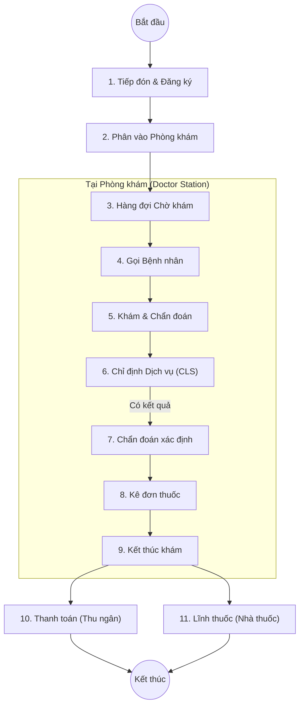

# Quy trình Khám bệnh Ngoại trú (Outpatient Examination)

## 1. Tổng quan
Quy trình Khám bệnh ngoại trú là một trong những luồng nghiệp vụ quan trọng nhất của HIS, phục vụ việc tiếp nhận người bệnh, thực hiện khám, chỉ định dịch vụ và kê đơn thuốc cho bệnh nhân không nằm viện.

## 2. Lưu đồ Quy trình (Flowchart)

## 3. Chi tiết Các bước & Mapping Plugin

### 3.1. Tiếp đón & Đăng ký (Reception)
Nhân viên tiếp đón nhập thông tin hành chính, tra cứu thẻ BHYT và đăng ký dịch vụ khám.

*   **Plugin chính**:
    *   `HIS.Desktop.Plugins.RegisterV3`: Giao diện đăng ký khám bệnh phiên bản mới nhất (thường dùng).
    *   `HIS.Desktop.Plugins.Register`: (Cũ hơn) Giao diện đăng ký cơ bản.
    *   `HIS.Desktop.Plugins.RegisterExamKiosk`: Đăng ký tự động tại Kiosk.
    *   `HIS.Desktop.Plugins.CheckInfoBHYT`: Kiểm tra thông tin thẻ BHYT trên cổng giám định.

### 3.2. Phân buồng & Hàng đợi (Queue)
Hệ thống tự động cấp số thứ tự và đẩy bệnh nhân vào hàng đợi của phòng khám tương ứng.

*   **Plugin chính**:
    *   `HIS.Desktop.Plugins.CallPatientV8` (hoặc V3, V4, V5...): Module gọi bệnh nhân tại phòng khám.
    *   `HIS.Desktop.Plugins.RegisterReqNumOrder`: Quản lý số thứ tự khám.

### 3.3. Khám bệnh (Examination)
Bác sĩ thực hiện khám lâm sàng, ghi nhận tiền sử bệnh, triệu chứng và các chỉ số sinh tồn.

*   **Plugin chính**:
    *   `HIS.Desktop.Plugins.ExamServiceReqExecute`: **Module lõi** xử lý toàn bộ nghiệp vụ tại phòng khám (Khám, Bệnh án, Xử trí).
    *   `HIS.Desktop.Plugins.ExaminationReqEdit`: Chỉnh sửa yêu cầu khám.
    *   `HIS.Desktop.Plugins.Dhst`: Nhập dấu hiệu sinh tồn (Mạch, Nhiệt, Huyết áp...).
    *   `HIS.Desktop.Plugins.Icd`: Tra cứu và chẩn đoán theo mã ICD-10.

### 3.4. Chỉ định Dịch vụ (Service Assignment)
Bác sĩ chỉ định các dịch vụ cận lâm sàng (Xét nghiệm, X-Quang, Siêu âm...) để hỗ trợ chẩn đoán.

*   **Plugin chính**:
    *   `HIS.Desktop.Plugins.AssignService`: Giao diện chỉ định dịch vụ CLS.
    *   `HIS.Desktop.Plugins.AssignServiceTest`: Chỉ định xét nghiệm nhanh.
    *   `HIS.Desktop.Plugins.Debate`: Quản lý hội chẩn (nếu ca bệnh khó).

### 3.5. Kê đơn thuốc (Prescription)
Sau khi có chẩn đoán xác định, bác sĩ kê đơn thuốc cho bệnh nhân về nhà điều trị.

*   **Plugin chính**:
    *   `HIS.Desktop.Plugins.AssignPrescriptionPK`: Kê đơn thuốc tại Phòng Khám (PK).
    *   `HIS.Desktop.Plugins.PrescriptionList`: Danh sách đơn thuốc đã kê.
    *   `HIS.Desktop.Plugins.DrugInterventionInfo`: Cảnh báo tương tác thuốc.

### 3.6. Kết thúc & Hướng xử trí
Bác sĩ chọn hướng xử trí cuối cùng cho bệnh nhân.

*   **Plugin chính**:
    *   `HIS.Desktop.Plugins.TreatmentFinish`: Kết thúc đợt điều trị ngoại trú.
    *   **Các hướng xử trí**:
        *   *Cấp toa về*: Bệnh nhân mua thuốc và ra về.
        *   *Nhập viện*: Chuyển sang luồng nội trú (`HIS.Desktop.Plugins.TranPatiToInfo`).
        *   *Chuyển tuyến*: Chuyển lên tuyến trên.

## 4. Dữ liệu Đầu vào & Đầu ra

### Đầu vào
*   Thông tin bệnh nhân (Họ tên, Tuổi, BHYT).
*   Lịch sử khám bệnh cũ.

### Đầu ra
*   **Phiếu khám bệnh**: Ghi nhận tình trạng và chẩn đoán.
*   **Phiếu chỉ định**: Yêu cầu CLS.
*   **Đơn thuốc**: Danh sách thuốc cần mua/lĩnh.
*   **Dữ liệu XML 130/4210**: Gửi lên cổng BHYT.

## 5. Liên kết Tài liệu
*   [Quy trình Chỉ định CLS](./02-service-indication.md)
*   [Quy trình Dược - Xuất ngoại trú](../pharmacy/01-business-overview.md#33-xuất-kho-export)
