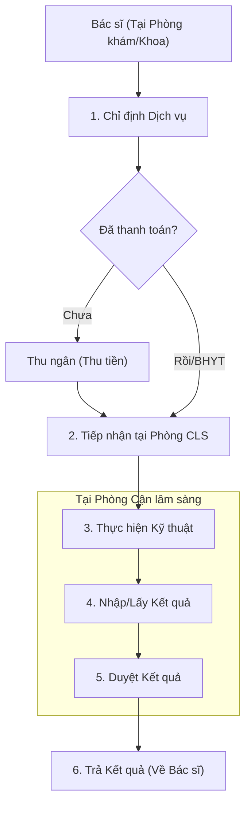

# Quy trình Chỉ định & Trả kết quả Cận lâm sàng (Subclinical Process)

## 1. Tổng quan
Quy trình mô tả các bước từ khi Bác sĩ ra y lệnh chỉ định (Xét nghiệm, Chẩn đoán hình ảnh, Thăm dò chức năng) đến khi nhận được kết quả trên hệ thống.

## 2. Lưu đồ Quy trình

## 3. Chi tiết Các bước

### 3.1. Chỉ định Dịch vụ (Indication)
Bác sĩ chọn các dịch vụ kỹ thuật cần thực hiện cho bệnh nhân. Hệ thống tự động cảnh báo các quy tắc giám định BHYT (trái tuyến, vượt trần, chỉ định trùng lắp).

*   **Plugin chính**:
    *   `HIS.Desktop.Plugins.AssignService`: Giao diện chỉ định tổng hợp (XN, CĐHA, TDCN).
    *   `HIS.Desktop.Plugins.AssignServiceTest`: Giao diện chỉ định nhanh cho Xét nghiệm (thường dùng form cây thư mục).
    *   `HIS.Desktop.Plugins.AssignServiceTestMulti`: Chỉ định theo gói hoặc nhiều nhóm cùng lúc.
    *   `HIS.Desktop.Plugins.Debate`: Hội chẩn để duyệt các kỹ thuật cao/chi phí lớn.

### 3.2. Tiếp nhận & Thực hiện (Reception & Execution)
Bệnh nhân đến phòng lấy mẫu hoặc phòng chụp chiếu. KTV xác nhận bệnh nhân đã đến.

*   **Plugin chính**:
    *   `HIS.Desktop.Plugins.SampleCollectionRoom`: Phòng lấy mẫu xét nghiệm (in barcode).
    *   `HIS.Desktop.Plugins.DiimRoom`: Phòng Chẩn đoán hình ảnh (X-Quang, CT, MRI). ("Diim" = Diagnostic Imaging).
    *   `HIS.Desktop.Plugins.FuntionalExploration`: Phòng Thăm dò chức năng (Nội soi, Điện tim...).

### 3.3. Nhập và Duyệt Kết quả (Entry & Approval)
Kết quả có thể được nhập thủ công hoặc đẩy tự động từ máy (đối với LIS/PACS).

*   **Plugin chính**:
    *   `HIS.Desktop.Plugins.ServiceReqResult`: Màn hình nhập trả kết quả chung.
    *   `HIS.Desktop.Plugins.ServiceReqResultView`: Xem lịch sử kết quả.
    *   `HIS.Desktop.Plugins.LisMachineResult`: Kết quả từ máy xét nghiệm (LIS).
    *   `HIS.Desktop.Plugins.PacsOne`: Kết nối hệ thống PACS để xem hình ảnh DICOM.

### 3.4. Mô hình Kết nối Máy (Integration)
*   **LIS (Laboratory)**: Kết nối 2 chiều (Chỉ định -> Máy, Kết quả -> Máy -> HIS).
*   **PACS/RIS**: HIS gửi chỉ định (HL7/Worklist) -> Máy chụp -> PACS lưu ảnh -> HIS nhận link xem ảnh.

## 4. Dữ liệu & Báo cáo
*   **Phiếu chỉ định**: In phiếu để bệnh nhân đi làm dịch vụ.
*   **Phiếu kết quả**: In trả cho bệnh nhân (có chữ ký số của Bác sĩ chuyên khoa).
*   **Sổ tổng hợp thực hiện**: Báo cáo số lượng ca thực hiện để tính công thủ thuật.

## 5. Liên kết Tài liệu
*   [Quy trình Khám bệnh Ngoại trú](./01-outpatient-examination.md)
*   [Thiết kế Kỹ thuật LIS](../../../03-technical-specs/laboratory/02-technical-design.md)
