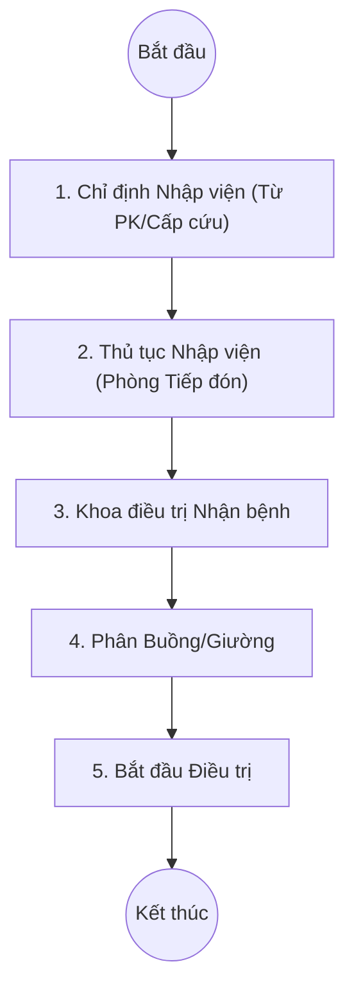

# Quy trình Nhập viện Nội trú (Inpatient Admission)

## 1. Tổng quan
Quy trình mô tả các bước từ khi bệnh nhân được chỉ định nhập viện (từ Phòng khám, Cấp cứu hoặc Tiếp nhận trực tiếp) đến khi được phân giường tại khoa điều trị.

## 2. Lưu đồ Quy trình

## 3. Chi tiết Các bước & Mapping Plugin

### 3.1. Quyết định Nhập viện (Admission Decision)
Bác sĩ khám bệnh ra quyết định cho bệnh nhân nhập viện.
*   **Plugin nguồn**:
    *   `HIS.Desktop.Plugins.TreatmentFinish` (Tại phòng khám): Chọn hướng xử trí là "Nhập viện".
    *   `HIS.Desktop.Plugins.TranPatiToInfo`: Nhập thông tin chuyển tuyến/nhập viện.

### 3.2. Thủ tục Nhập viện (Admission Procedure)
Nhân viên phòng Kế hoạch tổng hợp hoặc Tiếp đón nội trú làm thủ tục hành chính, đóng tạm ứng nhập viện.
*   **Plugin chính**:
    *   `HIS.Desktop.Plugins.Hospitalize`: Quản lý thông tin hồ sơ nhập viện, số bệnh án.
    *   `HIS.Desktop.Plugins.TransactionDeposit`: Thu tiền tạm ứng nhập viện.

### 3.3. Khoa Nhận bệnh (Department Reception)
Điều dưỡng tại khoa lâm sàng xác nhận bệnh nhân đã về khoa.
*   **Plugin chính**:
    *   `HIS.Desktop.Plugins.DepartmentTranReceive`: Tiếp nhận bệnh nhân chuyển khoa/nhập viện mới.
    *   `HIS.Desktop.Plugins.TreatmentList`: Danh sách bệnh nhân đang điều trị tại khoa.

### 3.4. [Phân Buồng/Giường (Bed Allocation)](./07-bed-management.md)
Điều dưỡng trưởng hoặc hành chính khoa xếp giường cho bệnh nhân.
*   **Plugin chính**:
    *   `HIS.Desktop.Plugins.BedAssign`: Giao diện xếp giường (kéo thả).
    *   `HIS.Desktop.Plugins.BedRoomPartial`: Quản lý sơ đồ giường bệnh (Đã sử dụng, Trống, Hỏng).
    *   `HIS.Desktop.Plugins.BedLog`: Lịch sử nằm giường (để tính tiền giường chi tiết theo thời gian).

### 3.5. Quản lý Buồng bệnh (Ward Management)
Các tác vụ quản lý hạ tầng buồng bệnh.
*   **Plugin chính**:
    *   `HIS.Desktop.Plugins.BedType`: Cấu hình loại giường (Giường thường, Hồi sức, Ghép).
    *   `HIS.Desktop.Plugins.BedHistory`: Tra cứu lịch sử luân chuyển giường của BN.

## 4. Dữ liệu Đầu ra
*   **Hồ sơ bệnh án nội trú**: Được khởi tạo số lưu trữ.
*   **Thẻ chăm sóc/Công khai thuốc**: Bắt đầu ghi nhận từ thời điểm nhận giường.
*   **Phí giường bệnh**: Tự động tính từ lúc xếp giường đến lúc chuyển/xuất.

## 5. Liên kết Tài liệu
*   [Quy trình Khám bệnh Ngoại trú](./01-outpatient-examination.md) (Nguồn đầu vào chính).
*   [Quy trình Điều trị Hàng ngày](./04-daily-treatment.md).
