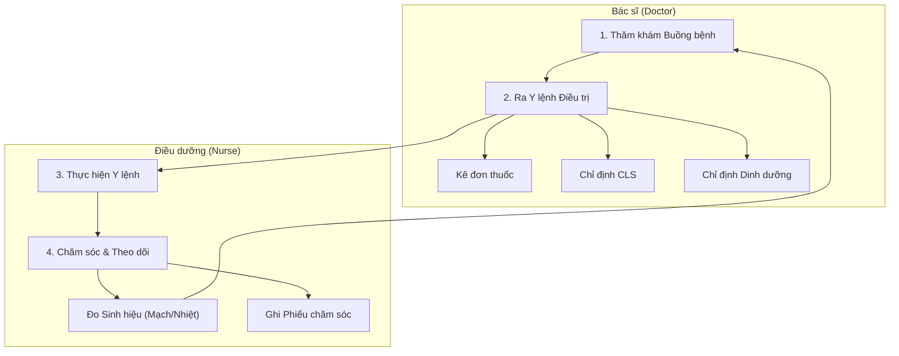

# Quy trình Điều trị & Chăm sóc Hàng ngày (Daily Treatment & Care)

## 1. Tổng quan
Quy trình mô tả các hoạt động chuyên môn diễn ra hàng ngày tại khoa điều trị nội trú, bao gồm thăm khám, ra y lệnh của Bác sĩ và thực hiện chăm sóc của Điều dưỡng.

## 2. Lưu đồ Quy trình

## 3. Chi tiết Các bước & Mapping Plugin

### 3.1. Quản lý Danh sách Người bệnh (Patient List)
Màn hình trung tâm của khoa lâm sàng, hiển thị danh sách bệnh nhân đang nằm viện.
*   **Plugin chính**:
    *   `HIS.Desktop.Plugins.TreatmentList`: Danh sách bệnh nhân nội trú (Hiện diện, Chuyển đi, Ra viện).
    *   `HIS.Desktop.Plugins.TreatmentBedRoomList`: Danh sách theo buồng/giường.

### 3.2. Ra Y lệnh Điều trị (Medical Orders)
Bác sĩ thực hiện ra y lệnh cho bệnh nhân trên tờ điều trị.
*   **Plugin chính**:
    *   `HIS.Desktop.Plugins.ServiceExecute` (hoặc `TreatmentDetail`): Giao diện xử lý y lệnh nội trú.
    *   `HIS.Desktop.Plugins.AssignPrescription`: Kê đơn thuốc nội trú (Thuốc viên, Thuốc tiêm, Truyền dịch).
    *   `HIS.Desktop.Plugins.AssignService`: Chỉ định cận lâm sàng (Xét nghiệm máu, X-Quang...).
    *   `HIS.Desktop.Plugins.AntibioticRequest`: Yêu cầu duyệt kháng sinh (Hội chẩn kháng sinh).

### 3.2a. Hội chẩn & Duyệt chuyên môn (Professional Consultation)
Quy trình hội chẩn khi bệnh nhân có diễn biến phức tạp hoặc cần dùng thuốc/phẫu thuật đặc biệt.

#### Quy trình Hội chẩn (`Debate`)
1.  **Lập Biên bản Hội chẩn**: Bác sĩ điều trị tạo yêu cầu hội chẩn.
    *   **Loại hội chẩn**: Tại khoa, Liên khoa, Toàn viện.
    *   **Thành phần tham gia**: Chủ tọa, Thư ký, Các thành viên.
2.  **Kết luận Hội chẩn (`DebateDiagnostic`)**:
    *   Thống nhất chẩn đoán (ICD-10).
    *   Phương hướng điều trị (Phẫu thuật, Chuyển viện...).
3.  **Plugin chính**:
    *   `HIS.Desktop.Plugins.Debate`: Quản lý danh sách biên bản hội chẩn.
    *   `HIS.Desktop.Plugins.DebateDiagnostic`: Ghi nhận chẩn đoán và hướng xử trí sau hội chẩn.
    *   `HIS.Desktop.Plugins.HisDebateReason`: Cấu hình lý do hội chẩn (Khó chẩn đoán, Tiên lượng nặng, Duyệt phẫu thuật).

#### Duyệt Kháng sinh hạn chế (`AntibioticRequest`)
Một số loại kháng sinh cao cấp cần phải thông qua hội chẩn hoặc duyệt của Dược lâm sàng mới được phép kê đơn.
1.  Bác sĩ kê đơn kháng sinh thuộc danh mục cảnh báo.
2.  Hệ thống yêu cầu lập phiếu "Đánh giá sử dụng kháng sinh".
3.  Lãnh đạo khoa/Dược lâm sàng phê duyệt phiếu trên hệ thống.
4.  Sau khi duyệt, bác sĩ mới có thể ký thực hiện y lệnh.

### 3.3. Chăm sóc & Theo dõi (Nursing Care)
Điều dưỡng thực hiện các y lệnh và ghi chép phiếu chăm sóc.
*   **Plugin chính**:
    *   `HIS.Desktop.Plugins.CareCreate`: Tạo và ghi phiếu chăm sóc hàng ngày.
    *   `HIS.Desktop.Plugins.CareSlipList`: Danh sách phiếu chăm sóc.
    *   `HIS.Desktop.Plugins.Dhst`: Nhập dấu hiệu sinh tồn (Mạch, Nhiệt độ, Huyết áp, Nhịp thở).
    *   `HIS.Desktop.Plugins.InfusionList`: Theo dõi truyền dịch.

### 3.4. Quản lý Dinh dưỡng & Vật tư
*   **Plugin chính**:
    *   `HIS.Desktop.Plugins.AssignNutrition`: Báo ăn, chỉ định chế độ ăn bệnh lý (Cháo, Cơm, Súp...).
    *   `HIS.Desktop.Plugins.MestExportRoom` (hoặc tương tự): Lĩnh vật tư tiêu hao cho khoa phòng.

### 3.5. Quản lý Tử vong (Death Management)
Trường hợp bệnh nhân tử vong, quy trình hệ thống đảm bảo các thủ tục pháp lý và hành chính.
*   **Ghi nhận Tử vong (`DeathInformation`)**:
    *   Thời gian chết, nguyên nhân chết (mã ICD-10 tử vong).
    *   Phân loại tử vong (Trước/Trong/Sau 24h nhập viện).
    *   Kiểm thảo tử vong: Biên bản họp hội đồng chuyên môn về nguyên nhân tử vong.

## 4. Dữ liệu Đầu ra
*   **Tờ điều trị**: Lưu lịch sử y lệnh theo ngày.
*   **Phiếu chăm sóc**: Lưu quá trình chăm sóc của điều dưỡng.
*   **Biểu đồ sinh tồn**: Vẽ biểu đồ diễn biến sức khỏe.
*   **Phiếu công khai thuốc**: Dùng để thanh toán viện phí.

## 5. Liên kết Tài liệu
*   [Quy trình Nhập viện](./03-inpatient-admission.md)
*   [Quy trình Xuất viện/Chuyển viện](./05-discharge-transfer.md)
