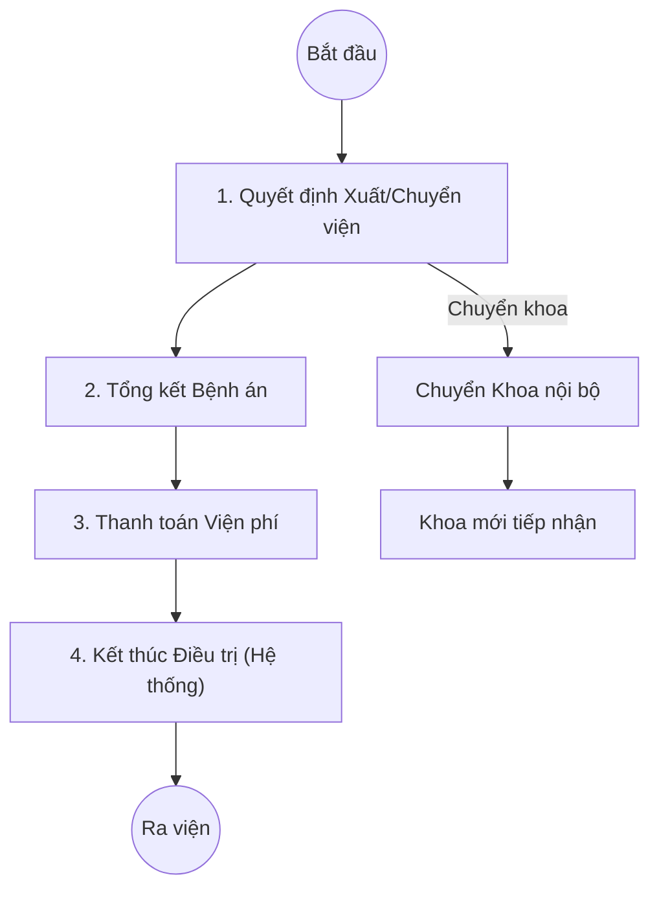

# Quy trình Xuất viện & Chuyển viện (Discharge & Transfer)

## 1. Tổng quan
Quy trình mô tả các bước kết thúc đợt điều trị nội trú để bệnh nhân ra viện, hoặc chuyển sang khoa phòng/tuyến khác.

## 2. Lưu đồ Quy trình

## 3. Chi tiết Các bước & Mapping Plugin

### 3.1. Quyết định & Tổng kết Bệnh án
Bác sĩ quyết định cho bệnh nhân xuất viện hoặc chuyển tuyến. Tiến hành tổng kết hồ sơ.
*   **Plugin chính**:
    *   `HIS.Desktop.Plugins.TreatmentFinish`: Màn hình xử lý kết thúc điều trị.
    *   `HIS.Desktop.Plugins.TreatmentEndType`: Chọn loại kết thúc (Ra viện, Chuyển viện, Trốn viện, Tử vong, Chuyển khoa).
    *   `HIS.Desktop.Plugins.SummaryInforTreatmentRecords`: Mô tả tóm tắt bệnh án, quá trình điều trị.

### 3.2. Chuyển Khoa (Internal Transfer)
Chuyển bệnh nhân sang khoa khác để tiếp tục điều trị.
*   **Plugin chính**:
    *   `HIS.Desktop.Plugins.TranPatiTech`: Chuyển khoa (Transfer Department).
    *   `HIS.Desktop.Plugins.DepartmentTranReceive`: Khoa mới xác nhận nhận bệnh nhân.

### 3.3. Chuyển Tuyến/Chuyển Viện (External Transfer)
Chuyển bệnh nhân lên tuyến trên hoặc sang bệnh viện khác.
*   **Plugin chính**:
    *   `HIS.Desktop.Plugins.TranPatiToInfo`: Nhập thông tin giấy chuyển tuyến (Lý do chuyển, Tuyến chuyên môn kỹ thuật...).
    *   `HIS.Desktop.Plugins.TranPatiDocumentInfo`: Thông tin giấy tờ đi kèm.

### 3.4. Tử vong (Death)
Xử lý trường hợp bệnh nhân tử vong tại viện.
*   **Plugin chính**:
    *   `HIS.Desktop.Plugins.DeathInformationList`: Ghi nhận thông tin tử vong (Thời gian, Nguyên nhân).
    *   `HIS.Desktop.Plugins.TytDeath`: Báo cáo tử vong (liên thông Y tế dự phòng/Dân số).

### 3.5. Thanh toán và Kết thúc (Checkout)
Sau khi hoàn tất thủ tục chuyên môn và tài chính, hồ sơ được đóng lại.
*   **Plugin chính**:
    *   `HIS.Desktop.Plugins.TreatmentFinish`: Khóa hồ sơ, đặt trạng thái "Đã ra viện".
    *   `HIS.Desktop.Plugins.TransactionBill`: Thanh toán và xuất hóa đơn cuối cùng (nếu có).

## 4. Dữ liệu Đầu ra
*   **Giấy Ra viện**: In từ hệ thống.
*   **Giấy Chuyển tuyến**: In theo mẫu BHYT.
*   **Giấy Báo tử**: Nếu tử vong.
*   **Tóm tắt hồ sơ bệnh án**: XML tổng kết.

## 5. Liên kết Tài liệu
*   [Quy trình Thanh toán Viện phí](../finance/01-cashier-payment.md) (Sẽ bổ sung ở Giai đoạn 2).
