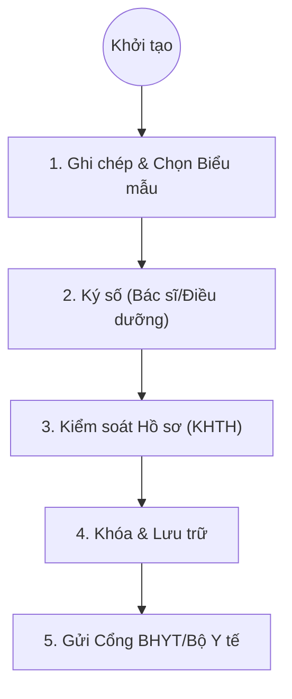

# Quản lý Hồ sơ Bệnh án Điện tử (EMR) - Business Overview

## 1. Tổng quan
Quy trình mô tả vòng đời của một hồ sơ bệnh án điện tử, từ khi khởi tạo, ghi chép biểu mẫu, ký số pháp lý đến khi lưu trữ vĩnh viễn và gửi lên các kho dữ liệu quốc gia.

## 2. Lưu đồ Quy trình

## 3. Chi tiết Các bước & Mapping Plugin

### 3.1. Ghi chép và Quản lý Biểu mẫu (Documentation)
Bác sĩ và Điều dưỡng chọn các biểu mẫu phù hợp (theo quy chế Bộ Y tế) để ghi chép.
*   **Plugin chính**:
    *   `EMR.Desktop.Plugins.EmrDocumentList`: Danh sách các tài liệu trong hồ sơ bệnh án.
    *   `EMR.Desktop.Plugins.DocumentEdit`: Trình soạn thảo văn bản EMR (tương tự Word nhưng có cấu trúc).
    *   `HIS.Desktop.Plugins.EmrForm`: Quản lý danh mục các loại biểu mẫu (Tờ điều trị, Phiếu phẫu thuật, Biên bản hội chẩn...).
    *   `HIS.Desktop.Plugins.EmrCoverType`: Quản lý vỏ bệnh án (Nội khoa, Ngoại khoa, Sản khoa...).

### 3.2. Ký số (Digital Signature)
Ký số xác thực giá trị pháp lý của tài liệu. Hỗ trợ ký đơn (Bác sĩ điều trị) và ký trình ký (Lãnh đạo khoa/Lãnh đạo viện).
*   **Plugin chính**:
    *   `EMR.Desktop.Plugins.EmrSign`: Module thực hiện ký số (kết nối USB Token, Sim CA, hoặc HSM).
    *   `EMR.Desktop.Plugins.EmrSignerFlow`: Cấu hình luồng trình ký (Bác sĩ -> Trưởng khoa -> Giám đốc).
    *   `EMR.Desktop.Plugins.EmrViewerReq`: Xem lại file PDF đã ký.

### 3.3. Kiểm soát & Phê duyệt (Quality Control)
Phòng Kế hoạch Tổng hợp (KHTH) rà soát tính chính xác và đầy đủ của hồ sơ trước khi đóng.
*   **Plugin chính**:
    *   `EMR.Desktop.Plugins.EmrApproveViewer`: Giao diện duyệt hồ sơ cho phòng KHTH.
    *   `HIS.Desktop.Plugins.TreatmentRecordChecking`: Công cụ kiểm tra logic hồ sơ (thiếu chữ ký, thiếu thông tin hành chính).

### 3.4. Lưu trữ và Kết xuất (Archiving & Export)
Sau khi hoàn tất, hồ sơ được khóa lại (không thể chỉnh sửa) và lưu trữ.
*   **Plugin chính**:
    *   `HIS.Desktop.Plugins.EmrConnector`: Kết nối gửi dữ liệu sang các hệ thống khác (Kho hồ sơ số, BHXH).
    *   `HIS.Desktop.Plugins.ExportXmlQD130`: Xuất dữ liệu quyết toán BHYT chuẩn 130.

## 4. Các Loại Biểu mẫu Chính
Hệ thống hỗ trợ đầy đủ các biểu mẫu theo Quyết định 4069/2001/QĐ-BYT và các văn bản sửa đổi:
*   Bệnh án Nội trú (các chuyên khoa).
*   Phiếu điều trị, Phiếu chăm sóc.
*   Biên bản hội chẩn, Giấy duyệt mổ.
*   Phiếu công khai thuốc vật tư.
*   Giấy ra viện, Giấy chứng sinh/báo tử.

## 5. Liên kết Tài liệu
*   [Thiết kế Kỹ thuật EMR](../../../03-technical-specs/emr/02-technical-design.md) (Cần bổ sung nếu chưa có).
