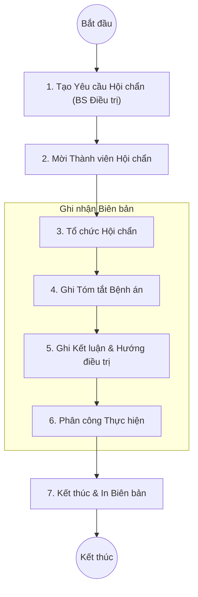

# Quy trình Hội chẩn (Consultation / Debate)

## 1. Tổng quan
Quy trình Hội chẩn (Consultation) trong HIS hỗ trợ bác sĩ lâm sàng tạo yêu cầu hội chẩn khi gặp ca bệnh khó, phức tạp, cần ý kiến chuyên môn từ nhiều chuyên khoa khác hoặc từ hội đồng chuyên môn (Hội chẩn viện, Hội chẩn liên viện).

## 2. Lưu đồ Quy trình

## 3. Chi tiết Các bước & Mapping Plugin

### 3.1. Tạo Yêu cầu Hội chẩn (Create Request)
Bác sĩ điều trị tại khoa lâm sàng tạo phiếu yêu cầu hội chẩn từ hồ sơ bệnh án.
*   **Plugin chính**:
    *   `HIS.Desktop.Plugins.Debate`: Giao diện quản lý danh sách các cuộc hội chẩn của bệnh nhân.
    *   **Chức năng**:
        *   Chọn loại hội chẩn (Khoa, Liên khoa, Toàn viện).
        *   Nhập lý do hội chẩn.

### 3.2. Quản lý Thành viên (Council Management)
Xác định thành phần tham gia hội chẩn.
*   **Plugin chính**:
    *   `HIS.Desktop.Plugins.Debate` (Tab Thành viên):
        *   **Chủ tọa**: Người chủ trì.
        *   **Thư ký**: Người ghi biên bản.
        *   **Thành viên**: Các bác sĩ tham gia.
    *   `HIS.Desktop.Plugins.ConfigAppUser`: Hỗ trợ chọn nhanh danh sách bác sĩ trong viện.

### 3.3. Ghi nhận Biên bản Hội chẩn (Minutes Recording)
Thư ký cuộc họp ghi lại nội dung chi tiết vào phần mềm.
*   **Plugin chính**:
    *   `HIS.Desktop.Plugins.DebateDiagnostic`: Module chẩn đoán và kết luận hội chẩn.
    *   **Thông tin ghi nhận**:
        *   **Tóm tắt diễn biến bệnh**: Tiền sử, bệnh sử, quá trình điều trị.
        *   **Kết quả CLS**: Các chỉ số xét nghiệm, chẩn đoán hình ảnh quan trọng.
        *   **Chẩn đoán Hội chẩn**: ICD-10 và chẩn đoán phân biệt.
        *   **Kết luận**: Phương pháp điều trị thống nhất (Phẫu thuật, Chuyển tuyến, Điều trị nội khoa...).

### 3.4. In ấn và Lưu trữ
*   **Biểu mẫu**: In "Biên bản Hội chẩn" để kẹp vào hồ sơ bệnh án.
*   **Plugin chính**:
    *   `HIS.Desktop.Plugins.Debate` (Chức năng In): Hỗ trợ in theo mẫu quy định của Bộ Y tế.

## 4. Dữ liệu Đầu ra
*   **Biên bản Hội chẩn**: Văn bản pháp lý ghi nhận ý kiến tập thể.
*   **Hướng điều trị mới**: Cập nhật vào Y lệnh hàng ngày của bệnh nhân (VD: Chỉ định mổ sau hội chẩn).

## 5. Liên kết Tài liệu
*   [Quy trình Điều trị Nội trú](./04-daily-treatment.md)
*   [Quy trình Phẫu thuật (Duyệt mổ)](../specialized/01-surgery-management.md)
