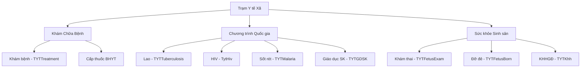

# Y tế Xã/Phường (Commune Health) - Business Overview

## 1. Mục đích và Phạm vi
Phân hệ Y tế Xã/Phường (TYT) được thiết kế để phục vụ công tác khám chữa bệnh ban đầu và quản lý các chương trình y tế quốc gia tại tuyến cơ sở.
Phạm vi bao gồm:
*   **Khám chữa bệnh BHYT & Dịch vụ**: Quản lý khám bệnh thông thường tại trạm.
*   **Quản lý Sức khỏe cộng đồng**: Tuyên truyền, giáo dục sức khỏe (GDSK).
*   **Thống kê báo cáo**: Báo cáo tử vong, báo cáo bệnh truyền nhiễm.

## 2. Các Quy trình Chính
Dựa trên mã nguồn hệ thống (`TYT.Desktop.Plugins.*`), trạm y tế thực hiện các chức năng sau:

### 2.1. Khám chữa bệnh tại Trạm (`TYTTreatment`)
Quy trình tương tự như khám ngoại trú nhưng đơn giản hóa:
1.  **Tiếp đón**: Đăng ký người bệnh (dùng chung `HIS.Desktop.Plugins.Register` hoặc module riêng).
2.  **Khám bệnh**: Bác sĩ trạm khám, chẩn đoán, kê đơn.
3.  **Cấp thuốc**: Xuất thuốc từ tủ thuốc trạm y tế.

### 2.2. Giáo dục Sức khỏe (`TYTGDSK`)
*   Quản lý các đợt truyền thông, giáo dục sức khỏe cho người dân.
*   Ghi nhận số lượng người tham dự, nội dung tuyên truyền.

### 2.3. Quản lý Tử vong (`TytDeath`)
*   Ghi nhận các trường hợp tử vong tại cộng đồng.
*   Phân loại nguyên nhân tử vong để báo cáo lên tuyến trên (CDC/Trung tâm y tế).

## 3. Bản đồ Chức năng
Hệ thống TYT được chia thành các nhóm chức năng lớn:

