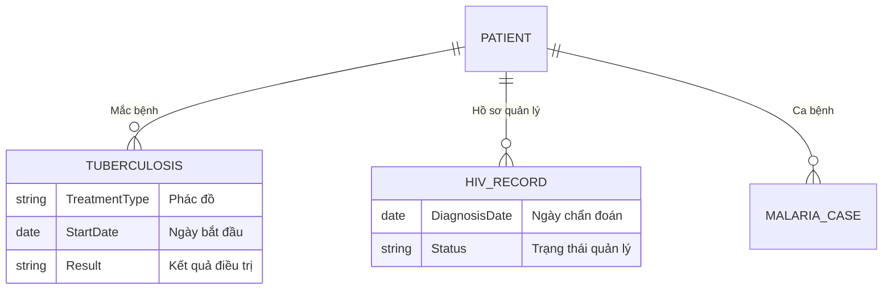

# Các Chương trình Mục tiêu Quốc gia (National Health Programs)

## 1. Tổng quan
Ngoài khám chữa bệnh thông thường, Trạm y tế chịu trách nhiệm triển khai các chương trình y tế mục tiêu quốc gia. Các module trong hệ thống được thiết kế riêng biệt cho từng chương trình để đảm bảo thu thập đúng và đủ các chỉ số báo cáo đặc thù.

## 2. Quản lý Bệnh Lao (`TYTTuberculosis`)
Module hỗ trợ quản lý bệnh nhân lao tại cộng đồng theo chương trình chống lao quốc gia.
*   **Quy trình**:
    1.  **Phát hiện**: Ghi nhận các ca nghi mắc.
    2.  **Quản lý điều trị**: Theo dõi quá trình dùng thuốc (DOTS) tại cộng đồng.
    3.  **Báo cáo**: Kết quả điều trị (khỏi, bỏ trị, tử vong).
*   **Chức năng chính**: `TYTTuberculosisList` (Danh sách bệnh nhân), `TYTTuberculosis` (Chi tiết hồ sơ).

## 3. Quản lý HIV/AIDS (`TytHiv`)
Quản lý người nhiễm HIV/AIDS và các đối tượng nguy cơ cao tại địa bàn.
*   **Quy trình**:
    1.  **Quản lý danh sách**: Cập nhật danh sách người nhiễm.
    2.  **Tư vấn & Hỗ trợ**: Ghi nhận các lần tư vấn, cấp phát bao cao su/bơm kim tiêm.
    3.  **Điều trị ARV**: (Nếu trạm có chức năng cấp phát thuốc ARV).
*   **Chức năng chính**: `TytHivCreate` (Thêm mới hồ sơ), `TytHiv` (Quản lý chung).

## 4. Quản lý Sốt rét (`TYTMalaria`)
Đặc thù cho các vùng có dịch tễ sốt rét lưu hành.
*   **Quy trình**:
    1.  **Giám sát ca bệnh**: Ghi nhận ca sốt rét (ký sinh trùng, lâm sàng).
    2.  **Cấp thuốc**: Cấp thuốc sốt rét và vật tư (màn tẩm hóa chất).
    3.  **Báo cáo dịch**: Báo cáo tình hình dịch tễ hàng tháng.

## 5. Báo cáo Tử vong (`TytDeath`)
Hệ thống ghi nhận tử vong A6/Báo cáo A6.
*   **Mục đích**: Thu thập số liệu tử vong theo nguyên nhân (ICD-10) để phân tích gánh nặng bệnh tật.
*   **Thông tin chính**: Họ tên, tuổi, địa chỉ, nguyên nhân tử vong, nơi tử vong.

## 6. Sơ đồ Quan hệ Dữ liệu

