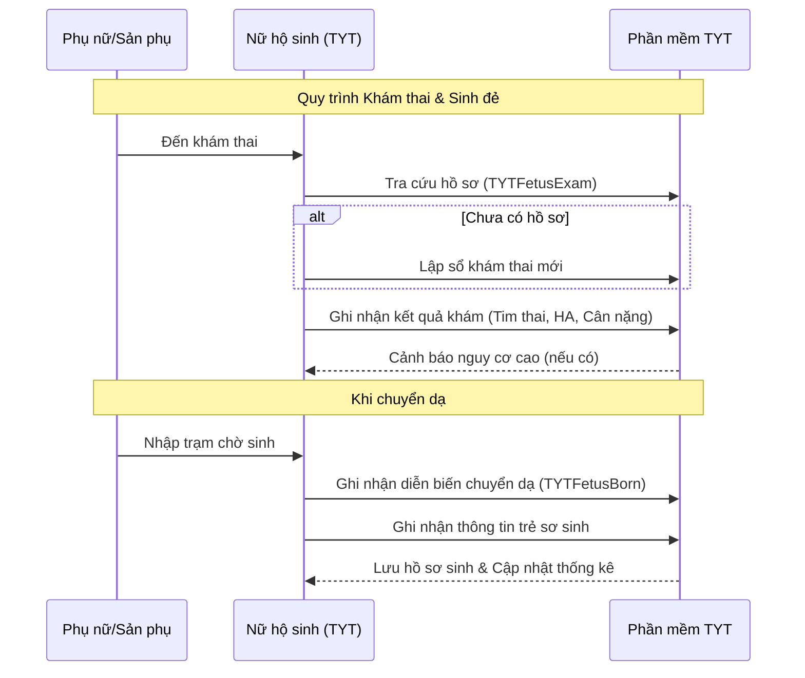

# Sức khỏe Sinh sản & KHHGĐ (Reproductive Health)

## 1. Tổng quan
Chăm sóc sức khỏe sinh sản là nhiệm vụ trọng tâm của tuyến y tế cơ sở. Hệ thống cung cấp các công cụ để quản lý thai nghén, sinh đẻ và kế hoạch hóa gia đình.

## 2. Quản lý Thai sản (`TYTFetus`)

### 2.1. Quản lý Thai nghén (`TYTFetusExam`)
Theo dõi quá trình mang thai của thai phụ trên địa bàn ("Quản lý thai 3 tháng đầu/giữa/cuối").
*   **Chức năng**:
    *   **Lập số khám thai**: Ghi nhận thông tin hành chính, tiền sử sản khoa.
    *   **Khám thai định kỳ**: Ghi nhận các chỉ số sinh tồn, bề cao tử cung, tim thai, tiêm uốn ván (VAT).
    *   **Dự kiến sinh**: Tự động tính ngày dự kiến sinh.

### 2.2. Quản lý Đẻ (`TYTFetusBorn`)
Ghi nhận thông tin về các ca sinh tại trạm hoặc đẻ rớt được trạm hỗ trợ.
*   **Thông tin mẹ**: Diễn biến cuộc chuyển dạ, can thiệp (cắt TSM, v.v.).
*   **Thông tin con**: Cân nặng, giới tính, tình trạng sau sinh (Apgar), tiêm Vitamin K1, Viêm gan B.
*   **Kết quả**: Tai biến sản khoa (nếu có).

## 3. Kế hoạch hóa Gia đình (`TYTKhh`)
Quản lý các biện pháp tránh thai (BPTT) cho phụ nữ trong độ tuổi sinh đẻ (15-49).
*   **Đối tượng**: Phụ nữ có chồng trong độ tuổi sinh đẻ.
*   **Dịch vụ**:
    *   Đặt vòng tránh thai (IUD).
    *   Cấp phát thuốc uống tránh thai, bao cao su.
    *   Tiêm thuốc tránh thai.
*   **Báo cáo**: Tỷ lệ áp dụng các biện pháp tránh thai hiện đại.

## 4. Dòng Chảy Dữ liệu (Workflow)

