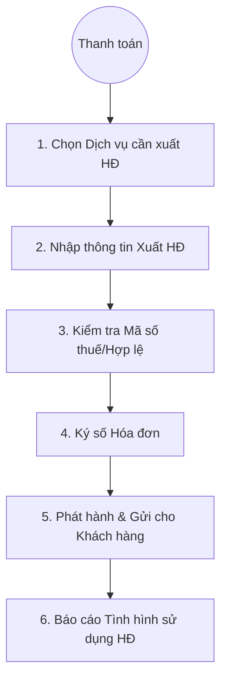

# Quản lý Hóa đơn Điện tử (Invoice Management)

## 1. Tổng quan
Quy trình mô tả việc phát hành, quản lý và báo cáo hóa đơn điện tử (E-Invoice) cho các dịch vụ khám chữa bệnh và bán thuốc.

## 2. Lưu đồ Quy trình

## 3. Chi tiết Các bước & Mapping Plugin

### 3.1. Tạo Lập Hóa đơn (Invoice Creation)
Sau khi bệnh nhân thanh toán hoặc quyết toán, kế toán/thu ngân tiến hành lập hóa đơn theo yêu cầu.
*   **Plugin chính**:
    *   `HIS.Desktop.Plugins.EInvoiceCreate`: Module chuyên dụng để tạo hóa đơn điện tử.
    *   `HIS.Desktop.Plugins.ElectronicBillTotal`: Tổng hợp chi phí để xuất hóa đơn gộp.
    *   `HIS.Desktop.Plugins.MedicineVaccinBill`: Xuất hóa đơn riêng cho thuốc/vaccine (thường thuế suất khác).

### 3.2. Ký số và Phát hành (Sign & Issue)
Hệ thống kết nối với nhà cung cấp hóa đơn điện tử (VNPT, Viettel, BKAV...) để ký số và cấp mã CQT.
*   **Plugin chính**:
    *   `HIS.Desktop.Plugins.EInvoiceCreate`: Tích hợp chữ ký số (Token/HSM).
    *   `HIS.Desktop.Plugins.TransactionEInvoice`: Quản lý giao dịch hóa đơn điện tử.

### 3.3. Xử lý Sai sót (Correction)
Xử lý các trường hợp viết sai hóa đơn, thay thế, điều chỉnh hoặc hủy hóa đơn.
*   **Plugin hỗ trợ**:
    *   Tính năng Hủy/Điều chỉnh/Thay thế nằm ngay trong module `EInvoiceCreate`.

## 4. Các Loại Hóa đơn
*   **Hóa đơn Giá trị gia tăng (VAT)**: Cho dịch vụ chịu thuế.
*   **Hóa đơn Bán hàng**: Cho đơn vị trực tiếp.
*   **Biên lai thu tiền phí, lệ phí**: Cho đơn vị công lập.

## 5. Dữ liệu Đầu ra
*   **File XML Hóa đơn**: Gửi cơ quan thuế.
*   **Bản thể hiện (PDF)**: Gửi qua Email/SMS cho khách hàng.

## 6. Liên kết Tài liệu
*   [Quy trình Viện phí & Thu ngân](./01-cashier-payment.md).
