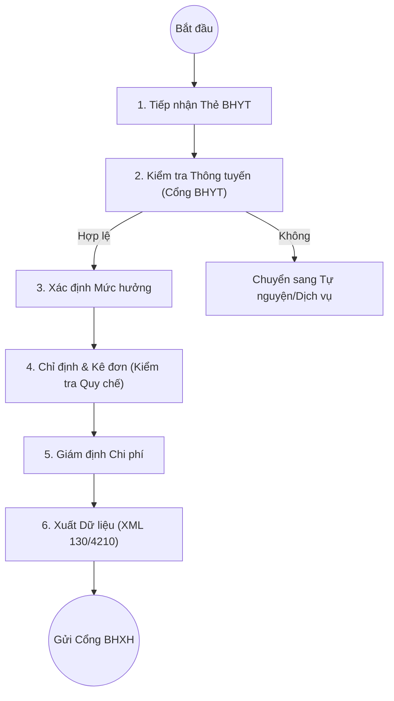

# Quy trình Bảo hiểm Y tế (Health Insurance)

## 1. Tổng quan
Quy trình mô tả các bước xử lý thông tin Bảo hiểm Y tế (BHYT) của bệnh nhân, từ tiếp nhận, thông tuyến, giám định quyền lợi đến quyết toán chi phí với cơ quan BHXH.

## 2. Lưu đồ Quy trình

## 3. Chi tiết Các bước & Mapping Plugin

### 3.1. Kiểm tra Thông tin Thẻ (Card Verification)
Khi bệnh nhân đăng ký khám, nhân viên nhập mã thẻ BHYT. Hệ thống kết nối cổng giám định BHYT để kiểm tra tính hợp lệ và thông tuyến.
*   **Plugin chính**:
    *   `HIS.Desktop.Plugins.CheckInfoBHYT`: Tra cứu thông tin thẻ online.
    *   `HIS.Desktop.Plugins.CheckHeinCardGOV`: Kiểm tra thẻ BHYT theo chuẩn Chính phủ (Government).
    *   `HIS.Desktop.Plugins.CompareBhytInfo`: So sánh thông tin trên thẻ và dữ liệu cổng.

### 3.2. Quản lý Danh mục BHYT (Hein Master Data)
Đảm bảo tất cả thuốc, vật tư, dịch vụ đều được ánh xạ đúng mã BHYT để được thanh toán.
*   **Plugin chính**:
    *   `HIS.Desktop.Plugins.ServiceHeinBHYT`: Quản lý danh mục dịch vụ BHYT.
    *   `HIS.Desktop.Plugins.HeinServiceTypeBhyt`: Cấu hình loại dịch vụ theo nhóm chi phí BHYT.
    *   `HIS.Desktop.Plugins.MedicineTypeAcin`: Ánh xạ thuốc thầu (Active Ingredient).

### 3.3. Giám định & Cảnh báo (Audit & Alert)
Trong quá trình chỉ định, hệ thống cảnh báo các vi phạm quy chế (Trái tuyến không giấy chuyển, Kê đơn vượt hạn mức, Trùng lặp dịch vụ).
*   **Plugin chính**:
    *   `HIS.Desktop.Plugins.HeinLimitPayment`: Kiểm tra trần thanh toán.
    *   `HIS.Desktop.Plugins.HeinCardProcess`: Xử lý quyền lợi thẻ (5 năm liên tục, Thẻ bộ đội...).

### 3.4. Giám định & Khóa dữ liệu BHYT (Insurance Expertise)
Quy trình chuyên sâu dành cho phòng Giám định BHYT để rà soát và chốt dữ liệu trước khi xuất XML.
*   **Quy trình**:
    1.  **Lọc hồ sơ**: Theo trạng thái (đã duyệt/chưa duyệt) và thời gian.
    2.  **Kiểm tra chi tiết**: Xem danh sách dịch vụ, thuốc, vật tư (Số lượng, Đơn giá, Thành tiền, Phần BHYT chi trả).
    3.  **Khóa dữ liệu (`Lock Data`)**:
        *   **Khóa Viện phí (`FeeLockTime`)**: Chốt số liệu tài chính.
        *   **Khóa BHYT (`HeinLockTime`)**: Chốt dữ liệu để xuất XML.
*   **Plugin chính**:
    *   `HIS.Desktop.Plugins.InsuranceExpertise`: Giao diện giám định và khóa dữ liệu tập trung.

### 3.5. Xuất Dữ liệu XML (Data Export)
Hàng ngày hoặc khi bệnh nhân ra viện, hệ thống xuất dữ liệu XML để gửi lên cổng tiếp nhận của BHXH.
*   **Plugin chính**:
    *   `HIS.Desktop.Plugins.ExportXmlQD130`: Xuất XML theo Quyết định 130 (Chuẩn mới).
    *   `HIS.Desktop.Plugins.ExportXmlQD4210`: Xuất XML theo Quyết định 4210 (Chuẩn cũ).

## 4. Dữ liệu Đầu ra
*   **Bảng kê 01/02/03/65a**: Các bảng kê chi phí khám chữa bệnh BHYT.
*   **File XML 1 (Tổng hợp), XML 2 (Thuốc), XML 3 (Dịch vụ)**: Hồ sơ điện tử gửi BHXH.

## 5. Liên kết Tài liệu
*   [Quy trình Đón tiếp & Đăng ký](../clinical/01-outpatient-examination.md).
