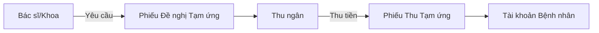

# Quản lý Tạm ứng & Công nợ (Deposit & Debt Management)

## 1. Tổng quan
Quy trình mô tả chi tiết các hoạt động quản lý dòng tiền tạm ứng của bệnh nhân nội/ngoại trú và kiểm soát các khoản nợ viện phí, đảm bảo thu hồi công nợ hiệu quả.

## 2. Quản lý Tạm ứng (Deposit)

### 2.1. Quy trình Thu Tạm ứng
Trong quá trình điều trị (thường là nội trú), bệnh nhân cần đóng trước một khoản tiền để đảm bảo khả năng thanh toán.

#### Plugin & Chức năng:
*   `HIS.Desktop.Plugins.RequestDeposit`: **Đề nghị Tạm ứng**.
    *   Khoa lâm sàng theo dõi tổng chi phí điều trị hiện tại và số dư khả dụng của bệnh nhân.
    *   Tạo phiếu đề nghị khi số dư < mức cảnh báo (Warning Threshold).
*   `HIS.Desktop.Plugins.TransactionDeposit`: **Giao dịch Tạm ứng**.
    *   Thu ngân thực hiện thu tiền dựa trên phiếu đề nghị hoặc thu trực tiếp.
    *   Hỗ trợ in phiếu thu theo mẫu quy định (C38-BB).
*   `HIS.Desktop.Plugins.DepositService`: **Tạm ứng theo Dịch vụ/Gói**.
    *   Áp dụng cho các kỹ thuật cao yêu cầu đóng tiền trước (VD: Phẫu thuật tim, Chạy thận...).

### 2.2. Hoàn ứng (Repayment)
Khi bệnh nhân ra viện hoặc hủy dịch vụ, nếu số tiền tạm ứng > chi phí thực tế, hệ thống thực hiện hoàn ứng.

*   `HIS.Desktop.Plugins.TransactionRepay`: **Hoàn tra tiền thừa**.
    *   Tự động tính toán: `Tiền hoàn = Tổng Tạm ứng - Tổng Chi phí`.
    *   Yêu cầu xác thực chính chủ (CMND/CCCD) khi nhận tiền hoàn.

### 2.3. Hủy Tạm ứng
*   `HIS.Desktop.Plugins.TransactionDepositCancel`: Hủy phiếu tạm ứng đã thu (trong trường hợp sai sót thao tác). Lưu ý: Chỉ hủy được khi chưa chốt số liệu kế toán ngày.

## 3. Quản lý Công nợ (Debt)

### 3.1. Ghi nhận Nợ (Debit Recording)
Khi bệnh nhân không đủ khả năng thanh toán tại thời điểm xuất viện và được Lãnh đạo bệnh viện phê duyệt cho nợ.

#### Plugin & Chức năng:
*   `HIS.Desktop.Plugins.DebtManager`: **Quản lý Hồ sơ Nợ**.
    *   Chuyển trạng thái hồ sơ thanh toán sang "Nợ" thay vì "Đã thanh toán".
    *   Lưu thông tin người bảo lãnh thanh toán.
    *   In "Giấy cam kết trả nợ".

### 3.2. Thu hồi Công nợ (Debt Collection)
Khi bệnh nhân quay lại thanh toán khoản nợ cũ.

#### Plugin & Chức năng:
*   `HIS.Desktop.Plugins.TransactionDebtCollect`: **Thu Nợ**.
    *   Tìm kiếm bệnh nhân theo mã hồ sơ/tên.
    *   Hiển thị danh sách các đợt điều trị còn nợ.
    *   Thực hiện thu tiền và xuất phiếu thu công nợ.
    *   Cập nhật trạng thái hồ sơ thành "Đã tất toán".

### 3.3. Xử lý Nợ khó đòi (Bad Debt)
*   Hệ thống cung cấp các báo cáo tuổi nợ (`ReportDebtAging`) để kế toán theo dõi và có biện pháp xử lý (gửi thông báo, nhắc nợ).

## 4. Dữ liệu Đầu ra
*   **Phiếu Thu Tạm ứng**.
*   **Phiếu Hoàn ứng**.
*   **Giấy Xác nhận Nợ**.
*   **Báo cáo Tổng hợp Tạm ứng/Hoàn ứng** (theo ngày/tháng).
*   **Báo cáo Công nợ chi tiết** (theo bệnh nhân/khoa phòng).

## 5. Liên kết Tài liệu
*   [Quy trình Viện phí & Thu ngân](./01-cashier-payment.md).
