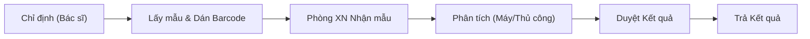

# Quy trình Xét nghiệm Thường quy (Routine Test)

## 1. Mục đích và Phạm vi
Phân hệ LIS (Laboratory Information System) quản lý toàn bộ quy trình xét nghiệm trong bệnh viện, từ lúc bác sĩ chỉ định đến khi trả kết quả.
Phạm vi bao gồm:
*   Tiếp nhận & Dán nhãn mẫu.
*   Kết nối máy xét nghiệm tự động.
*   Quản lý quy trình vi sinh, kháng sinh đồ.
*   Kiểm tra chất lượng (QC) và trả kết quả.

## 2. Quy trình Xét nghiệm Tổng quan

### 2.1. Các Giai đoạn Chính
1.  **Chỉ định & Lấy mẫu**: Bác sĩ chỉ định dịch vụ. Điều dưỡng in barcode và lấy bệnh phẩm.
2.  **Xử lý Mẫu (Sample Processing)**:
    *   Nhận mẫu tại khoa xét nghiệm.
    *   Ly tâm, chia mẫu (nếu cần).
3.  **Phân tích (Analysis)**:
    *   Chạy máy tự động (Huyết học, Sinh hóa, Miễn dịch).
    *   Làm thủ công hoặc nuôi cấy (Vi sinh).
4.  **Hậu kiểm & Duyệt**: Bác sĩ/KTV xét nghiệm duyệt kết quả, đối chiếu với lâm sàng.

## 3. Quản lý Thiết bị
LIS kết nối trực tiếp với các máy xét nghiệm để:
*   Đẩy chỉ định xuống máy (2-way communication).
*   Tự động nhận kết quả trả về từ máy.
*   Giảm thiểu sai sót do nhập liệu thủ công.

## 4. Liên kết Tài liệu
*   Để xem danh sách 12 Plugin LIS và chi tiết kết nối máy, vui lòng xem [Thiết kế Kỹ thuật LIS](../../../03-technical-specs/laboratory/02-technical-design.md).
