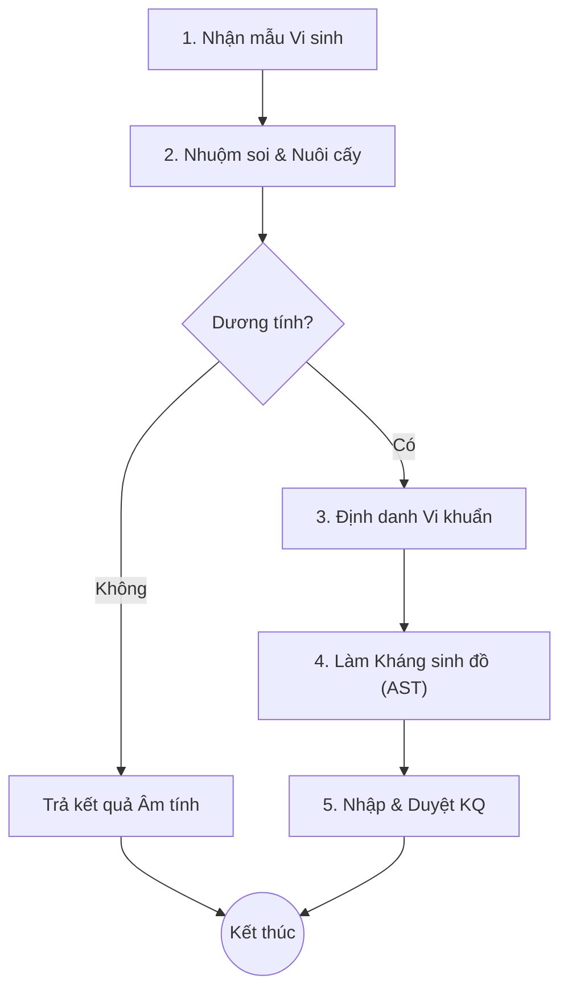

# Quy trình Xét nghiệm Vi sinh (Microbiology)

## 1. Tổng quan
Quy trình xét nghiệm vi sinh trong LIS quản lý các kỹ thuật nuôi cấy, nhuộm soi, định danh vi khuẩn và làm kháng sinh đồ (Antibiogram) để hỗ trợ bác sĩ lâm sàng chọn phác đồ điều trị kháng sinh hiệu quả.

## 2. Lưu đồ Quy trình

## 3. Các Bước Chính & Mapping Plugin

### 3.1. Nhận mẫu & Sơ bộ
Kỹ thuật viên nhận mẫu bệnh phẩm (máu, nước tiểu, dịch...) và thực hiện các kỹ thuật sơ bộ.
*   **Plugin chính**: 
    *   `HIS.Desktop.Plugins.LisSample`: Quản lý danh sách mẫu nhận.
    *   `HIS.Desktop.Plugins.LisSampleCondition`: Ghi nhận tình trạng mẫu (Đạt/Không đạt).

### 3.2. Định danh Vi khuẩn (Bacterial Identification)
Nếu mẫu nuôi cấy dương tính, tiến hành định danh tên loại vi khuẩn/nấm (Ví dụ: E. Coli, Staphylococcus aureus...).
*   **Plugin chính**:
    *   `HIS.Desktop.Plugins.LisBacteriumFamily`: Danh mục họ vi khuẩn.
    *   `HIS.Desktop.Plugins.LisSampleUpdate` (Tab Vi sinh): Nhập kết quả định danh.

### 3.3. Kháng sinh đồ (Antibiotic Susceptibility Testing - AST)
Thử độ nhạy của vi khuẩn với các loại kháng sinh (Nhạy - S, Kháng - R, Trung gian - I).
*   **Plugin chính**:
    *   `HIS.Desktop.Plugins.LisAntibiotic`: Danh mục kháng sinh.
    *   `HIS.Desktop.Plugins.LisBacAntibiotic`: Thiết lập panel kháng sinh cho từng loại vi khuẩn.
    *   `HIS.Desktop.Plugins.LisAntibioticRange`: Định nghĩa dải MIC (Nồng độ ức chế tối thiểu).

## 4. Dữ liệu Đầu ra
*   **Phiếu trả lời kết quả Vi sinh**: Bao gồm kết quả soi tươi/nhuộm, tên vi khuẩn định danh.
*   **Phiếu Kháng sinh đồ**: Danh sách kháng sinh và kết quả S/R/I kèm giá trị MIC.

## 5. Liên kết Tài liệu
*   [Danh mục Vi khuẩn & Kháng sinh](../../../03-technical-specs/laboratory/03-master-data.md)
