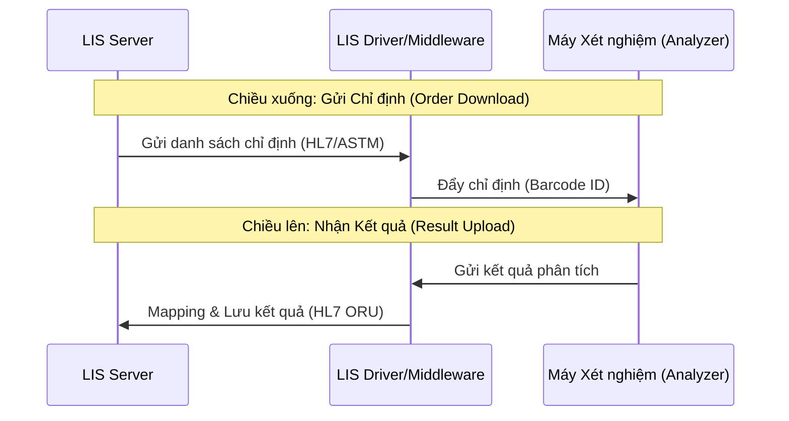

# Quy trình Kết nối Máy Xét nghiệm (Equipment Connection)

## 1. Tổng quan
Hệ thống LIS kết nối với các máy xét nghiệm tự động (Huyết học, Sinh hóa, Miễn dịch...) để tự động hóa việc gửi chỉ định và nhận kết quả, giảm thiểu sai sót do nhập liệu thủ công.

## 2. Mô hình Kết nối (Communication Flow)

## 3. Các Thành phần Chính & Plugin

### 3.1. Quản lý Máy & Giao thức
Cấu hình thông số kết nối (COM Port, TCP/IP) và giao thức giao tiếp cho từng máy.
*   **Plugin chính**:
    *   `HIS.Desktop.Plugins.LisMachine`: Danh sách máy xét nghiệm.
    *   `HIS.Desktop.Plugins.LisMachineIndex`: Mapping mã xét nghiệm của máy (Test Code) với mã dịch vụ trong HIS.

### 3.2. Mapping Kết quả (Result Mapping)
Xử lý việc quy đổi đơn vị đo và ánh xạ giá trị trả về từ máy vào các trường kết quả tương ứng trên phiếu in.
*   **Plugin chính**:
    *   `HIS.Desktop.Plugins.LisMachineResult`: Xem log kết quả thô (Raw Data) từ máy gửi về.
    *   `HIS.Desktop.Plugins.LisTestIndex`: Định nghĩa các chỉ số xét nghiệm.

### 3.3. Xử lý Lỗi & Cảnh báo
Hệ thống cảnh báo khi:
*   Máy không gửi kết quả sau một thời gian nhất định.
*   Mã Barcode không tồn tại trong hệ thống.
*   Kết quả trả về nằm ngoài dải đo (Flag H/L).

## 4. Các Loại Kết nối Thông dụng
1.  **Một chiều (One-way)**: Máy chỉ bắn kết quả về LIS (thường dùng cho máy Huyết học cũ).
2.  **Hai chiều (Bi-directional)**: LIS bắn chỉ định xuống, máy trả kết quả về (Chuẩn hiện đại).
3.  **Host Query**: Máy quét barcode và hỏi LIS "Mẫu này làm gì?", LIS trả lời chỉ định.

## 5. Liên kết Tài liệu
*   [Danh sách Driver máy xét nghiệm](../../../03-technical-specs/laboratory/05-equipment-drivers.md)
