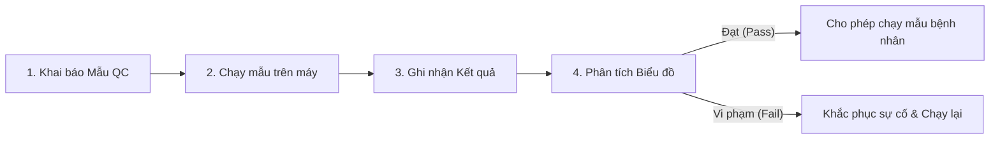

# Quản lý Chất lượng Xét nghiệm (Quality Control - QC)

## 1. Tổng quan
Quy trình Kiểm soát chất lượng (QC) đảm bảo độ tin cậy và chính xác của các kết quả xét nghiệm thông qua việc chạy mẫu chuẩn (Control) và phân tích các quy tắc thống kê.

## 2. Quy trình QC Hàng ngày

## 3. Các Chức năng Chí & Mapping Plugin

### 3.1. Thiết lập QC (Setup)
Khai báo các lô mẫu chuẩn (Lot Number), hạn sử dụng và dải giá trị cho phép (Mean, SD).
*   **Plugin chính**:
    *   `HIS.Desktop.Plugins.QcsQuery`: Giao diện truy vấn và thiết lập QC.
    *   `HIS.Desktop.Plugins.HisQcType`: Loại QC (Nội kiểm/Ngoại kiểm).
    *   `HIS.Desktop.Plugins.HisQcNormation`: Thiết lập dải chuẩn.

### 3.2. Phân tích Quy tắc Westgard (Analysis)
Hệ thống tự động vẽ biểu đồ Levey-Jennings và áp dụng các quy tắc Westgard để cảnh báo vi phạm.
*   **Các quy tắc phổ biến**:
    *   **1-2s**: Cảnh báo (Warning) - 1 điểm vượt quá 2SD.
    *   **1-3s**: Vi phạm (Reject) - 1 điểm vượt quá 3SD.
    *   **2-2s**: Vi phạm - 2 điểm liên tiếp vượt quá 2SD cùng phía.

### 3.3. Xử lý Vi phạm (Troubleshooting)
Khi QC thất bại, kỹ thuật viên cần ghi nhận biện pháp khắc phục:
*   Calibration (Hiệu chuẩn) lại máy.
*   Thay thuốc thử (Reagent).
*   Bảo trì máy.

## 4. Báo cáo QC
*   **Biểu đồ Levey-Jennings**: Trực quan hóa dao động của kết quả QC theo thời gian.
*   **Báo cáo Z-Score**: Đánh giá độ lệch chuẩn tương đối (thường dùng cho Ngoại kiểm).

## 5. Liên kết Tài liệu
*   [Quy định về Nội kiểm xét nghiệm (Bộ Y tế)](../../../04-references/statutory-regulations/qc-regulations.md)
