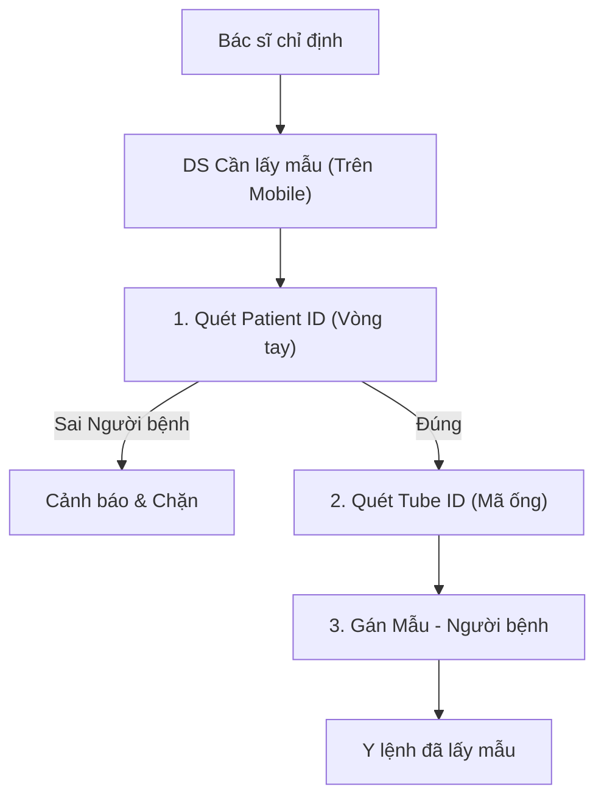

# Ứng dụng Di động (Mobile App) - Business Overview

## 1. Mục đích và Phạm vi
Phân hệ Mobile App ("Moba") mở rộng khả năng của hệ thống HIS, cho phép nhân viên y tế thực hiện các tác vụ tại giường bệnh hoặc khi di chuyển, và hỗ trợ các quy trình kho vận linh hoạt.

## 2. Các Quy trình Chính

### 2.1. Quản lý Kho Dược (Mobile Inventory)
Giúp thủ kho thực hiện các thao tác nhập xuất ngay tại kho mà không cần máy tính để bàn.
*   **Nhập kho (Import)**: Quét mã vạch sản phẩm để tạo phiếu nhập (`ImpMest`).
*   **Kiểm kê (Inventory Check)**:
    *   Sử dụng thiết bị di động đi dọc theo kệ thuốc.
    *   Quét mã và nhập số lượng thực tế.
    *   Dữ liệu đồng bộ tức thời về hệ thống trung tâm (`MobaImpMestList`).

### 2.2. Bán thuốc & Vật tư (Point of Sale)
Hỗ trợ quy trình bán thuốc lưu động hoặc tại quầy thuốc quá tải.
*   **Tạo đơn bán**: Chọn thuốc, tính tiền và in hóa đơn từ máy in nhiệt cầm tay (`MobaSaleCreate`).
*   **Tra cứu giá**: Quét mã vạch để xem giá và tồn kho hiện tại.

### 2.3. Bệnh án Điện tử & Chăm sóc (EMR & Nursing)
Hỗ trợ bác sĩ và điều dưỡng tại buồng bệnh (Point of Care - POC).
*   **Tra cứu hồ sơ**: Xem thông tin hành chính, lịch sử khám.
*   **Chỉ định dịch vụ**: Kê đơn hoặc chỉ định xét nghiệm nhanh (`MobaExamPresCreate`).
### 2.3. Lấy mẫu Xét nghiệm tại chỗ (Mobile Specimen Collection)
Giúp đảm bảo an toàn người bệnh thông qua quy trình xác thực "3 tra 5 đối" ngay tại giường.

*   **Plugin**: `HIS.Desktop.Plugins.MobaBloodCreate`
*   **Chức năng**:
    *   Hiển thị danh sách bệnh nhân cần lấy máu tại khoa.
    *   Xác thực người bệnh bằng mã vạch/QR Code.
    *   Xác nhận thời điểm lấy mẫu thực tế.

### 2.4. Kê đơn & Chỉ định tại giường (Mobile CPOE)
Hỗ trợ bác sĩ đi buồng có thể ra y lệnh ngay lập tức mà không cần quay về phòng hành chính.

*   **Plugin**: `HIS.Desktop.Plugins.MobaExamPresCreate` (Khám & Kê đơn)
*   **Quy trình**:
    1.  **Chọn bệnh nhân**: Từ danh sách theo buồng bệnh.
    2.  **Xem hồ sơ**: Xem nhanh kết quả xét nghiệm, lịch sử thuốc.
    3.  **Ra y lệnh**:
        *   Chọn thuốc từ danh mục (có cảnh báo tương tác).
        *   Chỉ định CLS (X-Quang tại giường, Xét nghiệm cấp cứu).
    4.  **Ký số**: Xác nhận y lệnh bằng PIN hoặc vân tay (trên thiết bị hỗ trợ).

## 3. Kiến trúc Plugin Mobile
Các plugin Mobile thường bắt đầu bằng tiền tố `HIS.Desktop.Plugins.Moba...`.
*   `MobaImpMestList`: Danh sách phiếu nhập kho mobile.
*   `MobaSaleCreate`: Tạo phiếu bán hàng mobile.
*   `MobaBloodCreate`: Quy trình lấy mẫu máu mobile.
*   `MobaExamPresCreate`: Tạo đơn thuốc/chỉ định mobile.

## 4. Liên kết Tài liệu
*   [Quản lý Kho Dược](../pharmacy/01-business-overview.md)
*   [Quy trình Khám bệnh](../clinical/01-outpatient-examination.md)
