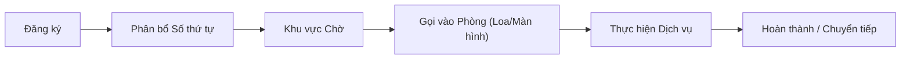

# Quản lý Gọi Bệnh nhân & Hàng đợi (Business Overview)

## 1. Mục đích và Phạm vi
Tài liệu này mô tả hạ tầng quản lý hàng đợi và hệ thống gọi bệnh nhân trong HIS.
Hệ thống đảm bảo việc điều phối bệnh nhân qua các điểm tiếp đón:
*   Đăng ký & Tiếp đón.
*   Phòng khám.
*   Khu vực Lấy mẫu xét nghiệm.
*   Quầy Thu ngân/Viện phí.

> **Lưu ý**: Chi tiết kỹ thuật về các phiên bản Plugin `CallPatient` và cấu hình PubSub xem tại [Thiết kế Kỹ thuật Patient Call & Queue](../../../03-technical-specs/patient-management/02-technical-design.md).

## 2. Quy trình Hàng đợi

Hệ thống quản lý hàng đợi dựa trên nguyên tắc "First Come, First Served" kết hợp với các quy tắc ưu tiên y tế.

### 2.1. Các Điểm Gọi Chính
1.  **Phòng khám (Clinic)**: Gọi bệnh nhân vào khám theo thứ tự hoặc ưu tiên (Người già, Trẻ em, Cấp cứu).
2.  **Cận lâm sàng (CLS)**: Gọi vào lấy máu, chụp X-Quang.
3.  **Thu ngân**: Gọi bệnh nhân vào thanh toán.

### 2.2. Quy tắc Ưu tiên
*   **Cấp cứu**: Luôn được ưu tiên hàng đầu.
*   **Đối tượng ưu tiên**: Người già > 80 tuổi, trẻ em < 6 tuổi, thương binh.
*   **Bệnh nhân hẹn trước**: Có thể có luồng riêng hoặc độ ưu tiên cao hơn.

## 3. Hệ thống Hiển thị (Display System)
Hệ thống cung cấp thông tin trực quan cho bệnh nhân tại các khu vực chờ:
*   **Màn hình Tổng**: Hiển thị danh sách đang chờ, số đang gọi cho nhiều phòng.
*   **Màn hình Tại phòng**: Hiển thị số đang phục vụ tại cửa phòng.
*   **Âm thanh**: Thông báo bằng giọng nói (Text-to-Speech) "Mời bệnh nhân Nguyễn Văn A đến phòng số...".

## 4. Liên kết Tài liệu
*   Để xem cấu hình kỹ thuật và danh sách Plugin, vui lòng xem [Thiết kế Kỹ thuật Patient Call & Queue](../../../03-technical-specs/patient-management/02-technical-design.md).
