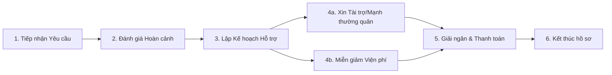

# Công tác Xã hội & Chăm sóc Khách hàng (Social Work)

## 1. Tổng quan
Quy trình hỗ trợ bệnh nhân có hoàn cảnh khó khăn, kêu gọi tài trợ và quản lý các phản hồi/yêu cầu từ người bệnh.

## 2. Quy trình Nghiệp vụ

## 3. Các Chức năng Chính & Plugin

### 3.1. Tiếp nhận & Quản lý Yêu cầu (Request Management)
Ghi nhận các yêu cầu cần hỗ trợ từ khoa lâm sàng hoặc trực tiếp từ người bệnh.
*   **Plugin chính**:
    *   `HIS.Desktop.Plugins.CustomerRequest`: Quản lý danh sách yêu cầu.
    *   `HIS.Desktop.Plugins.PatientProgram`: Đăng ký bệnh nhân vào các chương trình hỗ trợ (Ví dụ: Mổ tim nhân đạo, Mổ mắt miễn phí...).

### 3.2. Quản lý Nguồn Tài trợ (Sponsorship)
Quản lý các nguồn quỹ từ thiện và phân bổ cho bệnh nhân.
*   **Plugin chính**:
    *   `HIS.Desktop.Plugins.HisFund`: Quản lý quỹ từ thiện.
    *   `HIS.Desktop.Plugins.DepositReq` (nguồn từ thiện): Tạo phiếu tạm ứng/thanh toán từ nguồn quỹ.

### 3.3. Chăm sóc Khách hàng (CS)
Gửi tin nhắn chúc mừng, nhắc lịch tái khám hoặc khảo sát hài lòng.
*   **Plugin chính**:
    *   `HIS.Desktop.Plugins.ChanelManager`: Quản lý kênh liên lạc (SMS, Zalo...).
    *   `HIS.Desktop.Plugins.SdaNotify`: Gửi thông báo.

## 4. Báo cáo
*   Danh sách bệnh nhân được hỗ trợ.
*   Báo cáo tồn quỹ từ thiện.
*   Báo cáo tổng hợp ý kiến khách hàng.
