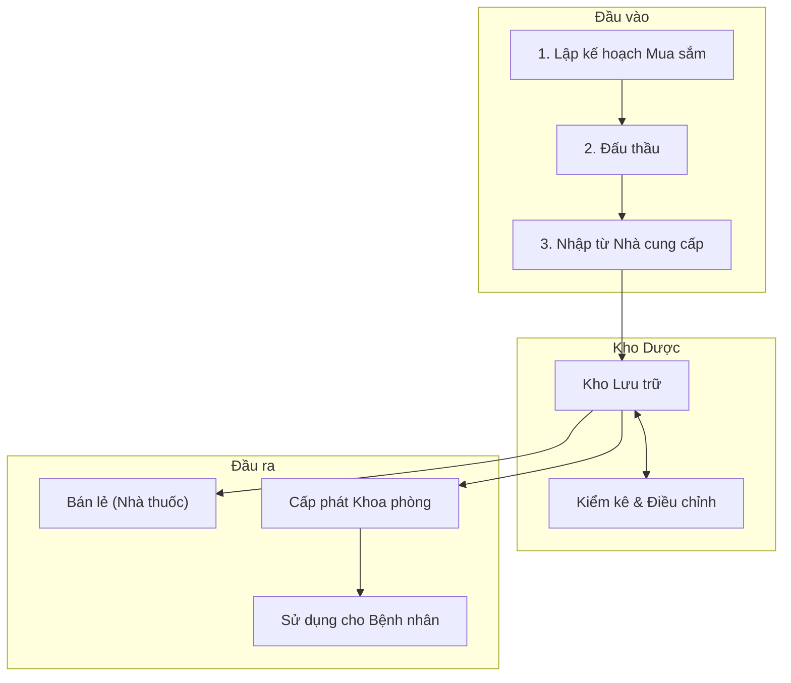

# Quản lý Thuốc & Vật tư Y tế (Business Overview)

## 1. Mục đích và Phạm vi
Tài liệu này mô tả các quy trình nghiệp vụ liên quan đến quản lý thuốc, vật tư y tế trong hệ thống HIS.
Phạm vi bao gồm:
*   Định nghĩa danh mục (Dược, Vật tư).
*   Quy trình Nhập kho (Mua sắm, Tài trợ).
*   Quy trình Xuất kho (Bán lẻ, Cấp phát khoa phòng).
*   Quản lý Tồn kho & Kiểm kê.
*   Quản lý Đấu thầu & Mua sắm.
*   Quản lý Máu & Chế phẩm máu.

> **Lưu ý**: Chi tiết kỹ thuật về Plugin, API, và Cấu trúc dữ liệu đã được tách sang tài liệu [Thiết kế Kỹ thuật Pharmacy](../../../03-technical-specs/pharmacy/02-technical-design.md).

## 2. Quy trình Nghiệp vụ Tổng quan

Hệ thống quản lý thuốc xoay quanh vòng đời của hàng hóa từ lúc nhập vào kho cho đến khi được sử dụng cho bệnh nhân.

## 3. Các Hoạt động Chính

### 3.1. Quản lý Danh mục (Master Data)
Việc chuẩn hóa dữ liệu danh mục là bước đầu tiên để vận hành kho dược.
*   **Loại Thuốc (Medicine Type)**: Định nghĩa tên, hàm lượng, hoạt chất, đường dùng.
*   **Loại Vật tư (Material Type)**: Định nghĩa vật tư tiêu hao, hóa chất, thiết bị y tế.
*   **Đơn vị tính**: Quản lý các đơn vị đóng gói và hệ số quy đổi.

### 3.2. Nhập kho (Import)
Quy trình tiếp nhận hàng hóa vào kho.
*   **Các loại nhập**:
    *   **Nhập mua (ImpMestBuy)**: Nhập từ nhà cung cấp theo hợp đồng thầu.
    *   **Nhập Hóa chất/Vật tư (ImpMestChms/Material)**: Quy trình nhập riêng cho hóa chất xét nghiệm và vật tư tiêu hao.
    *   **Nhập Tài sản/CCDC (ImpMestHcs)**: Nhập các công cụ dụng cụ, tài sản cố định quản lý tại kho dược.
    *   **Nhập trả lại**: Nhập hàng trả lại từ khoa phòng hoặc từ bệnh nhân.
*   **Kiểm soát**: Kiểm tra hạn dùng (Date), lô sản xuất (Lot), giá nhập theo hợp đồng thầu.

### 3.3. Xuất kho (Export)
*   **Xuất Bán lẻ**: Bán thuốc trực tiếp cho bệnh nhân ngoại trú (có đơn hoặc không đơn).
*   **Xuất Khoa phòng**: Cấp phát vật tư, hóa chất cho các khoa phòng sử dụng nội bộ.
*   **Xuất cho Bệnh nhân**: Cấp phát thuốc thực tế theo y lệnh (cho bệnh nhân nội trú).

### 3.4. Quản lý Thầu (Bidding)
*   Quản lý hồ sơ thầu, kế hoạch mua sắm.
*   Theo dõi số lượng đã nhập so với số lượng trúng thầu.

### 3.5. Quản lý Máu
*   Quy trình đặc thù cho việc nhập, lưu trữ, và cấp phát máu an toàn.
*   Yêu cầu kiểm tra phản ứng chéo (Cross-match) trước khi xuất dùng.

### 3.6. Kiểm kê Kho (Inventory)
Quy trình định kỳ để đối chiếu số lượng tồn kho trên phần mềm và thực tế.
*   **Quy trình Kiểm kê (`MediStockInventory`)**:
    1.  Chốt tồn đầu kiểm kê (Khóa kho).
    2.  Nhập số lượng kiểm kê thực tế theo từng lô/hạn dùng.
    3.  **Xử lý chênh lệch**:
        *   **Thừa**: Tạo phiếu nhập kiểm kê thừa (`ImpMestInve`).
        *   **Thiếu**: Tạo phiếu xuất kiểm kê thiếu (`ExpMestInve`).
    4.  **Duyệt & Cập nhật tồn kho**: Cập nhật số liệu tồn kho mới sau khi Ban giám đốc phê duyệt biên bản.

### 3.7. Quản lý Nhà cung cấp (Supplier Management)
*   **Danh mục Nhà cung cấp**: Quản lý thông tin chi tiết (Tên, Mã số thuế, Giấy phép hoạt động).
*   **Đánh giá & Xếp hạng**: Theo dõi lịch sử cung ứng, thời gian giao hàng và chất lượng thuốc để xếp hạng uy tín.
*   **Công nợ**: Theo dõi công nợ phải trả chi tiết theo từng hóa đơn nhập.
*   **Plugin chính**: 
    *   `HIS.Desktop.Plugins.Supplier`: Quản lý danh sách nhà cung cấp.
    *   `HIS.Desktop.Plugins.TransactionDebt`: Quản lý công nợ dược.

## 4. Liên kết Tài liệu
*   Để xem cách thức hệ thống hiện thực hóa các quy trình trên bằng Plugin và Code, vui lòng xem [Thiết kế Kỹ thuật Pharmacy](../../../03-technical-specs/pharmacy/02-technical-design.md).
