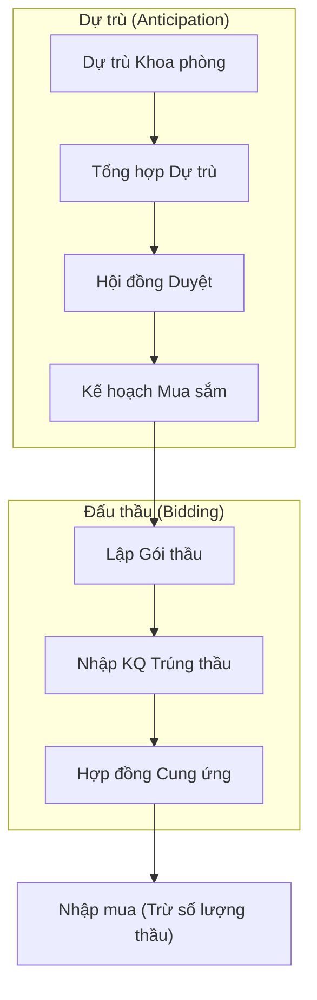

# Quản lý Dự trù & Đấu thầu (Anticipation & Bidding) - Business Overview

## 1. Mục đích và Phạm vi
Phân hệ Dự trù và Đấu thầu quản lý quy trình lập kế hoạch cung ứng thuốc/vật tư y tế, từ lúc các khoa phòng đề xuất nhu cầu cho đến khi tổ chức đấu thầu và ký hợp đồng với nhà cung cấp.
Phạm vi bao gồm:
*   Dự trù cấp cơ sở (Khoa/Phòng).
*   Tổng hợp dự trù toàn viện.
*   Quản lý Hồ sơ thầu & Gói thầu.
*   Theo dõi thực hiện thầu.

## 2. Quy trình Nghiệp vụ Tổng quan

## 3. Các Hoạt động Chính

### 3.1. Lập Dự trù (Anticipation)
*   **Dự trù định kỳ**: Hàng tháng/quý, các khoa dựa trên số lượng sử dụng thực tế của kỳ trước để lập dự trù cho kỳ sau (Hệ thống hỗ trợ tính toán tự động `AnticipationCreate`).
*   **Dự trù đột xuất**: Khi có nhu cầu phát sinh ngoài kế hoạch.
*   **Duyệt & Tổng hợp**: Kho dược xem xét, điều chỉnh và tổng hợp thành bảng dự trù chung cho toàn bệnh viện.

### 3.2. Quản lý Thầu (Bidding)
*   **Gói thầu (`BidCreate`)**: Định nghĩa thông tin gói thầu (Thuốc Generics, Biệt dược, Vật tư...), hình thức thầu (Rộng rãi, Chỉ định...).
*   **Quyết định trúng thầu**: Nhập danh sách mặt hàng trúng thầu: Tên thương mại, Số đăng ký, Giá trúng thầu, Nhà thầu, Số lượng.
*   **Hiệu lực thầu**: Quản lý thời gian hiệu lực và số lượng phân bổ của từng mặt hàng.

### 3.3. Theo dõi Thực hiện Thầu
*   Hệ thống tự động trừ lùi số lượng khả dụng của quyết định thầu mỗi khi có phiếu Nhập mua (`ImpMestBuy`).
*   Cảnh báo khi sắp hết số lượng thầu hoặc gói thầu sắp hết hạn.

## 4. Chức năng Hệ thống (Key Features)

### 4.1. Import Thầu
*   Hỗ trợ Import danh sách trúng thầu từ Excel (theo mẫu chuẩn của Sở Y tế/Bảo hiểm Xã hội) để giảm tải nhập liệu thủ công cho hàng nghìn mặt hàng.

### 4.2. Khóa Dự trù
*   Chức năng khóa sổ dự trù vào ngày quy định để đảm bảo tiến độ lập kế hoạch mua sắm.

## 5. Liên kết Tài liệu
*   Module chính: `HIS.Desktop.Plugins.AnticipateCreate`, `HIS.Desktop.Plugins.BidCreate`.
