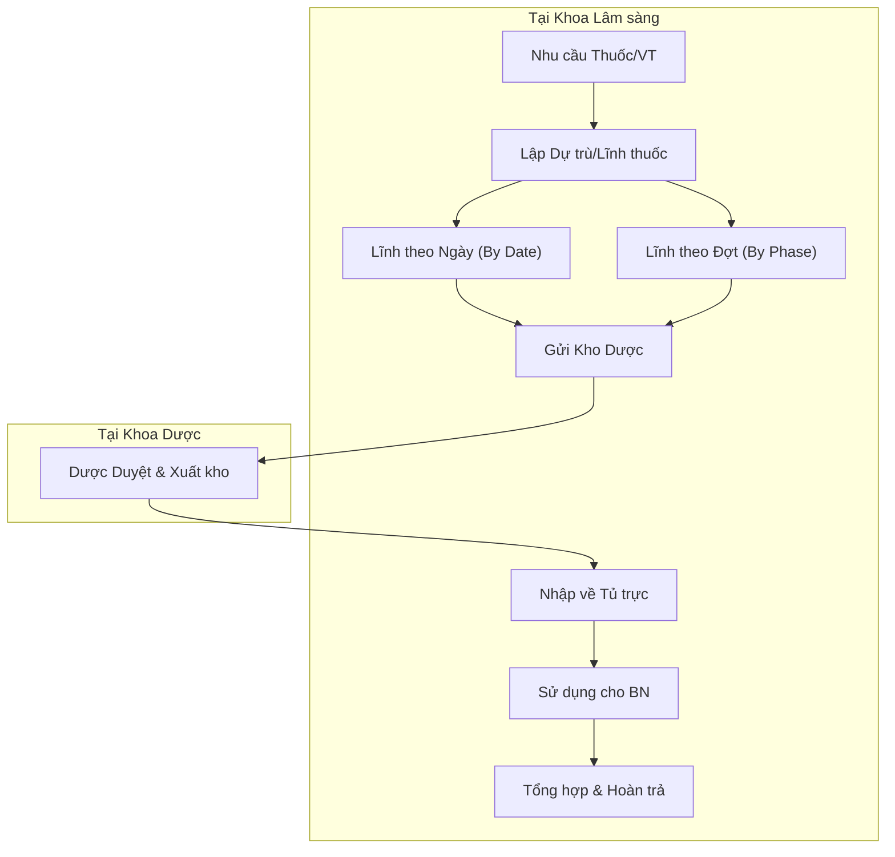

# Quản lý Tủ thuốc trực & Thuốc tủ trực (Public Medicine)

## 1. Tổng quan
Trong hoạt động của khoa lâm sàng, ngoài thuốc kê đơn cho từng bệnh nhân ("Thuốc kê đơn"), khoa còn cần quản lý một lượng thuốc/vật tư chung để sử dụng cấp cứu hoặc sử dụng chung ("Thuốc tủ trực" hoặc "Public Medicine").

**Mục đích**:
*   Đảm bảo luôn có sẵn cơ số thuốc cấp cứu.
*   Quản lý các loại vật tư tiêu hao dùng chung (bông, băng, cồn, gạc) không kê chi tiết theo đơn.
*   Hoàn trả thuốc thừa cuối ngày/ca trực.

## 2. Quy trình Nghiệp vụ

### 2.1. Các hình thức Lĩnh thuốc tủ trực
Hệ thống hỗ trợ các phương thức lĩnh thuốc về tủ trực khác nhau tùy theo quy định của bệnh viện:

1.  **Lĩnh theo Ngày (`PublicMedicineByDate`)**:
    *   Điều dưỡng tổng hợp nhu cầu cho 24h tới.
    *   Thường dùng cho các vật tư tiêu hao hàng ngày (bơm kim tiêm, dung dịch sát khuẩn).

2.  **Lĩnh theo Đợt điều trị (`PublicMedicineByPhased`)**:
    *   Lĩnh thuốc cho một đợt (ví dụ: đợt hóa trị, đợt chạy thận).
    *   Giúp quy hoạch nguồn lực thuốc cho các liệu trình dài ngày.

3.  **Lĩnh Tổng hợp (`PublicMedicineGeneral`)**:
    *   Quy trình lĩnh bù cơ số tủ trực (bù lại số lượng đã dùng cấp cứu).

## 3. Chức năng Hệ thống (Plugin Mapping)

Các chức năng này thường được sử dụng bởi **Điều dưỡng hành chính** hoặc **Điều dưỡng trưởng**.

| Tính năng | Plugin (Mã nguồn) | Mô tả |
| :--- | :--- | :--- |
| **Quản lý Thuốc tủ trực (Tổng hợp)** | `HIS.Desktop.Plugins.PublicMedicineGeneral` | Giao diện chính quản lý danh mục và số lượng tồn tại tủ trực khoa. |
| **Lĩnh thuốc theo Ngày** | `HIS.Desktop.Plugins.PublicMedicineByDate` | Lập phiếu lĩnh thuốc/vật tư tiêu hao hàng ngày. |
| **Lĩnh thuốc theo Đợt** | `HIS.Desktop.Plugins.PublicMedicineByPhased` | Lập phiếu lĩnh theo đợt điều trị. |
| **In Phiếu lĩnh** | `HIS.Desktop.Plugins.Library.PrintPublicMedicines` | In phiếu dự trù/phiếu lĩnh để ký duyệt. |

## 4. Dữ liệu & Báo cáo
*   **Thẻ kho tủ trực**: Theo dõi biến động nhập/xuất/tồn của từng mặt hàng tại tủ trực.
*   **Biên bản kiểm kê tủ trực**: Đối chiếu số lượng thực tế và phần mềm mỗi khi giao ban (`ShiftHandover`).

## 5. Liên kết Tài liệu
*   [Quản lý Kho Dược Tổng quan](./01-business-overview.md)
*   [Quy trình Giao ban & Bàn giao](../administration/07-shift-handover.md)
