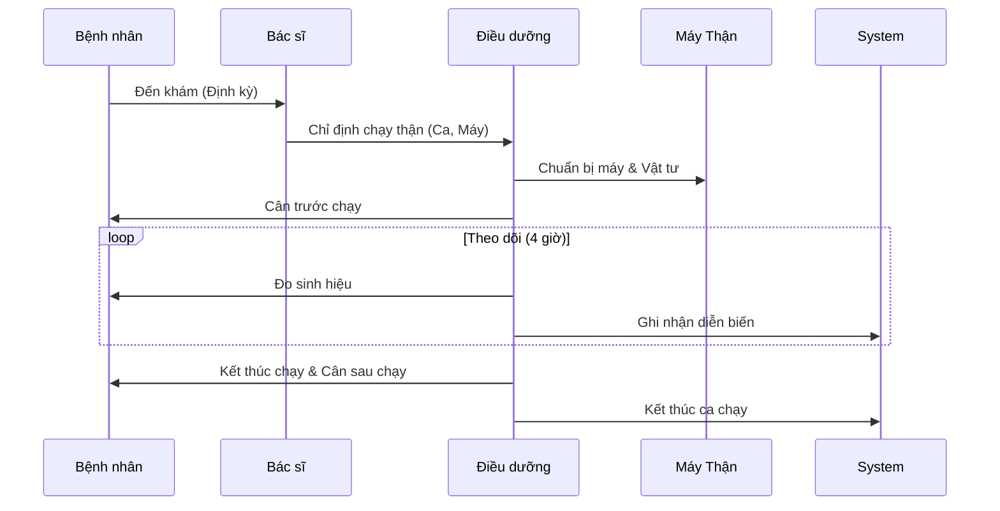

# Quản lý Thận Nhân tạo (Hemodialysis)

## 1. Tổng quan
Phân hệ Thận nhân tạo (Hemodialysis) quản lý toàn bộ quy trình chạy thận chu kỳ cho bệnh nhân suy thận mạn. Đặc thù của phân hệ này là tính lặp lại theo chu kỳ (Lịch chạy thận) và quản lý chặt chẽ thiết bị (Máy chạy thận).

## 2. Quy trình Nghiệp vụ

### 2.1. Quản lý Lịch chạy thận (`KidneyShiftSchedule`)
Thay vì đăng ký khám từng lần, bệnh nhân chạy thận được xếp lịch cố định.
*   **Ca làm việc**: Định nghĩa các ca (Ca 1, Ca 2, Ca 3, Ca 4) trong ngày.
*   **Xếp lịch**: Gán bệnh nhân vào ca chạy cụ thể và máy cụ thể.
*   **Điểm danh**: Xác nhận bệnh nhân đến chạy theo lịch.

### 2.2. Chỉ định & Vật tư
*   **Gói dịch vụ**: Định nghĩa gói vật tư tiêu hao chuẩn cho một lần chạy (Quả lọc, Dây dẫn, Kim...).
*   **Chỉ định thuốc**: Các thuốc dùng trong quá trình chạy (Chống đông, Erythropoietin).

### 2.3. Theo dõi Diễn biến (`Hemodialysis`)
Trong suốt 4 giờ chạy thận, điều dưỡng phải ghi nhận các chỉ số sinh tồn định kỳ (mỗi 30 phút/1 giờ).
*   **Các chỉ số**: Mạch, Huyết áp, Tốc độ rút nước, Áp lực tĩnh mạch/động mạch.
*   **Tai biến**: Ghi nhận các biến cố (Hạ huyết áp, Chuột rút) và xử trí.

## 3. Quản lý Máy & Quả lọc
*   **Máy chạy thận**: Theo dõi số giờ hoạt động, lịch bảo trì, khử khuẩn.
*   **Quả lọc (Dialyzer)**: Quản lý số lần tái sử dụng (nếu có quy trình rửa quả lọc).

## 4. Sơ đồ Quy trình

