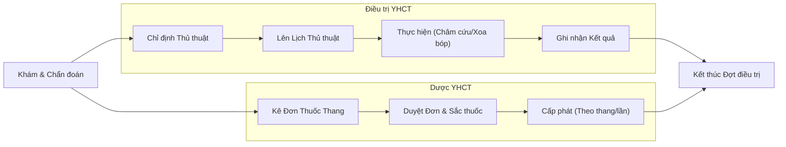

# Quản lý Y Học Cổ Truyền (YHCT) - Business Overview

## 1. Mục đích và Phạm vi
Phân hệ Y Học Cổ Truyền (YHCT) hỗ trợ quy trình khám, chẩn đoán và điều trị bằng phương pháp y học cổ truyền kết hợp với y học hiện đại.
Phạm vi bao gồm:
*   Chẩn đoán bát cương, tạng phủ.
*   Kê đơn thuốc thang (thuốc sắc, thuốc bột).
*   Chỉ định và thực hiện các thủ thuật YHCT (châm cứu, xoa bóp, bấm huyệt).
*   Quản lý liệu trình điều trị nhiều ngày.

## 2. Quy trình Nghiệp vụ Tổng quan

## 3. Các Hoạt động Chính

### 3.1. Khám và Chẩn đoán
Khác với y học hiện đại, bác sĩ YHCT cần ghi nhận các thông tin chẩn đoán đặc thù:
*   **Vọng, Văn, Vấn, Thiết**: 4 phương pháp khám lâm sàng.
*   **Chẩn đoán Bát cương**: Âm/Dương, Hàn/Nhiệt, Hư/Thực, Biểu/Lý.
*   **Chẩn đoán Tạng phủ**: Tâm, Can, Tỳ, Phế, Thận...

### 3.2. Kê Đơn Thuốc Thang (Prescription)
Quy trình kê đơn thuốc YHCT có các đặc điểm riêng:
*   **Bài thuốc**: Bác sĩ có thể chọn các bài thuốc cổ phương (Lục vị, Bát vị...) hoặc đối pháp lập phương.
*   **G gia giảm**: Thêm/bớt vị thuốc trong bài thuốc gốc.
*   **Cách sắc**: Sắc uống, ngâm rượu, thuốc bột...
*   **Số thang**: Kê đơn theo số thang (ví dụ: 5 thang uống trong 5 ngày).
*   **Quản lý Sắc thuốc**: Bệnh nhân có thể tự sắc hoặc nhờ bệnh viện sắc hộ (có thu phí sắc thuốc).

### 3.3. Quản lý Thủ thuật (Procedures)
*   **Chỉ định liệu trình**: Các thủ thuật thường được chỉ định theo đợt (ví dụ: Châm cứu 10 ngày).
*   **Lịch thực hiện**: Theo dõi lịch thực hiện hàng ngày cho bệnh nhân nội trú/ngoại trú.
*   **Vật tư tiêu hao**: Tự động trừ vật tư (kim châm, ngải cứu) theo từng lần thực hiện.

## 4. Chức năng Hệ thống (Key Features)

### 4.1. Copy Đơn & Liệu trình (`NumCopy`, `MultiDate`)
*   Hệ thống hỗ trợ sao chép đơn thuốc từ đợt trước hoặc sao chép liệu trình thủ thuật cho nhiều ngày liên tiếp để giảm thao tác nhập liệu.

### 4.2. Kho Dược YHCT
*   Quản lý vị thuốc (Gram, Chỉ, Lạng).
*   Quản lý thất thoát trong quá trình bảo quản, sơ chế.

## 5. Liên kết Tài liệu
*   Module chính: `HIS.Desktop.Plugins.AssignPrescriptionYHCT`.
