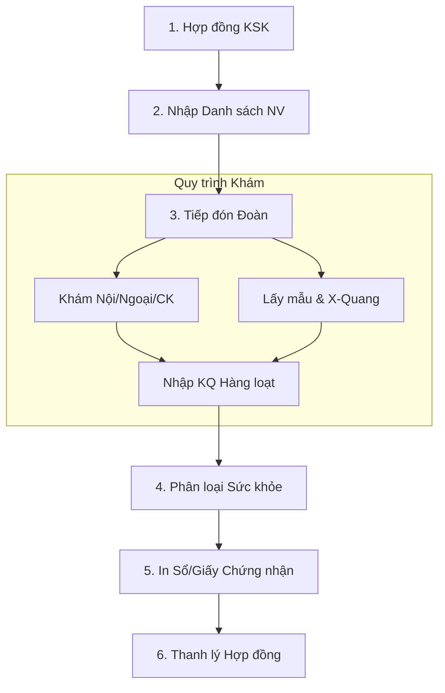

# Quản lý Khám Sức Khỏe (KSK) - Business Overview

## 1. Mục đích và Phạm vi
Phân hệ Khám Sức Khỏe (KSK) quản lý các quy trình khám bệnh tập trung, bao gồm khám sức khỏe định kỳ cho doanh nghiệp, khám lái xe, và khám tuyển dụng.
Phạm vi bao gồm:
*   Quản lý Hợp đồng khám sức khỏe đoàn (Công ty/Cơ quan).
*   Quản lý Khám sức khỏe lái xe (Theo quy định Bộ GTVT).
*   Quy trình tiếp đón và khám hàng loạt (Mass examination).

## 2. Quy trình Nghiệp vụ Tổng quan

## 3. Các Hoạt động Chính

### 3.1. KSK Đoàn / Hợp đồng (Cooperate Contracts)
*   **Quản lý Hợp đồng (`KskContract`)**: Định nghĩa thông tin công ty, số lượng nhân viên, gói khám (các dịch vụ được bao gồm), tổng giá trị hợp đồng.
*   **Phân bổ chi phí**: Quản lý phần công ty chi trả và phần nhân viên tự chi trả thêm (nếu có).
*   **Tiếp đón hàng loạt**: Check-in nhanh theo danh sách nhập sẵn (Excel), in barcode hàng loạt.

### 3.2. KSK Lái xe (Driver License)
Quy trình đặc thù tuân thủ mẫu của Bộ Y tế/GTVT:
*   **Xét nghiệm bắt buộc**: Ma túy (4-5 chỉ số), nồng độ cồn.
*   **Khám chuyên khoa**: Tâm thần, Mắt (Thị lực/Mù màu), Tai mũi họng.
*   **Kết luận**: Đủ điều kiện lái xe hạng hạng (A1, B1, C...).
*   **Liên thông**: Có khả năng liên thông dữ liệu lên Cổng giám định BHYT/Sở GTVT (nếu tích hợp).

### 3.3. Nhập liệu và Phân loại
*   **Nhập hàng loạt (`EnterKskInfomantion`)**: Giao diện tối ưu cho phép bác sĩ nhập nhanh kết quả cho nhiều bệnh nhân cùng lúc (theo dây chuyền).
*   **Phân loại tự động**: Hệ thống tự động xếp loại sức khỏe (I, II, III, IV, V) dựa trên quy tắc của Bộ Y tế.

## 4. Chức năng Hệ thống (Key Features)

### 4.1. In ấn Hàng loạt
*   In hồ sơ khám, sổ khám sức khỏe.
*   In báo cáo tổng hợp tình hình sức khỏe cho công ty (Tỷ lệ mắc bệnh, phân loại).

### 4.2. Khám Dịch vụ Ngoại viện (Mobile)
*   Hỗ trợ quy trình đi khám tại cơ sở của doanh nghiệp (Off-site), đồng bộ dữ liệu về máy chủ sau khi kết thúc đợt khám.

## 5. Liên kết Tài liệu
*   Module chính: `HIS.Desktop.Plugins.KskContract`, `HIS.Desktop.Plugins.KskDriver`.
*   Nhập liệu: `HIS.Desktop.Plugins.EnterKskInfomantion`.
