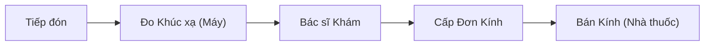

# Quản lý Khúc Xạ & Mắt (Optometry) - Business Overview

## 1. Mục đích và Phạm vi
Phân hệ Optometry hỗ trợ quy trình khám chuyên khoa mắt, đặc biệt là đo khúc xạ và kê đơn kính.
Phạm vi bao gồm:
*   Đo khúc xạ (Refraction).
*   Đo nhãn áp.
*   Cấp toa kính (Glasses Prescription).

## 2. Quy trình Nghiệp vụ Tổng quan

## 3. Các Hoạt động Chính

### 3.1. Đo Khúc Xạ (Refraction Measurement)
Ghi nhận các chỉ số từ máy đo khúc xạ tự động hoặc đo thủ công:
*   **Mắt Phải (OD) / Mắt Trái (OS)**.
*   **SPH (Độ cầu)**: Cận/Viễn.
*   **CYL (Độ trụ)**: Loạn thị.
*   **AX (Trục)**: Trục loạn.
*   **ADD**: Độ nhìn gần.
*   **PD (Khoảng cách đồng tử)**.

### 3.2. Cấp Toa Kính (Glasses Prescription)
*   Bác sĩ dựa trên kết quả đo và khả năng thích nghi của bệnh nhân để ra toa kính cuối cùng.
*   In phiếu đo mắt và đơn kính.

### 3.3. Tích hợp Bán hàng
*   Đơn kính được chuyển trực tiếp sang phân hệ Nhà thuốc/Vật tư để thực hiện bán kính thuốc, gọng kính cho bệnh nhân.

## 4. Chức năng Hệ thống (Key Features)

### 4.1. Kết nối Máy đo Khúc xạ
*   Hệ thống có khả năng kết nối (Interface) với các dòng máy đo khúc xạ phổ biến để lấy số liệu tự động, tránh sai sót nhập liệu.

## 5. Liên kết Tài liệu
*   Module chính: `HIS.Desktop.Plugins.Optometrist`.
