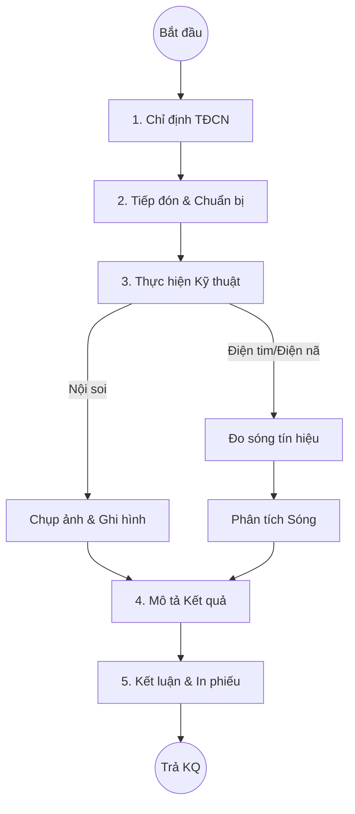

# Quy trình Thăm dò Chức năng (Functional Exploration)

## 1. Tổng quan
Quy trình mô tả các hoạt động thực hiện dịch vụ nội soi (Tiêu hóa, Tai mũi họng), thăm dò điện sinh lý (Điện tim, Điện não) và các kỹ thuật thăm dò chức năng hô hấp/tuần hoàn.

## 2. Lưu đồ Quy trình

## 3. Chi tiết Các bước & Mapping Plugin

### 3.1. Tiếp đón và Chuẩn bị (Preparation)
Tại phòng Nội soi/TĐCN, điều dưỡng kiểm tra thông tin hành chính, hướng dẫn bệnh nhân chuẩn bị (nhịn ăn, tẩy ruột... với nội soi tiêu hóa).
*   **Plugin chính**:
    *   `HIS.Desktop.Plugins.SampleCollectionRoom` (Tái sử dụng cho luồng tiếp đón CLS chung).
    *   `HIS.Desktop.Plugins.CallPatientCLS`: Gọi bệnh nhân.

### 3.2. Thực hiện Kỹ thuật & Bắt hình (Execution & Capture)
Bác sĩ thực hiện kỹ thuật. Hệ thống kết nối với thiết bị (Máy nội soi) để bắt hình ảnh thời gian thực (nếu có Card Capture).
*   **Plugin chính**:
    *   `HIS.Desktop.Plugins.ExecuteRoom`: Màn hình thực hiện.
    *   `HIS.Desktop.Plugins.Camera`: Module kết nối Camera/Card Capture để lấy ảnh từ máy nội soi/siêu âm.

### 3.3. Mô tả và Trả kết quả (Reporting)
Bác sĩ chọn mẫu mô tả (Template) phù hợp với kỹ thuật và chỉnh sửa chi tiết.
*   **Plugin chính**:
    *   `HIS.Desktop.Plugins.HisEndoServiceType`: Cấu hình danh mục và mẫu phiếu nội soi/TĐCN.
    *   `HIS.Desktop.Plugins.ServiceReqResult`: Nhập kết quả. Hỗ trợ chèn ảnh đã chụp vào phiếu in.

## 4. Các Loại Kỹ thuật Phổ biến
*   **Nội soi**: Dạ dày, Đại tràng, Tai mũi họng, Phế quản.
*   **Điện sinh lý**: Điện tâm đồ (ECG), Điện não đồ (EEG), Điện cơ (EMG).
*   **Hô hấp**: Đo chức năng hô hấp (Spirometry).

## 5. Dữ liệu Đầu ra
*   **Phiếu kết quả Nội soi**: Kèm 2-4 ảnh màu.
*   **Phiếu kết quả Điện tim**: Kèm biểu đồ sóng (nếu máy có kết nối số) hoặc dán giấy in nhiệt.

## 6. Liên kết Tài liệu
*   [Quy trình Chẩn đoán Hình ảnh](./01-diagnostic-imaging.md).
