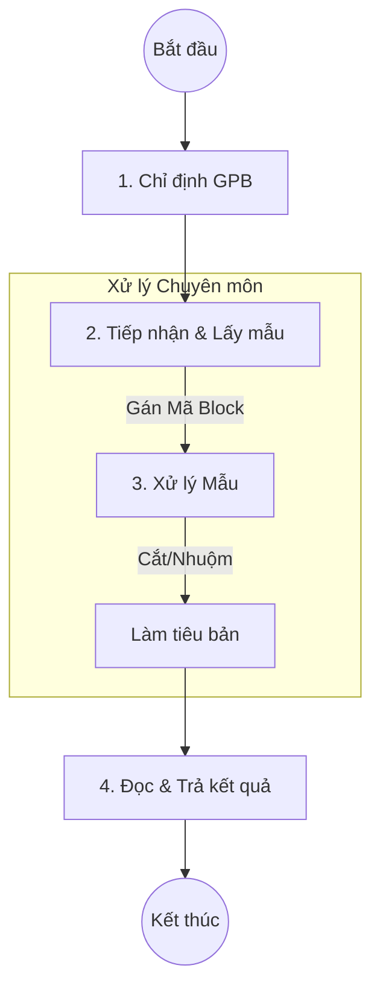

# Quy trình Giải phẫu bệnh (Pathology)

## 1. Tổng quan
Phân hệ Giải phẫu bệnh (GPB) quản lý quy trình xét nghiệm mô bệnh học và tế bào học, từ khâu tiếp nhận mẫu bệnh phẩm, xử lý kỹ thuật (cắt nhuộm, đúc block) đến khi bác sĩ đọc và trả kết quả.

## 2. Lưu đồ Quy trình

## 3. Chi tiết Các bước & Mapping Plugin

### 3.1. Chỉ định (Indication)
Bác sĩ lâm sàng chỉ định xét nghiệm GPB/Tế bào học (VD: Sinh thiết, FNA, Papsmear...).
*   **Lưu ý**: Cần ghi rõ vị trí lấy mẫu và tóm tắt lâm sàng.

### 3.2. Tiếp nhận & Lấy mẫu (Reception & Sampling)
Tại khoa GPB, kỹ thuật viên tiếp nhận bệnh phẩm và xác nhận trên phần mềm.
*   **Plugin chính**: `HIS.Desktop.Plugins.SamplePathologyReq` - Danh sách công việc (Worklist) Giải phẫu bệnh.
*   **Quy trình chi tiết**:
    1.  **Lấy danh sách**: Lọc bệnh nhân theo ngày, trạng thái.
    2.  **Xác nhận Lấy mẫu (Sampled)**: Chuyển trạng thái từ "Chưa lấy mẫu" -> "Đã lấy mẫu".
    3.  **Gán mã Block (Block Code)**: Nhập mã hộp sáp/Block (VD: `B.23-001`) để quản lý lưu trữ và truy xuất sau này.
    4.  **In phiếu**: In phiếu yêu cầu/Phiếu chuyển mẫu giải phẫu bệnh kẹp cùng lọ bệnh phẩm.

### 3.3. Đọc và Trả kết quả (Reporting)
Bác sĩ GPB đọc tiêu bản dưới kính hiển vi và nhập kết quả mô tả trên hệ thống.
*   **Plugin chính**: Sử dụng chung cấu trúc `HIS.Desktop.Plugins.ServiceReqResult` nhưng được cấu hình riêng cho loại dịch vụ GPB.
*   **Nội dung trả**:
    *   Đại thể (Macroscopic).
    *   Vi thể (Microscopic).
    *   Kết luận (Diagnosis).
    *   Mã ICD-O (Ung bướu) nếu có.

## 4. Trạng thái Quy trình
Hệ thống theo dõi tiến độ qua các trạng thái:
1.  **Chưa lấy mẫu (Pending)**: Mới chỉ định.
2.  **Đã lấy mẫu (Sampled)**: Đã nhận bệnh phẩm và gán code.
3.  **Đâng xử lý (Processing)**: Đang trong quá trình kỹ thuật.
4.  **Hoàn thành (Completed)**: Đã trả kết quả.

## 5. Liên kết Tài liệu
*   [Danh mục Dịch vụ Cận lâm sàng](../subclinical/02-functional-exploration.md) (Tham khảo cấu trúc chung trả KQ).
