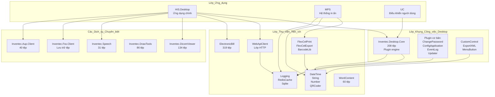
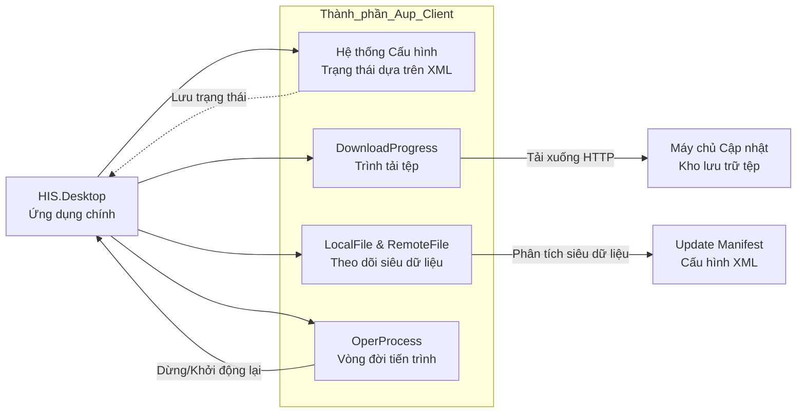
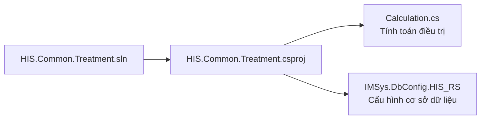
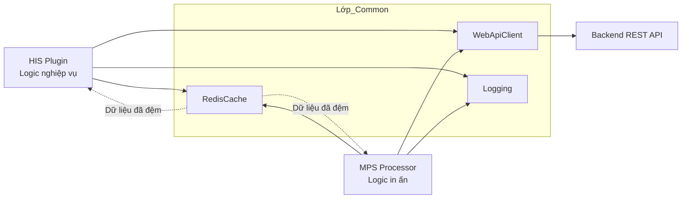
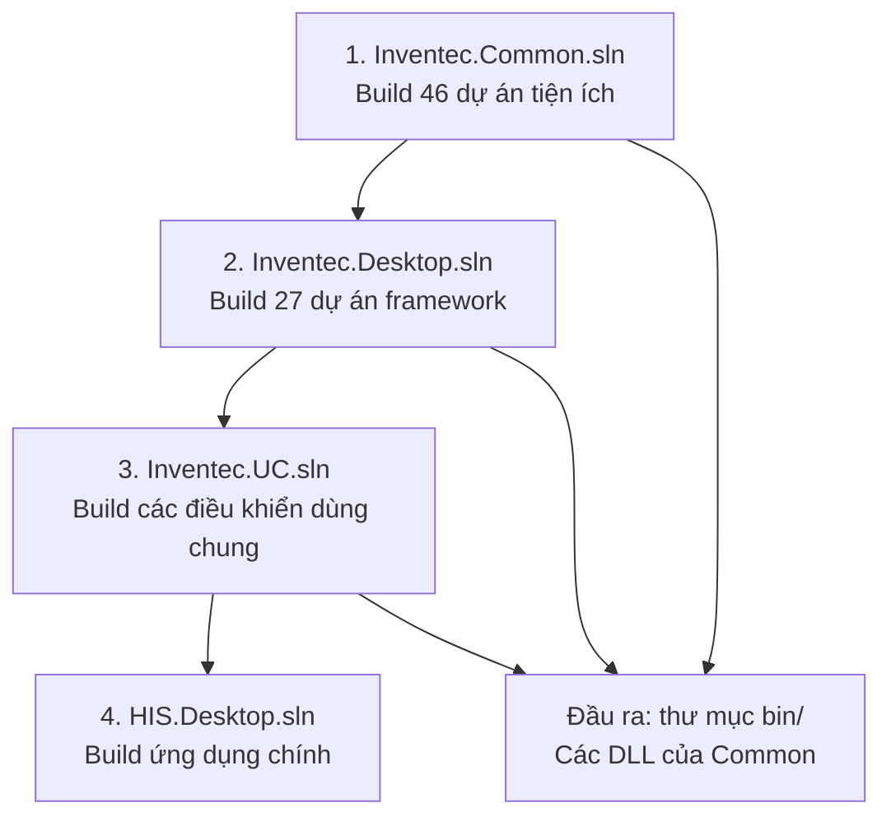

## Mục đích và Phạm vi

Thư mục `Common/` chứa các thư viện tiện ích và khung (framework) nền tảng, cung cấp các chức năng cốt lõi cho tất cả các mô-đun của hệ thống HIS. Trang này cung cấp cái nhìn tổng quan về 12 nhóm thành phần chính, kiến trúc và các phụ thuộc (dependencies) của chúng. Các thư viện Common tạo nên một nền tảng ba tầng: các tiện ích cốt lõi (Inventec.Common), khung công việc cho ứng dụng desktop (Inventec.Desktop), và các điều khiển giao diện (UI controls) dùng chung (Inventec.UC), cùng với các thư viện chuyên dụng cho chẩn đoán hình ảnh y khoa, lưu trữ tệp tin và nhận dạng giọng nói.

Để biết thêm chi tiết về các phân hệ cụ thể:
- Tiện ích Inventec.Common (46 dự án) - xem [Tiện ích Inventec Common](../../02-modules/common-libraries/libraries.md#inventec-common)
- Khung công việc Inventec.Desktop (27 dự án) - xem [Khung công việc Inventec Desktop](../../02-modules/common-libraries/libraries.md#inventec-desktop)  
- Các điều khiển dùng chung Inventec.UC (1,060 tệp) - xem [Điều khiển dùng chung Inventec UC](../../02-modules/common-libraries/libraries.md#inventec-uc)

## Danh mục thành phần

Thư mục `Common/` chứa 12 nhóm thành phần chính được tổ chức theo chức năng:

| Thành phần | Số lượng tệp | Mục đích chính | Các dự án then chốt |
|-----------|------------|-----------------|--------------|
| `Inventec.UC` | 1,060 tệp | Nền tảng các điều khiển UI dùng chung | TreatmentRecord, TreeSereServHein |
| `Inventec.Common` | 890 tệp (46 dự án) | Các tiện ích đa mục đích | ElectronicBill, QRCoder, FlexCelPrint, WebApiClient, Logging |
| `Inventec.Desktop` | 455 tệp (27 dự án) | Khung công việc cho ứng dụng desktop | Core (208 tệp), hệ thống plugin, các plugin cơ bản |
| `Inventec.DicomViewer` | 134 tệp | Trình xem hình ảnh y tế | Hỗ trợ định dạng DICOM, xử lý hình ảnh |
| `Inventec.DrawTools` | 86 tệp | Công cụ vẽ và chú thích | Các tiện ích đồ họa |
| `Inventec.Aup.Client` | 40 tệp | Client tự động cập nhật | Quản lý tải xuống, kiểm soát phiên bản, vòng đời tiến trình |
| `Inventec.Speech` | 31 tệp | Nhận dạng giọng nói | Chuyển giọng nói thành văn bản cho ghi chép y tế |
| `Inventec.Fss.Client` | Thay đổi | Client dịch vụ lưu trữ tệp | Tải lên/tải xuống tệp từ xa |
| `Inventec.WCF` | Thay đổi | Lớp giao tiếp WCF | Các hợp đồng dịch vụ (Service contracts) |
| `HIS.Common.*` | Thay đổi | Các tiện ích đặc thù cho HIS | Tính toán điều trị, logic nghiệp vụ |

Nguồn: [[`.devin/wiki.json:243-246`](../../../../.devin/wiki.json#L243-L246)](../../../../.devin/wiki.json#L243-L246)

## Các lớp Kiến trúc

### Luồng phụ thuộc giữa các lớp



Sơ đồ minh họa cấu trúc phụ thuộc từ dưới lên:
- **Các mô-đun ứng dụng** (HIS, MPS, UC) phụ thuộc vào cả lớp khung công việc (framework) và lớp tiện ích (utility).
- **Lớp khung công việc desktop** cung cấp hạ tầng plugin và quản lý vòng đời ứng dụng.
- **Lớp thư viện tiện ích** cung cấp các tính năng xuyên suốt (logging, caching, giao tiếp API).
- **Các dịch vụ chuyên biệt** được các mô-đun ứng dụng sử dụng trực tiếp cho các nhu cầu đặc thù của nghiệp vụ.

Nguồn: [[`.devin/wiki.json:240-247`](../../../../.devin/wiki.json#L240-L247)](../../../../.devin/wiki.json#L240-L247)

## Inventec.Common - Thư viện Tiện ích (46 Dự án)

Namespace `Inventec.Common` chứa 46 dự án riêng biệt với tổng cộng 890 tệp, cung cấp các tiện ích đa mục đích trên nhiều lĩnh vực khác nhau.

### Giao tiếp & Tích hợp

| Dự án | Số tệp | Mục đích |
|---------|-------|---------|
| `Inventec.Common.WebApiClient` | Thay đổi | Client REST API với xác thực, logic thử lại (retry), và xử lý lỗi |
| `Inventec.Common.ElectronicBill` | 319 tệp | Tích hợp hóa đơn điện tử với các cơ quan thuế Việt Nam |
| `Inventec.Common.RedisCache` | 26 tệp | Lớp đệm (caching) Redis để tối ưu hóa hiệu suất |
| `Inventec.Common.Sqlite` | 32 tệp | Các tiện ích cơ sở dữ liệu SQLite cục bộ |
| `Inventec.Common.WitAI` | 25 tệp | Tích hợp xử lý ngôn ngữ tự nhiên Wit.ai |

### Tạo Tài liệu

| Dự án | Số tệp | Mục đích |
|---------|-------|---------|
| `Inventec.Common.FlexCelPrint` | 38 tệp | Tạo tài liệu in ấn sử dụng thư viện FlexCell |
| `Inventec.Common.FlexCelExport` | 23 tệp | Chức năng xuất dữ liệu Excel/PDF |
| `Inventec.Common.WordContent` | 60 tệp | Thao tác với tài liệu Microsoft Word |
| `Inventec.Common.QRCoder` | 51 tệp | Tạo và giải mã mã QR |
| `Inventec.Common.BarcodeLib` | 32 tệp | Tạo mã vạch (nhiều định dạng) |

### Thao tác Dữ liệu & Tiện ích Cốt lõi

| Dự án | Mục đích |
|---------|---------|
| `Inventec.Common.Logging` | Khung ghi nhật ký (logging) toàn hệ thống với nhiều đích đầu ra |
| `Inventec.Common.DateTime` | Các tiện ích ngày/giờ hỗ trợ lịch Việt Nam |
| `Inventec.Common.String` | Thao tác và kiểm tra (validation) chuỗi văn bản |
| `Inventec.Common.Number` | Định dạng và tính toán số học |

Nguồn: [[`.devin/wiki.json:250-256`](../../../../.devin/wiki.json#L250-L256)](../../../../.devin/wiki.json#L250-L256)

## Inventec.Desktop - Khung công việc Ứng dụng (27 Dự án)

Namespace `Inventec.Desktop` cung cấp khung công việc nền tảng cho ứng dụng desktop, bao gồm 27 dự án và 455 tệp.

### Các Thành phần Cốt lõi của Framework

```mermaid
graph TB
    Desktop_Core["Inventec.Desktop.Core<br/>208 tệp"]
    
    subgraph "Trách_nhiệm_Cốt_lõi"
        Discovery["Khám phá Plugin<br/>Quét các assembly"]
        Registration["Đăng ký Plugin<br/>Sổ đăng ký mô-đun"]
        Lifecycle["Quản lý Vòng đời<br/>Khởi tạo, Bắt đầu, Dừng"]
        Loading["Tải Mô-đun<br/>Tải assembly động"]
    end
    
    subgraph "Plugin_Cơ_bản"
        ChangePass["ChangePassword"]
        ConfigApp["ConfigApplication"]
        EventLog["EventLog"]
        Updater["Updater"]
        TrackUser["TrackingUser"]
        PrintLog["PrintLog"]
        ProductVer["ProductVersion"]
        Developer["Developer"]
    end
    
    subgraph "Thành_phần_UI"
        CustomControl["CustomControl<br/>26 tệp"]
        ExportXML["ExportXML<br/>30 tệp"]
        MenuButton["MenuButton"]
    end
    
    Desktop_Core --> Discovery
    Desktop_Core --> Registration
    Desktop_Core --> Lifecycle
    Desktop_Core --> Loading
    
    Desktop_Core --> ChangePass
    Desktop_Core --> ConfigApp
    Desktop_Core --> EventLog
    Desktop_Core --> Updater
    Desktop_Core --> TrackUser
    Desktop_Core --> PrintLog
    Desktop_Core --> ProductVer
    Desktop_Core --> Developer
    
    Desktop_Core --> CustomControl
    Desktop_Core --> ExportXML
    Desktop_Core --> MenuButton
```



### Các Plugin Cơ bản (8 Plugin tích hợp sẵn)

| Tên Plugin | Mục đích |
|-------------|---------|
| `ChangePassword` | Giao diện đổi mật khẩu người dùng |
| `ConfigApplication` | UI quản lý cấu hình ứng dụng |
| `Developer` | Công cụ dành cho lập trình viên và các tiện ích gỡ lỗi |
| `EventLog` | Trình xem nhật ký sự kiện hệ thống |
| `Plugin` | Giao diện quản lý plugin |
| `PrintLog` | Ghi nhật ký và lịch sử thao tác in ấn |
| `ProductVersion` | Hiển thị thông tin phiên bản |
| `TrackingUser` | Theo dõi hoạt động người dùng và kiểm tra (audit) |
| `Updater` | Cơ chế tự động cập nhật ứng dụng |

Nguồn: [[`.devin/wiki.json:260-267`](../../../../.devin/wiki.json#L260-L267)](../../../../.devin/wiki.json#L260-L267)

## Inventec.UC - Thư viện Điều khiển Dùng chung (1,060 Tệp)

Dự án `Inventec.UC` là thành phần Common lớn nhất với 1,060 tệp, cung cấp các điều khiển UI nền tảng được sử dụng trong toàn bộ ứng dụng.

### Các Thành phần Chính

| Thành phần | Số tệp | Mục đích |
|-----------|-------|---------|
| `TreatmentRecord` | 29 tệp | Các điều khiển hiển thị và chỉnh sửa hồ sơ điều trị |
| `TreeSereServHein` | 29 tệp | Cây dịch vụ với hiển thị thông tin bảo hiểm |

Các điều khiển này tạo thành lớp cơ sở mà thư viện HIS.UC.* (131 thành phần) xây dựng dựa trên đó. Các dự án HIS.UC.* mở rộng các điều khiển nền tảng này với các chức năng đặc thù của nghiệp vụ.

Để biết đầy đủ về các thành phần UC, xem [Thư viện Thành phần UC](../../02-modules/uc-controls/form-type-controls.md) và [Các điều khiển dùng chung Inventec UC](../../02-modules/common-libraries/libraries.md#inventec-uc).

Nguồn: [[`.devin/wiki.json:270-272`](../../../../.devin/wiki.json#L270-L272)](../../../../.devin/wiki.json#L270-L272)

## Các Thành phần Chuyên biệt

### Inventec.DicomViewer (134 Tệp)

Trình xem hình ảnh y tế hỗ trợ định dạng tiêu chuẩn DICOM:

**Khả năng:**
- Tải và hiển thị hình ảnh DICOM
- Các thao tác windowing/leveling để điều chỉnh độ tương phản
- Các công cụ đo lường (khoảng cách, góc, diện tích)
- Hỗ trợ đa khung hình (multi-frame) và đa chuỗi hình (multi-series)
- Tích hợp với PACS (Hệ thống lưu trữ và truyền thông hình ảnh)
- Các công cụ chú thích và đánh dấu

**Tích hợp:** Được sử dụng bởi các plugin chẩn đoán hình ảnh của HIS để hiển thị kết quả X-quang, CT scan, MRI và các hình ảnh y tế khác.

### Inventec.Speech (31 Tệp)

Tích hợp nhận dạng giọng nói cho quy trình ghi chép y tế:

**Tính năng:**
- Chuyển đổi giọng nói thành văn bản
- Hỗ trợ từ vựng thuật ngữ y tế
- Nhận dạng lệnh thoại
- Tích hợp quy trình đọc ghi chú
- Hỗ trợ thuật ngữ y tế tiếng Việt

**Các trường hợp sử dụng:** 
- Đọc ghi chú lâm sàng
- Nhập đơn thuốc bằng giọng nói
- Tạo báo cáo chẩn đoán

### Inventec.Fss.Client

Client Dịch vụ Lưu trữ Tệp (File Storage Service) cho các thao tác tệp từ xa:

**Chức năng:**
- Tải lên/tải xuống tệp với tính năng theo dõi tiến trình
- Quản lý siêu dữ liệu (metadata) (kích thước tệp, loại tệp, ngày tải lên)
- Kiểm soát phiên bản cho các lần sửa đổi tài liệu
- Xử lý quyền truy cập
- Tích hợp với dịch vụ FSS ở backend

**Được sử dụng bởi:** Các plugin quản lý tài liệu, lưu trữ tài liệu EMR, xử lý tệp đính kèm.

### Inventec.Aup.Client (40 Tệp)

Hệ thống client tự động cập nhật quản lý việc cập nhật ứng dụng:



**Quy trình Cập nhật:**
1. Kiểm tra cập nhật thông qua tệp manifest XML
2. Tải xuống các tệp mới với tính năng theo dõi tiến trình
3. Dừng ứng dụng
4. Thay thế các tệp
5. Khởi động lại ứng dụng

Nguồn: [[`.devin/wiki.json:243-246`](../../../../.devin/wiki.json#L243-L246)](../../../../.devin/wiki.json#L243-L246)

## Các Thư viện HIS.Common

### HIS.Common.Treatment

Các tiện ích tính toán điều trị cung cấp logic đặc thù của nghiệp vụ.

**Cấu trúc Dự án:**



**Vị trí Tệp:**
- Solution: [[`Common/HIS.Common.Treatment/HIS.Common.Treatment.sln:1-20`](../../../../Common/HIS.Common.Treatment/HIS.Common.Treatment.sln#L1-L20)](../../../../Common/HIS.Common.Treatment/HIS.Common.Treatment.sln#L1-L20)
- Project: [[`Common/HIS.Common.Treatment/HIS.Common.Treatment/HIS.Common.Treatment.csproj:1-57`](../../../../Common/HIS.Common.Treatment/HIS.Common.Treatment/HIS.Common.Treatment.csproj#L1-L57)](../../../../Common/HIS.Common.Treatment/HIS.Common.Treatment/HIS.Common.Treatment.csproj#L1-L57)
- Assembly: [[`Common/HIS.Common.Treatment/HIS.Common.Treatment/Properties/AssemblyInfo.cs:1-37`](../../../../Common/HIS.Common.Treatment/HIS.Common.Treatment/Properties/AssemblyInfo.cs#L1-L37)](../../../../Common/HIS.Common.Treatment/HIS.Common.Treatment/Properties/AssemblyInfo.cs#L1-L37)

**Phụ thuộc:**
- `IMSys.DbConfig.HIS_RS` - Truy cập cấu hình cơ sở dữ liệu
- .NET Framework 4.5 ([[`Common/HIS.Common.Treatment/HIS.Common.Treatment/HIS.Common.Treatment.csproj:12`](../../../../Common/HIS.Common.Treatment/HIS.Common.Treatment/HIS.Common.Treatment.csproj#L12)](../../../../Common/HIS.Common.Treatment/HIS.Common.Treatment/HIS.Common.Treatment.csproj#L12))

**Mục đích:** Cung cấp logic tính toán liên quan đến điều trị (ví dụ: tính toán liều lượng, thời gian điều trị) được sử dụng trong các mô-đun HIS.

Nguồn: [[`Common/HIS.Common.Treatment/HIS.Common.Treatment.sln:1-20`](../../../../Common/HIS.Common.Treatment/HIS.Common.Treatment.sln#L1-L20)](../../../../Common/HIS.Common.Treatment/HIS.Common.Treatment.sln#L1-L20), [[`Common/HIS.Common.Treatment/HIS.Common.Treatment/HIS.Common.Treatment.csproj:1-57`](../../../../Common/HIS.Common.Treatment/HIS.Common.Treatment/HIS.Common.Treatment.csproj#L1-L57)](../../../../Common/HIS.Common.Treatment/HIS.Common.Treatment/HIS.Common.Treatment.csproj#L1-L57), [[`Common/HIS.Common.Treatment/HIS.Common.Treatment/Properties/AssemblyInfo.cs:1-37`](../../../../Common/HIS.Common.Treatment/HIS.Common.Treatment/Properties/AssemblyInfo.cs#L1-L37)](../../../../Common/HIS.Common.Treatment/HIS.Common.Treatment/Properties/AssemblyInfo.cs#L1-L37)

## Ánh xạ Thực thể Mã nguồn

### Khái niệm Ngôn ngữ Tự nhiên sang Thực thể mã nguồn

```mermaid
graph TB
    subgraph "Khái_niệm_Nghiệp_vụ"
        API["Giao tiếp API"]
        EInvoice["Hóa đơn điện tử"]
        Printing["In ấn Tài liệu"]
        Caching["Đệm dữ liệu (Caching)"]
        Logging["Ghi nhật ký hệ thống"]
        Plugins["Hệ thống Plugin"]
        Updates["Tự động Cập nhật"]
        Imaging["Hình ảnh Y tế"]
        Voice["Đầu vào Giọng nói"]
    end
    
    subgraph "Namespaces_Mã_nguồn"
        NS_WebAPI["Inventec.Common.WebApiClient"]
        NS_EBill["Inventec.Common.ElectronicBill"]
        NS_FlexCel["Inventec.Common.FlexCelPrint<br/>Inventec.Common.FlexCelExport"]
        NS_Redis["Inventec.Common.RedisCache"]
        NS_Log["Inventec.Common.Logging"]
        NS_Core["Inventec.Desktop.Core"]
        NS_Aup["Inventec.Aup.Client"]
        NS_Dicom["Inventec.DicomViewer"]
        NS_Speech["Inventec.Speech"]
    end
    
    API --> NS_WebAPI
    EInvoice --> NS_EBill
    Printing --> NS_FlexCel
    Caching --> NS_Redis
    Logging --> NS_Log
    Plugins --> NS_Core
    Updates --> NS_Aup
    Imaging --> NS_Dicom
    Voice --> NS_Speech
```



### Các Lớp và Interface Chính

| Khái niệm Nghiệp vụ | Namespace | Các Lớp/Interface Chính |
|----------------|-----------|------------------------|
| Giao tiếp API | `Inventec.Common.WebApiClient` | `ApiConsumer`, `WebApiRequest`, `WebApiResponse` |
| Hóa đơn điện tử | `Inventec.Common.ElectronicBill` | `BillProcessor`, `TaxAuthorityClient`, `InvoiceData` |
| In ấn Tài liệu | `Inventec.Common.FlexCelPrint` | `PrintManager`, `TemplateProcessor`, `ExportFormat` |
| Đệm dữ liệu | `Inventec.Common.RedisCache` | `RedisCacheManager`, `CacheKey`, `CacheValue` |
| Ghi nhật ký | `Inventec.Common.Logging` | `LogSystem`, `LogAction`, `LogLevel` |
| Hệ thống Plugin | `Inventec.Desktop.Core` | `IModule`, `ModuleLoader`, `PluginRegistry` |
| Tự động Cập nhật | `Inventec.Aup.Client` | `DownloadProgress`, `OperProcess`, `UpdateManifest` |
| Hình ảnh Y tế | `Inventec.DicomViewer` | `DicomImage`, `ViewerControl`, `ImageProcessor` |
| Nhận dạng Giọng nói | `Inventec.Speech` | `SpeechRecognizer`, `DictationEngine`, `VoiceCommand` |

Nguồn: [[`.devin/wiki.json:243-267`](../../../../.devin/wiki.json#L243-L267)](../../../../.devin/wiki.json#L243-L267)

## Các Mô hình Tích hợp

### Giao tiếp Liên mô-đun



**Luồng Giao tiếp:**
1. Các plugin HIS và bộ xử lý MPS sử dụng cùng một instance `WebApiClient` để giao tiếp API nhất quán.
2. `RedisCache` cung cấp bộ nhớ đệm dùng chung cho tất cả các mô-đun.
3. `Logging` đảm bảo việc ghi nhật ký thống nhất qua các ranh giới ứng dụng.

**Lợi ích:**
- Điểm cấu hình API duy nhất (URL gốc, xác thực).
- Bộ nhớ đệm dùng chung giảm các lời gọi API dư thừa.
- Ghi nhật ký tập trung để dễ dàng xử lý sự cố.

### Truy cập của Plugin vào các Thư viện Common

Các plugin truy cập thư viện Common thông qua ba cơ chế:

1. **Tham chiếu Trực tiếp:** Dự án plugin tham chiếu đến DLL của Common.
   ```xml
   <Reference Include="Inventec.Common.Logging">
     <HintPath>..\..\Common\bin\Inventec.Common.Logging.dll</HintPath>
   </Reference>
   ```

2. **Truy cập Tĩnh:** Các mô hình Singleton cho các tiện ích.
   ```csharp
   Inventec.Common.Logging.LogSystem.Info("Message");
   ```

3. **Tiêm phụ thuộc (Dependency Injection):** Các instance do Framework cung cấp.
   ```csharp
   public MyPlugin(ILoggingService logger, IApiClient apiClient)
   {
       this.logger = logger;
       this.apiClient = apiClient;
   }
   ```

Nguồn: [[`.devin/wiki.json:240-247`](../../../../.devin/wiki.json#L240-L247)](../../../../.devin/wiki.json#L240-L247)

## Các Phụ thuộc Bên ngoài

### Thư viện của Bên thứ ba

Các thư viện Common tích hợp với các thành phần thương mại và mã nguồn mở:

| Thư viện | Phiên bản | Được dùng bởi | Mục đích |
|---------|---------|---------|---------|
| FlexCell | 5.7.6.0 | `FlexCelPrint`, `FlexCelExport` | Tạo tài liệu Excel |
| BarTender | 10.1.0 | `BarcodeLib` | In mã vạch |
| Redis | Thay đổi | `RedisCache` | Bộ nhớ đệm phân tán |
| SQLite | Thay đổi | `Sqlite` | Cơ sở dữ liệu cục bộ |
| Wit.ai | Thay đổi | `WitAI` | Xử lý ngôn ngữ tự nhiên |

### Các Dịch vụ Bên ngoài

| Dịch vụ | Thư viện Client | Mục đích |
|---------|----------------|---------|
| Tổng cục Thuế Việt Nam | `ElectronicBill` | Gửi và xác thực hóa đơn điện tử |
| Hệ thống PACS | `DicomViewer` | Tích hợp hình ảnh y tế (giao thức DICOM) |
| Dịch vụ lưu trữ tệp | `Fss.Client` | Lưu trữ và truy xuất tệp từ xa |
| Máy chủ cập nhật | `Aup.Client` | Quản lý phiên bản ứng dụng |

Nguồn: [[`.devin/wiki.json:12-14`](../../../../.devin/wiki.json#L12-L14)](../../../../.devin/wiki.json#L12-L14)

## Các Ví dụ Sử dụng

### Giao tiếp API

```csharp
// Sử dụng WebApiClient cho các lời gọi REST API
using Inventec.Common.WebApiClient;

var apiClient = new ApiConsumer();
var result = await apiClient.Get<List<PatientDTO>>(
    endpoint: "/api/patients",
    parameters: new { page = 1, pageSize = 50 }
);

if (result.Success)
{
    var patients = result.Data;
    // Xử lý dữ liệu bệnh nhân
}
```

### Logging (Ghi nhật ký)

```csharp
// Ghi nhật ký toàn hệ thống sử dụng LogSystem
using Inventec.Common.Logging;

public class MyPlugin
{
    public void ProcessData()
    {
        LogSystem.Info("Bắt đầu xử lý");
        
        try
        {
            // Logic nghiệp vụ
            LogSystem.Debug("Đang xử lý hồ sơ bệnh nhân 12345");
        }
        catch (Exception ex)
        {
            LogSystem.Error("Xử lý thất bại", ex);
        }
    }
}
```

### Caching (Bộ nhớ đệm)

```csharp
// Sử dụng RedisCache để đệm dữ liệu
using Inventec.Common.RedisCache;

public class DataService
{
    private RedisCacheManager cache;
    
    public async Task<List<Medicine>> GetMedicines()
    {
        var cacheKey = "medicines:all";
        var cached = await cache.GetAsync<List<Medicine>>(cacheKey);
        
        if (cached != null)
            return cached;
        
        var medicines = await LoadFromDatabase();
        await cache.SetAsync(cacheKey, medicines, TimeSpan.FromHours(1));
        
        return medicines;
    }
}
```

### Tạo Tài liệu

```csharp
// Tạo báo cáo Excel bằng FlexCelPrint
using Inventec.Common.FlexCelPrint;

public void GeneratePrescriptionReport(PrescriptionData data)
{
    var printManager = new PrintManager();
    var result = printManager.Print(
        templateFile: "Templates/Prescription.xls",
        data: data,
        outputFormat: ExportFormat.Pdf,
        outputPath: "Output/Prescription_12345.pdf"
    );
}
```

### Tạo Hóa đơn Điện tử

```csharp
// Tạo hóa đơn điện tử cho cơ quan thuế
using Inventec.Common.ElectronicBill;

public void CreateElectronicInvoice(InvoiceData invoiceData)
{
    var processor = new BillProcessor();
    var result = processor.CreateBill(
        invoiceData: invoiceData,
        taxAuthorityCode: "VIETSENS-001",
        certificatePath: "certificates/tax-cert.pfx"
    );
    
    if (result.Success)
    {
        LogSystem.Info($"Hóa đơn điện tử đã được tạo: {result.InvoiceNumber}");
    }
}
```

## Quản lý Cấu hình

### Các Nguồn Cấu hình

Các thư viện Common đọc cấu hình từ nhiều nguồn với thứ tự ưu tiên sau:

1. **Biến môi trường** (ưu tiên cao nhất) - dành cho dữ liệu nhạy cảm như khóa API.
2. **Các tệp cấu hình XML** - các cài đặt cấp ứng dụng.
3. **Cấu hình cơ sở dữ liệu** - các tùy chọn của người dùng và hệ thống.
4. **Giá trị mặc định** (ưu tiên thấp nhất) - các giá trị dự phòng tích hợp sẵn.

### Lưu trữ Cấu hình

| Loại Cấu hình | Vị trí Lưu trữ | Phương thức Truy cập |
|-------------------|------------------|---------------|
| Cài đặt ứng dụng | `HIS.Desktop.LocalStorage.ConfigApplication` | Các thuộc tính tĩnh (Static properties) |
| Cài đặt hệ thống | `HIS.Desktop.LocalStorage.ConfigSystem` | Các khóa cấu hình (Config keys) |
| Tùy chọn người dùng | Cơ sở dữ liệu thông qua `BackendData` | Các lời gọi API với cơ chế đệm |
| Dữ liệu nhạy cảm | Biến môi trường | `Environment.GetEnvironmentVariable()` |

Để biết chi tiết về quản lý cấu hình, xem [LocalStorage & Cấu hình](../../02-modules/his-desktop/core.md).

## Quản lý Phiên bản

### Đánh phiên bản Assembly

Các thư viện Common tuân theo cách đánh số phiên bản ngữ nghĩa (semantic versioning) với thông tin được lưu trong các tệp [[`AssemblyInfo.cs`](../../../AssemblyInfo.cs)](../../../AssemblyInfo.cs):

```csharp
// Ví dụ từ HIS.Common.Treatment
[assembly: AssemblyVersion("1.0.0.0")]
[assembly: AssemblyFileVersion("1.0.0.0")]
```

**Định dạng phiên bản:** `Major.Minor.Build.Revision`
- **Major:** Các thay đổi API gây phá vỡ (Breaking changes).
- **Minor:** Các tính năng mới, có khả năng tương thích ngược.
- **Build:** Sửa lỗi.
- **Revision:** Các bản vá nóng (Hotfixes).

Ví dụ: [[`Common/HIS.Common.Treatment/HIS.Common.Treatment/Properties/AssemblyInfo.cs:35-36`](../../../../Common/HIS.Common.Treatment/HIS.Common.Treatment/Properties/AssemblyInfo.cs#L35-L36)](../../../../Common/HIS.Common.Treatment/HIS.Common.Treatment/Properties/AssemblyInfo.cs#L35-L36)

### Quản lý Phụ thuộc

Các thư viện Common duy trì tính tương thích thông qua:
- **Strong naming** - Ký tên assembly để quản lý phiên bản.
- **Gói NuGet** - Các phụ thuộc bên ngoài được quản lý trong thư mục `packages/`.
- **Chuyển hướng assembly (Assembly redirects)** - Ràng buộc chuyển hướng cho các xung đột phiên bản.

Nguồn: [[`Common/HIS.Common.Treatment/HIS.Common.Treatment/Properties/AssemblyInfo.cs:1-37`](../../../../Common/HIS.Common.Treatment/HIS.Common.Treatment/Properties/AssemblyInfo.cs#L1-L37)](../../../../Common/HIS.Common.Treatment/HIS.Common.Treatment/Properties/AssemblyInfo.cs#L1-L37)

## Quy trình Build

### Thứ tự Build

Các thư viện Common được build trước các mô-đun phụ thuộc:



### Cấu hình Build

- **Target Framework:** .NET Framework 4.5 ([[`Common/HIS.Common.Treatment/HIS.Common.Treatment/HIS.Common.Treatment.csproj:12`](../../../../Common/HIS.Common.Treatment/HIS.Common.Treatment/HIS.Common.Treatment.csproj#L12)](../../../../Common/HIS.Common.Treatment/HIS.Common.Treatment/HIS.Common.Treatment.csproj#L12))
- **Platform:** AnyCPU
- **Configuration:** Debug hoặc Release
- **Đầu ra:** Các DLL đã biên dịch trong thư mục `bin/` dùng chung

### Lệnh Build

```bash
msbuild Inventec.Common.sln /p:Configuration=Release
msbuild Inventec.Desktop.sln /p:Configuration=Release
msbuild Inventec.UC.sln /p:Configuration=Release
```